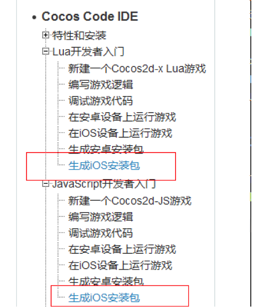

#GITHUB文档编写规范

##说明

Github文档编写规范是为了规范各个文档统一样式，实现自动抓取github内容而不会出现样式乱码以及图片抓取错误等现象。所以需要在此对文档做出规范统一。

因为程序是使用的第三方Markdown解析器，所以很多Markdown的特殊语法支持不够，每次频繁因为不标准的Markdown语法而修改程序实在浪费大家时间，所以我们制定这个文档尽量大家使用一致性的严格语法的Markdown编辑器来编写文档

##规范

**命名**

正确的格式：

- manual/code-ide/zh.md


使用zh.md结尾，不要使用to-apk-zh等结尾， 使用数字,字母,中横线,下划线在链接和图片命名中，其他的格式将不能被识别。


不正确的格式：

- on-android-zh.md
- getting-started-for-lua/5-packaging/to-apk-zh.md
- get~strpp().md
- get+xxx/funny()/zh.md


**图片**

正确使用格式为：

```

```


不建议或者说不正确使用格式为：（太多层的 ../../会造成链接地址过长，不能识别）

```
不建议！

```

```
不识别！应该放到目录下面 ./res/enable...
 
```

- 使用三种标准图片格式（jpg,png,gif）， 不要使用 jpeg格式，不识别
- 使用zip包下载请使用完整链接，比如http://xxxx/xxx.zip, 不要使用RAR格式下载包
- 图片不要跟文件统计目录，应当放到/res中

**其他**

- 边栏目录使用不同的名字


可以添加：JS生成iOS安装包， Lua生成iOS安装包。