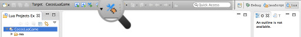
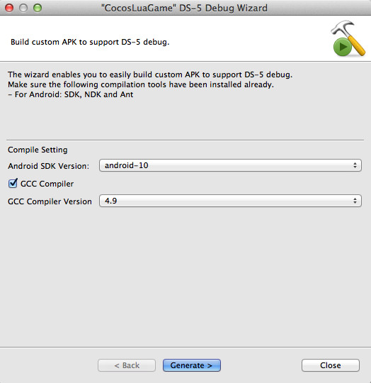
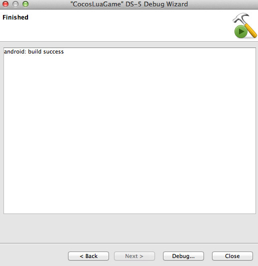
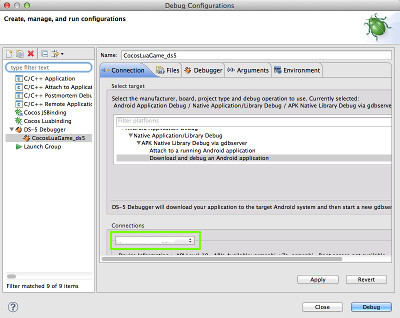
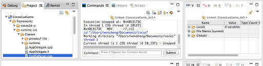
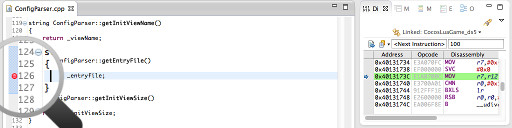
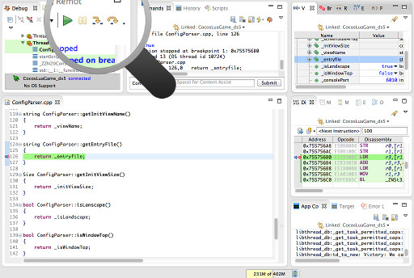

# Debug C++ Code with DS-5

Before debugging C++ code in Cocos Code IDE, ARM DS-5 should be installed. [Click here to install DS-5](../zh.md).

Initial configuration of DS-5 need to be done before debugging Android C++ code.Glad to tell you that configuration wizard of DS-5 have built in from Cocos Code IDE 1.1.0 to help you to configure DS-5 automatically.

In addition, the following tools also needed:

- Cocos2d-x 3.3 or Cocos2d-JS 3.2 or above
- Android SDK
- Android NDK r10c or above
- Apache Ant 1.9 or above

## Debugging Steps

-------
1. At first, create a game that contains C ++ code, then select the project, and click on the "DS-5 Debug ..." button on the toolbar.   
    

2. If you have not configured Android compile environment, the settings dialog box will be opened automatically. If the environment has been set up, this step will be skipped.   
    

3. In addition to Android SDK version selection, you also need to set which version of GCC toolchain to compile C ++ code, because the current DS-5 only support debugging programs compiled with GCC. You'd better to select high version of GCC, since the lowwer version may cause some unexpected bugs.   
    

4. You can click "Generate" button to start the build after the compiler options set. The compile operation will take a while, and after a successful compilation, click on "Debug ..." to enter the configuration dialog of the DS-5.  
    

5. All necessary options has been filled up, the only thing before start debugging is to connect an Android device which debug mode has been turned on with a USB cable.  
    

6. DS-5 will break down automatically when debug began, then you can select one file, which is in the left corner of the project management view, for breakpoint insertion.   
    

7. Double click to open the file, then double click the left column of the code window to set breakpoints. 
    

8. However,so far the DS-5 Debug is not able to break off the program at the entrance on Android, so some of the front code may have been run over. If the breakpoint was set, click "continue" or "F8" to continue debugging to the breakpoint and then stop.  
    

9. You can click the "Debug" in the upper left corner to restart debugging after the debug is stopped. If you modify the C++ code, select "Cocos Tools" -> "DS-5 Debug ..." menu in the project's quick menu to open the wizard for recompilation. Nevertheless, other ways to compile the code are also workable.  
    

----------
Follow the above instructions, you can use DS-5 in Cocos Code IDE in the Android platform to debug C ++ code. So can we debug C++ code and scrip code simultaneously? Yes！Very simple:

    1. Start DS-5 debug and keep the game stay in the connection waiting view.
    2. Switch to the Cocos Lua or Cocos JS perspective view.
    3. Start script debug with "Remote Debug" mode.

## Tips

- The table of engine version and the Android NDK version which has been tested：

    | Engine | Build Runtime | Package to APK | Debug with DS-5 |
    |:----------|:----------:|:----------:|:----------:|
    |Cocos2d-x 3.3|  r10c | r10c | r10c |
    |Cocos2d-x 3.2|  r9d, r10c | r9d, r10c | r10c |
    |Cocos2d-JS 3.2RC0| r9d, r10c | r9d, r10c | r10c |
    |Cocos2d-JS 3.1| r9d, r10c | r9d, r10c | r10c* |
    |Cocos2d-JS 3.0| r9d, r10c | r9d, r10c | r10c* |
    - __*__: The external libraries should recompile using GCC4.9.   
    
- When debug with DS-5, the application can't execute script logic and stay in wait connection view if the engine version older than Cocos2d-x 3.3 or Cocos2d-JS 3.2. To fix this bug please modify a function "lua_cocos2dx_runtime_addSearchPath" in file: `"<PROJECT>/frameworks/runtime-src/Classes/runtime/Runtime.cpp"`:

        int lua_cocos2dx_runtime_addSearchPath(lua_State* tolua_S)
        {
            ......
        // Modify the 'if' condition, at line: 1090
        #if(CC_TARGET_PLATFORM == CC_PLATFORM_IOS || CC_TARGET_PLATFORM == CC_PLATFORM_ANDROID)
            cobj->addSearchPath(originPath);
        #endif
            ......
        }

- DS-5 need to call the command tool "adb" in Android SDK to identify "USB" connected devices. It's all right on Windows, but need to add "adb" to system path variable manually. Command as below:

        $>sudo ln <Android SDK>/platform-tools/adb /usr/bin/adb
        
- Want to know more information about DS-5, please refer to the ARM official documentation :[《DS-5 Community Edition Android Debug》](http://ds.arm.com/developer-resources/tutorials/android-native-app-debug-tutorial/). 

