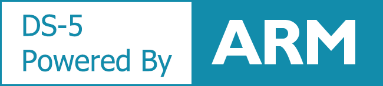
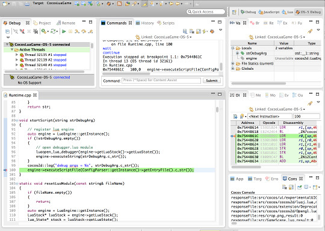
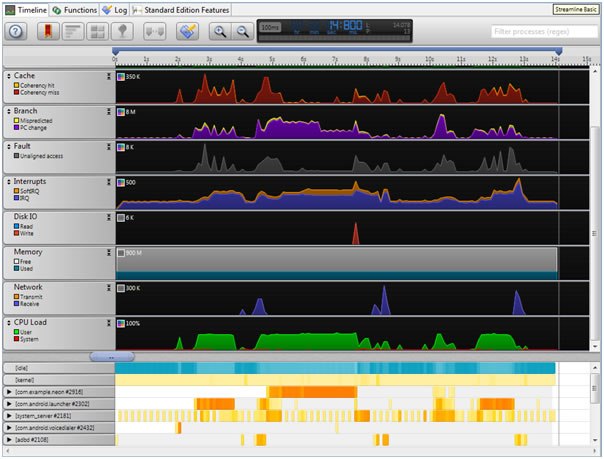
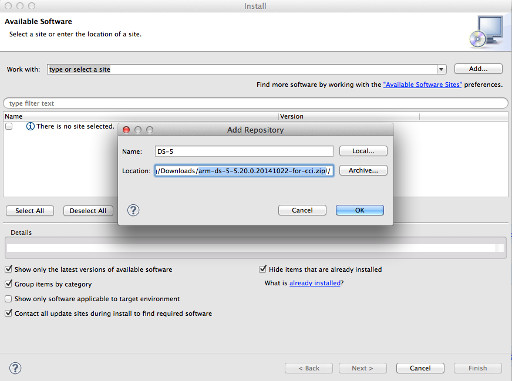
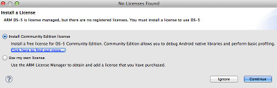
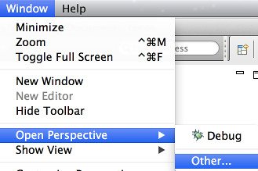

# ARM DS-5 助力安卓游戏开发

## 1. DS-5是什么？
DS-5是 ARM® Development Studio 5 的简称，基于标准 Eclipse 开发环境，提供一流的窗口管理,项目管理和 C/C++ 源代码编辑工具。DS-5 将特定于 ARM 的众多功能集成到 Eclipse 平台，使得它成为功能最强大的工具链，非常适用于 ARM 软件开发。

DS-5分为旗舰版,专业版和社区版。Cocos Code IDE 获得 ARM Limited 授权，可以发布 DS-5 社区版给开发者使用。

## 2. 下载
Cocos Code IDE 从1.1.0版本开始支持 DS-5 社区版, 不过由于安装包大小原因，DS-5 由单独的安装包提供，没有集成到安装包中。下载后，请按照下面的安装方法安装到 Cocos Code IDE 中。

DS-5 社区版功能安装包:  
-  [点击下载](http://www.cocos2d-x.org/filedown/arm-ds-5-5.20.0.20141022-for-cci.zip)  
- __Size__: 250.7 MB(250,681,142 bytes)  
- __MD5__: 7f2aa372c4ab15b34c2b96f010d4fecb  

## 3. 功能介绍
DS-5 社区版虽然没有专业版和旗舰版功能强大，但给安卓开发者提供的帮助可不小。

### 安卓平台C++代码调试
支持基于ARM9,ARM11和Cortex-A (ARMv7-A)架构的处理器的安卓设备进行调试，注意某些基于安卓 2.2 版 (Froyo) 的产品尚未启用此功能。  

### 安卓平台性能分析
支持简单的GPU/CPU功能分析，注意此功能只有一些特定的设备才能支持，更多信息请参考[《DS-5 CE Android Streamline》](http://ds.arm.com/zh-cn/developer-resources/tutorials/android-performance-analysis-streamline-tutorial/)。  

## 4. 安装

--------
1. 在"Help"菜单中点击"Install New Software..."。  

2. 点击"Add..."按钮，然后点击"Archive..."导航到下载的安装包。  

3. 一路"Next"下去，重启后就安装成功了，初次安装需要安装授权文件，请选择社区版本。  

4. 可以在菜单"Windows"->"Open Perspective"->"Other..."中找到"DS-5 Debug"双击打开。  

--------
在Cocos Code IDE中安装好DS-5后，来体验一下[《用 DS-5 调试 C++ 代码》](./debug-with-ds-5/zh.md)吧。
