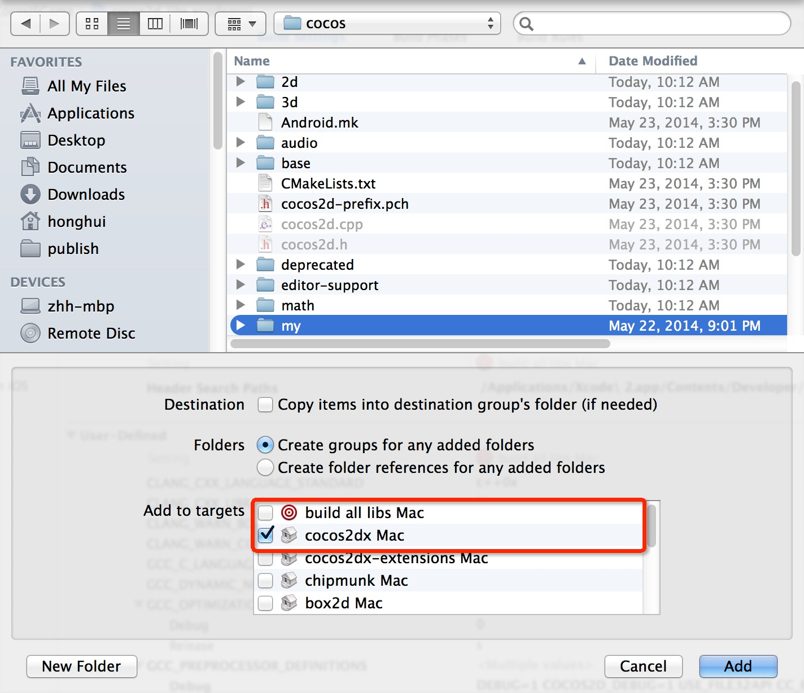
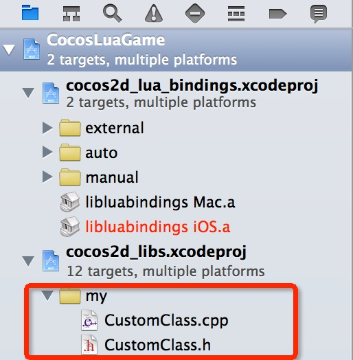

カスタムクラスをluaランタイムにバインドする方法
===
---

このドキュメントでは,luaランタイムにカスタムCppクラスをバインドする方法を解説していきます。 **luaバインディングについての説明ではありません**.

バインドをするための過程はどのプラットフォームでも同じですが,ここでは例としてMacランタイムを選びます。

### ランタイムのソースコードを作成します
ここでは,あなたが　Cocos　Code　IDE　で　CocosLuaGameという名前の　cocos lua project を作成してあることを仮定して説明していきます。

* ランタイムのソースコードが格納される場所は \<projectLocation>/frameworks/runtime-src, です。もし,このディレクトリが存在する場合は,次の手順をスキップしてください。
* 無い場合は次の手順でランタイムのソースコードを生成する必要があります。
  * CocosLuaGame プロジェクトを右クリックします。
  * Cocos Tools->Add Native Codes Supportを選択。
  * **Create Native Source Wizard**　の　**Generate**　をクリック。
  * これで,ソースコードが生成されたと思います。


### プロジェクトで　CustomClass クラスを追加します。


```

// CustomClass.h

#ifndef __CUSTOM__CLASS

#define __CUSTOM__CLASS

#include "cocos2d.h"

namespace cocos2d {
class CustomClass : public cocos2d::Ref
{
public:
    
    CustomClass();

    ~CustomClass();

    bool init();
    
    std::string helloMsg();

    CREATE_FUNC(CustomClass);
};
} //namespace cocos2d

#endif // __CUSTOM__CLASS

```

```
// CustomClass.cpp
#include "CustomClass.h"

USING_NS_CC;

CustomClass::CustomClass(){
    
}

CustomClass::~CustomClass(){
    
}

bool CustomClass::init(){
    return true;
}

std::string CustomClass::helloMsg() {
    return "Hello from CustomClass::sayHello";
}

```

**frameworks/runtime-src/proj.ios_mac/CocosLuaGame.xcodeproj**を開き, cocos2d_libs.xcodeproj　に　CustomClass.h/CustomClass.cpp　を追加します。  　また,以下の画像のように**cocos2dx iOS**にチェックが入っているか確認してください。　


その後,以下の画像のように新しいプロジェクト構造が表示されます。 



そして,パスも追加します。


### cocos2dx_custom.iniを追加します。

`tools/tolua`ディレクトリを開いて,`cocos2dx_custom.ini` というファイルを追加します。


このファイルの`target_namespace`の内容は空白のままにしてください。
名前空間に,カスタムクラスのコードを自動的に埋め込む自動補完は,まだ'Cocos Code IDE'でサポートされていません。

```
[cocos2dx_custom]
#生成された関数に追加する接頭辞を変更できます。
#通常では以下のようになっています。
prefix = cocos2dx_custom

# ターゲット名前空間を作成します。 (javascriptでは,これと同じようなコードをいくつか作成します。`ns = ns || {}`)
# すべてのクラスはその名前空間に埋め込まれます。
target_namespace =

android_headers = -I%(androidndkdir)s/platforms/android-14/arch-arm/usr/include -I%(androidndkdir)s/sources/cxx-stl/gnu-libstdc++/4.7/libs/armeabi-v7a/include -I%(androidndkdir)s/sources/cxx-stl/gnu-libstdc++/4.7/include -I%(androidndkdir)s/sources/cxx-stl/gnu-libstdc++/4.8/libs/armeabi-v7a/include -I%(androidndkdir)s/sources/cxx-stl/gnu-libstdc++/4.8/include
android_flags = -D_SIZE_T_DEFINED_ 

clang_headers = -I%(clangllvmdir)s/lib/clang/3.3/include 
clang_flags = -nostdinc -x c++ -std=c++11

cocos_headers = -I%(cocosdir)s/cocos -I%(cocosdir)s/my -I%(cocosdir)s/cocos/base -I%(cocosdir)s/cocos/platform/android
cocos_flags = -DANDROID

cxxgenerator_headers = 

# extra arguments を書き換える
extra_arguments = %(android_headers)s %(clang_headers)s %(cxxgenerator_headers)s %(cocos_headers)s %(android_flags)s %(clang_flags)s %(cocos_flags)s %(extra_flags)s 

# ヘッダーを解析する。
headers = %(cocosdir)s/cocos/my/CustomClass.h

# classes はコードを作成するためのものです。 ここには正規表現を使用する事が出来ます。
# 正規表現は"^$"によって囲まれた文になります。 例: "^Menu*$".
classes = CustomClass.*

# 何をスキップするかの指定。 フォーマット: ClassName::[function function]
# クラス名の正規表現はこのように使用します: "^ClassName$" 関数で使用する場合も同様です。
# 正規表現は,それらが全て"^$"に囲まれる事はありません。ただし,全てのクラスをスキップしたいという場合は例外になります。
# "*"でもスキップの対象となります。いくつかの例については以下の項目を参照してください。基底クラス名は"*"となります。
# 全てのクラス名に適用されます。これはとても便利で,似た名前のものをスキップするのに役立ちます。
# 全てのクラスから機能します。

skip = 

rename_functions = 

rename_classes = 

# 全てのクラス名において,ターゲットのVMに登録する際に削除する必要があるか？
remove_prefix = 

# クラスの親をルックアップしません。
classes_have_no_parents = 

# サブクラスが基底クラスを見つけたとき,スキップします。
base_classes_to_skip = 

# コンストラクタの有無を設定します。
# 設定は手書きのコンストラクタと基底クラスを使用します。
abstract_classes = 

# スクリプト(Js)オブジェクトのライフサイクルをネイティブ(cpp)オブジェクトがコントロールするかどうか決めます。項目には'yes' もしくは 'no'を記述してください。
script_control_cpp = no

```

### tools/tolua/genbindings.py　を書き換える

tools/tolua/genbindings.pyの中から`cmd_args`を探し,以下の一文を追加します:

```
  'cocos2dx_custom.ini' : ('cocos2dx_custom', 'lua_cocos2dx_custom'), \
```


### tools/tolua/genbindings.pyを実行します。

tools/tolua/genbindings.py　を実行したら,`lua_cocos2dx_custom.cpp` と `lua_cocos2dx_custom.h`がcocos/scripting/lua-bindings/auto ディレクトリに追加されます。さらに,cocos/scripting/lua-bindings/auto/api の中に`CustomClass.lua`が追加されます。


Xcode project　に　.h/.cpp　を追加します。:


### luaに登録

`lua_cocos2dx_custom.h`を開く,グローバル関数の宣言は以下のようになります。 --> `register_all_cocos2dx_custom(lua_State* tolua_S);`

この関数は,AppDelegate.cppで　CustomClass　を使う前に呼び出します。 例えば,Lua entry fileを実行する前など。:

```
    ...
    #include "lua_cocos2dx_custom.hpp"
    ...
    
	// register custom function
    LuaStack* stack = engine->getLuaStack();
    auto state = stack->getLuaState();
    lua_getglobal(state, "_G");
    register_all_cocos2dx_custom(state);
    lua_pop(state, 1);
    
#if (COCOS2D_DEBUG>0)
    if (startRuntime())
        return true;
#endif

    engine->executeScriptFile(ConfigParser::getInstance()->getEntryFile().c_str());
    return true;        
```

### ランタイムの変更
Cocos Code IDEの操作:

 * CocosLuaGame project　を右クリック
 * Cocos Tools->Build Runtime　を選択
 * プラットフォームを選択し,ビルドを実行。
 
### Cocos Code IDE(1.0.1.beta もしくわ above) 用に, カスタムクラスの自動補完を追加します。
次のコマンドで CustomClass.zip のように `CustomClass.lua` を圧縮します。

```
zip CustomClass.zip CustomClass.lua
```

Cocos Code IDEの操作:

* CocosLuaGame project を 右クリック
* Build Path->Configure Build Path...->Libraries->Add ZIPS... をクリック
* 
* `CustomClass.zip`を選択し, **OK** を押す

### lua でカスタムクラスを使う場合
あなたが使用したいカスタムクラスを宣言し,main.luaを編集します。

```
	local customClass = CustomClass:create()
    local msg = customClass:helloMsg()
    cclog("customClass's msg is : " .. msg)
```

### テスト実行
ランタイムの設定を完了した`CocosLuaGame`を実行し,以下がコンソールに表示されれば成功です:

`customClass's msg is : Hello from CustomClass::sayHello`


