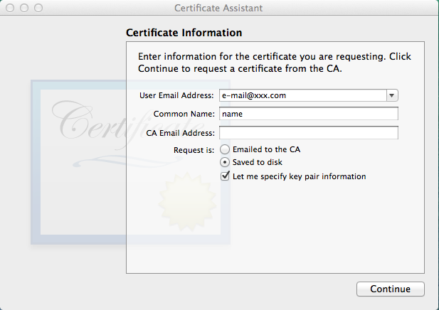
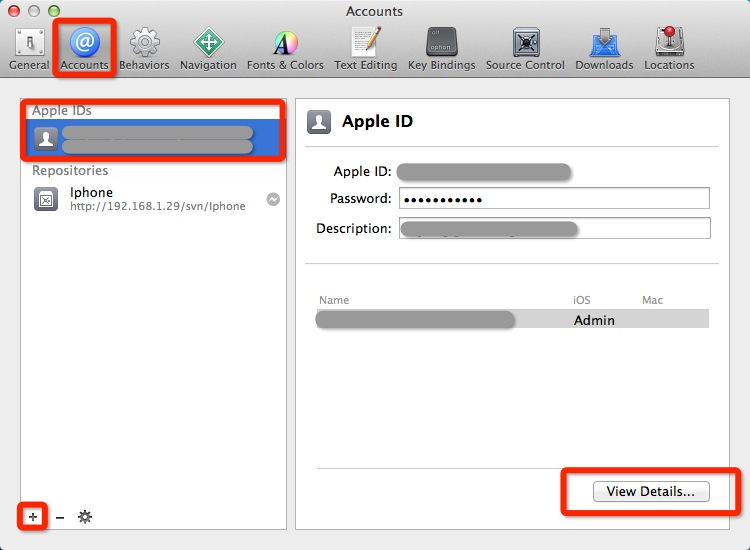

#配布証明書を申請する方法とIDEのコードを使用して配布可能なipaにする方法

## 1. 手順

- **配布証明書を追加します。**
- **App IDを追加します。**
- **配布用プロビジョニング プロファイルを追加します。**
- **コードIDEを使ってコンパイルし,配布用ipaに梱包します**

###注: 証明書配布のアプリケーション プロセスは開発者証明書によく似ています。なので,配布証明書とプロビジョニング プロファイルをすべてを再生成する必要があります。

## 2. iOS配布バージョンについての注意事項

#####1. 証明書の配布: Appleは開発者のための開発証明書を承認しています。　配布証明書とは異なり,開発証明書は配布していない実際のデバイスのデバックの為だけに使用することができます。

#####2. App ID: 全てのアプリをリリースする前にApp　IDを持っている必要があります。 App　IDはアプリ毎に必要となる身分証明書の様なものです。IDの作成には,製品名とBundle IDを登録する必要があります。
#####Bundle ID はDNSの逆文字列であることに注意してください。 たとえば: com.company.name; この文字列には,開発者とアプリケーションの情報が含まれています。 名前の部分には,単一のアプリケーション,または複数のアプリケーションの名前として指定することができます。 前者の場合には,上記の例のように名前の部分にアプリケーション名を記入します。 後者の場合,名前部分は,「*」で置換することができます。　ただし Bundle IDは"\*"などのいくつかの機能を利用する事ができません。

#####3. 配布用プロビジョニングプロファイル: プロビジョニングプロファイルには証明書とアプリケーション ID が含まれています。 開発プロビジョニングプロファイルにはデバイスのUDIDなどの情報が含まれていますが,配布用プロビジョニングプロファイルには情報が含まれていません。

## 3. 配布用証明書を追加

#####まず初めに,[Apple Developer Center](http://developer.apple.com)で入力する必要があります。MemberCenterをクリックし,ログインします。(ここでは,IOSデベロッパーアカウントが必要です。) 
そして,次の画像のように選択していきます。

#####証明書オプションを選択します。

#####"(Certificates)証明書"の下に"production(生産)"というサブオプションがあるので選択してください。

#####ページの右側にある小さなプラスアイコンをクリックします。 App Storeでとアドホックを選択し,[continue（続行）]をクリックします

#####この画面では,配布用証明書を製作するためにMac上にCSRファイルを作成する必要があるという説明があります。その為,ここに一連の動作が表示されているのでそれに従います。

#####Applications/Utilityの中に,CSR file を簡単に作ることのできる,keychain accessというツールがあるので開きます。

#####keychain accessのメニューを開き,“Certificates Assistant/Request a Certificate From Authority”を選択。

#####その後,メールアドレスと共通名を入力します。保存には二つの方法がありますが,特別な理由がなければデスクに保存を選択してください。次に,[continue（続行）]ボタンをクリックします。

#####ここはデフォルトの設定のまま続けてください。

#####問題がなければ,CSRファイルが作成されます。次に,証明書の作成をします。

#####デベロッパーセンターのウェブサイトに戻ったら,継続をクリックします。すると以下のような画面が表示されるので,「Choose File(ファイルを選択)」をクリックし,作成したCSRファイルを選択します。その後,「Generate(生成)
」をクリックします。

#####証明書が正常に作成されたことを確認したら,「Done(完了)」をクリックし,ダウンロードを始めます。

#####証明書ファイルをダブルクリックすると,秘密鍵が自動的にキーチェーンに登録されます。また,証明書にある小さな三角矢印をクリックするとキー型のアイコンでサブ項目が表示されます。これで証明書の作成は終了です。  

## 5. App ID　の追加

#####配布用プロビジョニングプロファイルを作成するには,アプリケーションIDが必要です。既に持っている場合はこの項目をスキップしてください。

#####Identifiers/App ID　をクリック。 さらにプラスボタンをクリックします。

#####名前を入力します。

#####次にBundle IDを入力します。Wilcard App IDを選択してください。 フォーマットは通常,com.company.*のように書き,真ん中の会社名の部分を入力します。 このようなAppIDは便利ですが,アプリ内課金のような機能を使用することはできません。 もちろん, Explicit App ID　を選択し,任意の使用法を無しにBundle IDを設定することもできます。自分に合っている方を選択してください。

#####「Submit(送信)」ボタンをクリックし,AppIDの作成プロセスを終了します。

## 6. 配布用プロビジョニング プロファイルを追加します。

#####Provisioning Profiles/Distribution（プロビジョニングプロファイル/配布）を選択します。 そして,プラスボタンを押します。

#####App Storeを選択し,「Continue(続ける)」をクリック

#####先ほど作ったApp IDを選択してください。

#####利用可能な配布証明書が記載された場合は,先ほど作った物を選択してください。

#####設定名を入力し,「Generate(生成)」をクリックします。

#####少し待つと,配布用プロビジョニングプロファイルが作成されたことが通知されます。

#####配布バージョンの ipa の作成を許可できるように,Mac にプロビジョニング ファイルをインポートする必要があります。 
#####インポートするには2つの方法がありますが,まずは Xcode に付属しているアカウント システムを使用します。

#####Xcode を開き Xcode ドロップ ダウン メニューの「preference(環境設定)」オプションをクリックしてポップアップ ページの「Accounts(アカウント)」を選択します。 開発者アカウントを使ってログインしていない場合,左と右の下部にあるプラス ボタンをクリックし,追加アプリ ID を選択,開発者アカウントにログインします。ログイン後,右下にある[View Details(詳細の表示)] をクリックします。

#####その後,[View Details(詳細の表示)] をクリックすると,このアカウントの証明書および記述ファイルに関する詳細情報がポップアップします。 プロビジョニング プロファイル リストが空で,先ほど作成した記述ファイルが含まれていない場合,左下にある更新ボタンをクリックしてみてください。すると,一致する現在の証明書が自動的にインポートされると思います。

#####もう一つの方法は [iPhone configuration utility tool](http://support.apple.com/kb/DL1465?viewlocale=zh_CN&locale=zh_CN): Mac に生成された説明ファイルをダウンロードして iPhone configuration utility toolを起動し,Mac にインポートされるので,それに記述ファイルをドラッグする必要があります。

#####これで記述ファイルの作成,およびインポートは終了しました。

## 7. IOS用にIPAをコンパイルし,パッケージにパックします。このIPAは実際のデバイスのデバックに使用することができます。

#####コードIDEであなたが公開したい,パックしたIPAプロジェクトを右クリックし,「Cocos Tools」メニューの下のiOSのオプションのIPAへのパッケージを選択します。

#####現在のプロジェクトにまだ追加されていないソースがある場合は「YES」を押してください(追加したいソースが既にプロジェクトにある場合,は,この手順をスキップしてください)

#####「追加ネイティブソースウィザード」ページが表示されたら,下部のIOSバンドル識別子と作成したアプリケーションIDが一致することを確認してください。 その後,「Generate(生成)」をクリックしてください。

#####コードが正常に追加されたことを確認したら,「Close(閉じる)」をクリックしてください。

#####“Package to IPA for iOS generated wizard:”ページに切り替わりましたら,証明書とパッケージ化されたターゲットが正しいか確認してください。その後「Generate(生成)」をクリックしてください。

#####IPAの生成には,約5～15分ぐらいかかります。

#####正常に生成された場合は,IPAが保存されていることを通知します。失敗した場合は,ログコンソールの出力を参照し,エラーをチェックしてください

## 8. インストールと配布用IPAの実行

#####注意事項として,配布版のIPAが正常にパックされた後に,自分でインストールして直接デバッグできないことです。なのでApp Storeに,ダウンロードできるよう提出しなければなりません。それがApp Storeで承認された後,それをインストールする必要があります。