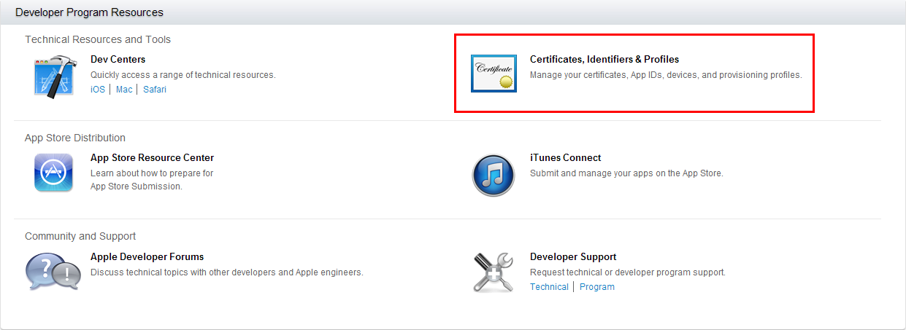
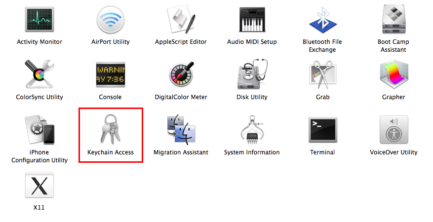
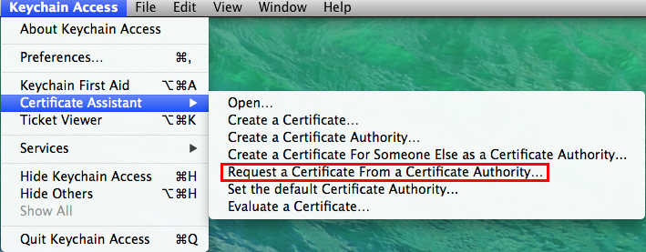
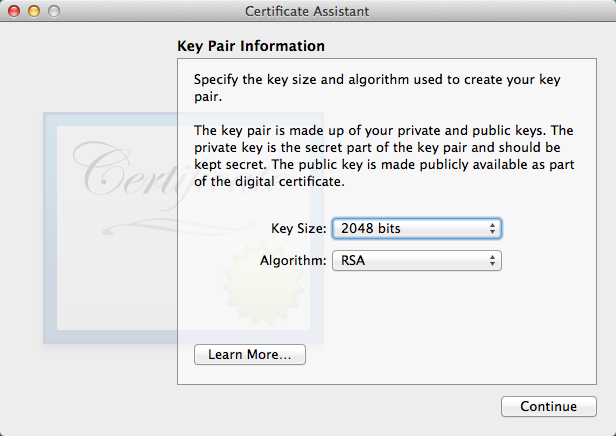
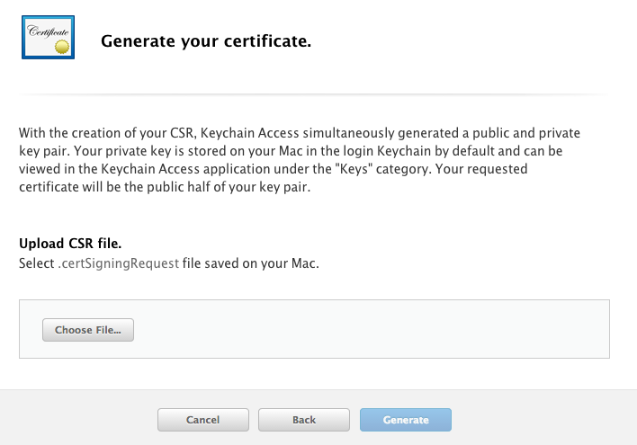
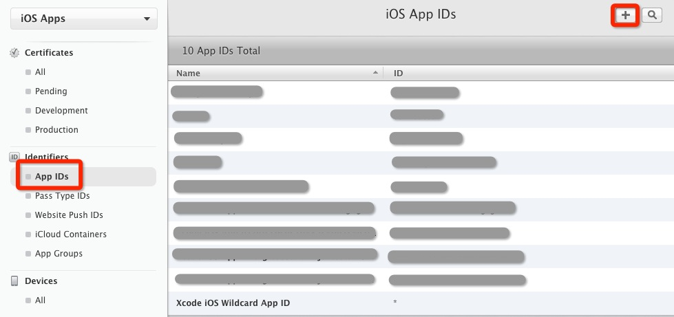
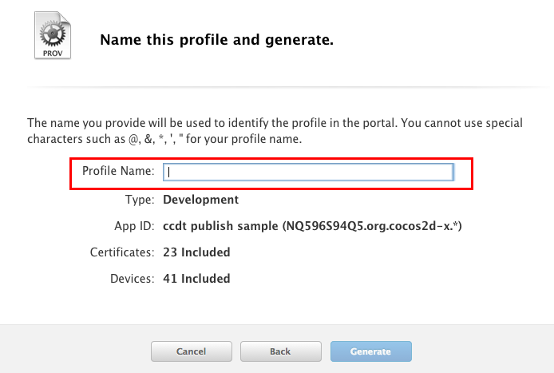

# 如何申请发布版本的证书和使用Code IDE制作可发布的ipa

## 1. 所需步骤

- **添加证书 (Distribution Certificates)**
- **添加App ID**
- **添加描述文件(Distribution Provisioning Profile)**
- **使用Code IDE编译打包可发布版本的ipa**

###备注：发布版本的证书申请流程其实和调试用的证书流程相差不多，只需要重新生成发布版本的证书和描述文件即可

## 2. 关于iOS发布所需要的材料说明

#####1. 证书(Distribution Certificates): 苹果对于开发者的授权认证，与Development版本的证书不同的是，Distribution版本的证书只能用于发布，不能用于真机调试
#####2. App ID: 对于每个要发布的App，都需要设置一个App ID, 它也是App的唯一标识，它通常需要用户提供Product name和Bundle ID
#####这里需要注意的是，Bundle ID是一个反转的DNS串, 例如：com.company.name, 它集合了开发商与应用程序的信息，这里的name字段可以指定为单一的应用，也可以指定为多个或全部的应用，单一的应用就如刚才的例子所描述的，name字段填写应用名称就好。如果多个或全部应用，name字段可以用“＊”件号代替。但用“＊”号代替的Bundle ID很多功能是使用不了的，例如推送等功能。
#####3. 描述文件(Distribution Provisioning Profile): 就是将以上的证书，App ID合起来，就是我们所说的描述文件，但Distribution版本的描述文件与Development版本的描述文件不同的是，此描述文件中不包含调试设备的UDID等信息

## 3. 添加证书（Distribution Certificates）

#####首先，我们需要进入[Apple Developer Center](http://developer.apple.com)，点击MemberCenter后登陆(当然，你得先有一个开发者帐号)，登陆后进入到图中所指向的位置

#####进入到这一页面后，选择Certificates选项

#####然后我们在左上角的位置，可以看到Certificates选项中，有一个Production的子选项，选中它。

#####这时，我们在页面的右侧，可以找到一个小的加号，点击它，接着选择App Store and Ad Hoc，点击Continue继续

#####这里的意思是说，我们必须在Mac上创建一个CSR文件，用来创建我们的证书，接下来，我们就在我们的Mac上进行这一系列的操作

#####在应用程序下的实用工具里，有一个钥匙串访问的小工具，可以帮助我们快速的创建CSR文件

#####打开它以后，点击左上角的钥匙串访问的下拉菜单，选择证书助理下面的从证书的颁发机构请求证书

#####然后我们需要填写用户的Email地址和Common Name，需要注意的就是，存储方式有两种，如果没有特殊需求的话，一般都是会保存在磁盘中，然后点击继续

#####这一页面默认即可，然后继续

#####此时，我们所需要的CSR文件就已经创建好了，接下来我们可以继续回到我们的创建Certificate的步骤

#####回到我们的开发者中心的网站，并点击Continue后，会看到下图，Choose File就是我们刚才创建的那个文件，选择它，并点击Generate

#####等待数秒后,如果不出意外，会提示我们已创建成功，点击Done后，选择我们创建的这一Certificate并下载

#####双击下载好的Certificate文件，会自动的在钥匙串中添加秘钥,并且在证书的前方，有个小的三角箭头，点击后，会看到证书中包含一个钥匙一样的子项，这就证明我们的证书已创建成功了

## 5. 添加App ID

#####我们需要创建一个可用的App ID用于发布版本的描述文件的制作，如果已设置和创建过App ID，可跳过此步骤
#####点击Identifiers下的App ID，并点击右上角的加号按钮，添加一个新的App ID

#####需要填写它的name

#####接着填写它的Bundle ID，我们选择Wilcard App ID, 格式一般就是com.company.*, 中间的这一段一般使用公司的名称，虽然看起来很方便，但坏处就是，这样的App ID不能使用内购，推送，Gamecenter等功能。当然你也可以选择Explicit App ID，但你必须明确的指定你的Bundle ID，不能使用＊号来代替。可以跟据自己应用的需求，来选择具体要使用哪一种。

#####点击Submit, 这样我们的App ID就创建完成

## 6. 添加描述文件(Distribution Provisioning Profile)

#####选择Provisioning Profiles下面的Distribution,并点击右上角的加号

#####选择App Store,点击Continue

#####选择我们刚刚创建好的App ID

#####会列出当前帐号里面所有的可用的发布版本证书，选择我们刚刚创建好的那个发布版证书就可以了

#####填写配置文件名，然后点击Generate

#####等待数秒后，提示我们的发布版描述文件已经创建成功了

#####现在我们需要将描述文件导入到我们的Mac上，使我们的Mac真正具备制作发布版本的ipa
#####导入的方式有两种，第一种是使用Xcode自带的帐号系统来导入描述文件到Mac上

#####打开Xcode, 单击Xcode菜单栏中的Xcode下拉菜单中的Preferences选项，在弹出的页面中，选择Accounts, 如果当前没有登录你的开发者帐户，单击左右下的加号按钮，选择Add App ID, 然后登录你的开发者帐户,登陆成功后，单击页面右下角的View Details

#####单击View Details后，会弹出关于此帐号中证书和描述文件的具体信息，如果在下方的Provisioning Profiles中是空的或者没有我们之前创建的那个描述文件，点击左下角的刷新按钮，即可自动适配和导入当前证书所匹配的描述文件

#####第二种是使用[iPhone实用配置工具](http://support.apple.com/kb/DL1465?viewlocale=zh_CN&locale=zh_CN): 我们需要手动将刚才生成的描述文件下载到我们的Mac上, 然后打开iPhone实用配置工具将描述文件拖入iPhone实用配置工具中，这样但将描述文件导入了Mac中

#####这样，我们描述文件的生成和导入也全部完成了。

## 7. 使用Code IDE中的Pakcage to IPA for iOS 来编译打包可真机调试的iOS的Ipa

#####在我们的Code IDE中，右键单击我们将打包发布ipa的工程，选择Cocos Tools菜单项中的Pakcage to IPA for iOS选项

#####如果当前工程在创建时没有添加源码或从来没有追加过源码，将提示需要追加源码工程,单击Yes进行追加源码（如果工程中已有源码，请跳过此步骤）

#####在弹出的追加源码向导页面中，需要注意的是下方的iOS Bundle Identifier, 请确保它跟我们之前创建App ID是匹配的，点击Generate开始生成源码，追加源码需要花费一些时间，所以请耐心等待

#####追加源码成功,点击Close按钮

#####会跳转到我们的Pakcage to IPA for iOS生成的向导页面,确认需要提供的证书和所打包的Target是否正确，然后点击Generate开始生成可发布的ipa。

#####生成ipa的过程，根据机器配置的不同，大概要花费掉5-15分，请耐心等待

#####生成完成，会有提示ipa存放在哪里，如果生成失败，请详细查看Console中输出的log

## 7. 发布版本ipa的安装及运行
#####首先我们需要了解的事情就是，发布版本的ipa在打包成功后，我们是不能进行私自安装和debug调试的。做为发布版本的App, 我们需要将它提交到App Store，在苹果官司方通过审核后，我们可以通过App Store来下载并安装它.