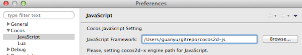
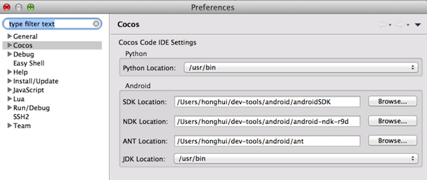
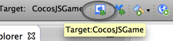
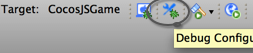
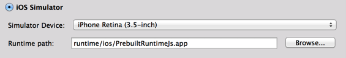
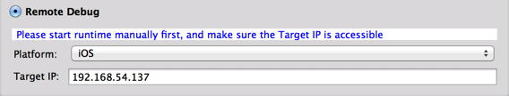
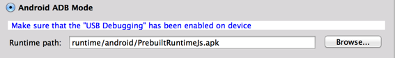
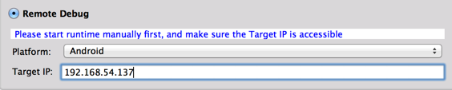

使用Code IDE调试Cocos2d-x JavaScript游戏
===
---
支持的调试环境：

在 Windows 上你可以调试Windows和Android游戏，在 Mac 上你可以调试Mac,iOS和Android游戏。我们以 Mac 作为开发环境来演示 Code IDE 的使用，Windows上的流程和这里所介绍的几乎一样，不再赘述。

先决条件
===
---
如果你还没有安装好 Cocos Code IDE，请先参考[Code IDE 安装指南](../../../install-zh.md)

IDE 配置
===
---
## 基础设置
打开工具的 **Preferences** 页，切换到 **Cocos/JavaScript** 子页面，选择你刚刚下载 Cocos2d-js 3.x 作为 JavaScript Framework。

+ 

## 额外设置
假设你发现我们提供给你的预编译的Android runtime不能满足你的要求，你就需要重新定制，那么你就需要提供给 IDE 几个 Android 编译需要用到的工具。这可以通过打开 **Preferences/Cocos** 页面进行配置。

+ 

运行,测试游戏
===
---
1. 新建一个名为 CocosJSGame 的 Cocos JavaScript 工程
2. 点击工具栏上的 debug 按钮
3. 
4. 默认情况下脚本会运行在我们提供的 mac 版本预编译 runtime 上。为了简单起见，我们不对默认值进行任何改动。如果你想要在其他我们支持的目标平台上调试程序，可参考**在其它目标平台上调试**

如何调试
===
---
## 断点支持
+ 可以在 javascript 脚本文件中增加断点
+ 当断点被触发时选择 “Yes” 打开 **Debug Perspective** 透视图，可以看到很多与调试相关的视图，调用栈,变量和断点等等
+ 
+ 支持 **Step over, Step into, Step out** 等调试方式

## 代码热更新
想更改右下角的 close 按钮的位置？closeItem.attr 方法是控制该按钮的显示位置的。

```javascript
		closeItem.attr({
            x: size.width - 20,
            y: 20,
            anchorX: 0.5,
            anchorY: 0.5
        });
```
修改“x”上面的值，把"size.width-20" 改成 ""size.width/2" 然后保持修改, 你会发现，在没有重启的情况下 close 按钮的位置已经改变了，在屏幕底部的中间!

## 在其它目标平台上调试
+ 通过工具栏上的打开 Debug Configurations 打开 Debug Configurations 页面
+ 
+ 在页面的左侧，选择之前我们为你创建的名为CocosJSGame的configuration

### 在 iOS Simulator 上调试
+ 选择 **iOS Simulator** 单选项
+ 选择正确的 runtime app
+ 
+  点击 **Debug** 按钮，预编译的 runtime 会被自动安装到模拟器中

### 在 iOS 设备上调试
+ 首先，你需要一个 runtime IPA， 从 cocos2d-js 3.0 正式版开始，创建工程的时候会给你准备一个 PrebuiltRuntimeJs.ipa，然后[安装IPA到设备中][How To Install IPA]
+ 在 iOS 设备上启动 runtime
+ 在 "Debug Configuration" 界面选择 **Remote Debug** 单选项
+ platform 选择 "iOS"
+ 将设备的 ip 地址填写在 **Device IP** 上
+ 
+ 最后点击 **Debug** 按钮 

### 在 android 设备上使用 ADB 模式调试 
+ 在 "Debug Configuration" 界面选择 **Android ADB Mode** 单选项
+ 选择正确的 runtime apk
+ 
+ 点击 **Debug** 按钮
+ IDE 会自动安装配置中的 runtime apk 到你的连接设备上并启动runtime开始调试

### 在 android 设备上使用网络模式调试
+ 手动安装 runtime 到你的设备上，它被存放在 CocosLuaGame/runtime/android 目录中
+ 手动启动 runtime，停留在 waiting 页面
+ 在 "Debug Configuration" 界面选择 **Remote Debug** 单选项
+ platform 选择 "Android"
+ 将设备的 ip 地址填写在 **Device IP** 上
+ 
+ 点击 **Debug** 按钮

[How To Install IPA]:http://www.solutionanalysts.com/blog/how-install-ipa-file-iphone-ipod-ipad-using-itunes-mac-windows