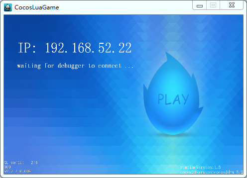
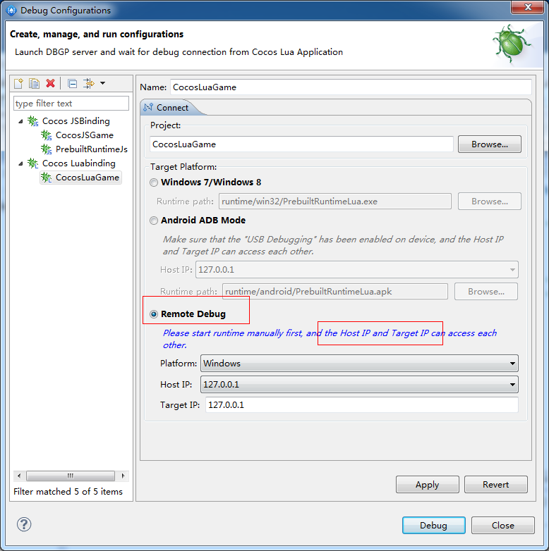
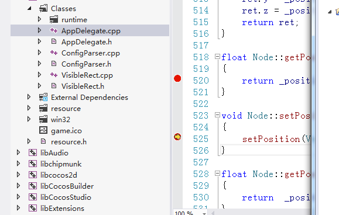
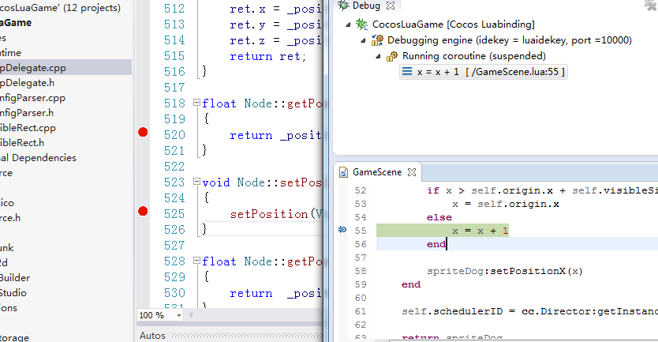

如何同时调试脚本代码和C++代码
=======

在用Lua或JavaScript开发cocos游戏项目时，经常需要添加第三方功能库或用C++来实现一些独特的逻辑，然后绑定到Lua，来扩充Lua层所能调用的功能；在这些情形下，调试时需要一会儿跟踪Lua层的游戏逻辑，当调用到扩充的功能时需要查看C++代码表现是否正常。Code IDE支持和Visual Studio或Xcode等C++调试工具一起来调试。

-------
操作步骤
-------
以下以Windows平台Lua游戏工程为例，来说明Code IDE是如何和Visual Studio联合起来同时调试Lua脚本和C++代码的，对于JavaScript脚本和C++代码来说也是同理：

+ 用Code IDE新建一个带C++源码的工程
+ 打开工程目录下 frameworks/runtime-src/proj.win32 下面的Visual Studio工程。如果是在Mac下，请打开proj.ios_mac 下面的Xcode工程。
+ 在Visual Studio(Xcode)中编译，然后开始C++代码的调试
+ 在出现带Play按钮的蓝色界面时
+ 
+ 在Code IDE中打开此工程的debug configurations 
+ 选择Remote Debug调试模式
+ 设置Platform参数，因为当前C++代码是用Visual Studio运行起来的所以这里选择Platform为windows；如果是用Xcode运行的Mac程序就选择Platform为Mac；如果是用Xcode运行的iOS程序就选择Platform为iOS
+ 设置Target IP，如果Platform选择的是windows或mac，可以填写系统的真实IP，也可以填写127.0.0.1；Platform选择的是iOS或Android，只可以填写系统的真实IP
+ 如果是调试Lua的话，需要设置Host IP，如果Platform选择的是windows或mac，可以选择系统的真实IP，也可以选择127.0.0.1；Platform选择的是iOS或Android，只可以选择系统的真实IP
+ 
+ 然后点击debug就可以开始调试Lua脚本了
+ 在Visual Studio中在想调试的C++代码上设置断点，在Code IDE中在想调试的Lua代码上设置断点
+ 
+ 
+ 这样就可以同时调试项目的C++代码和Lua代码了:)