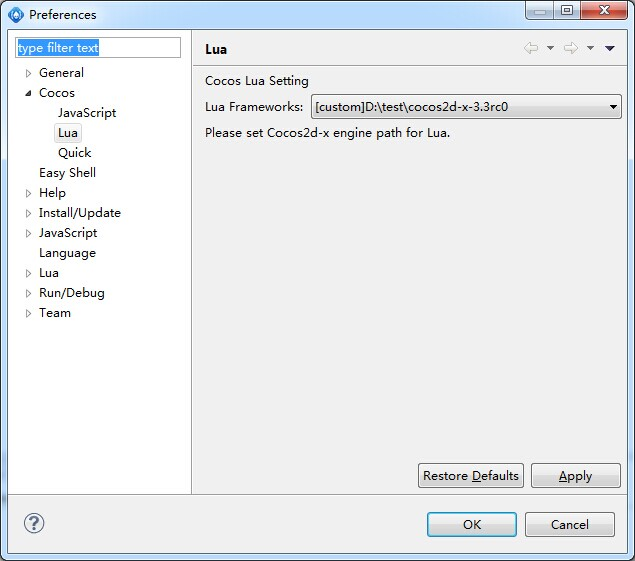
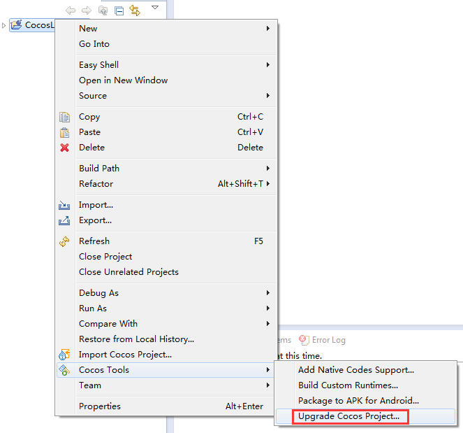
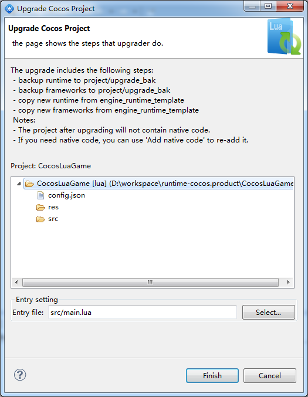
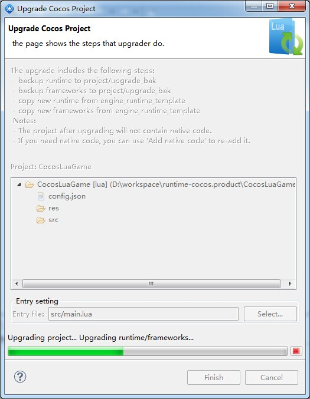
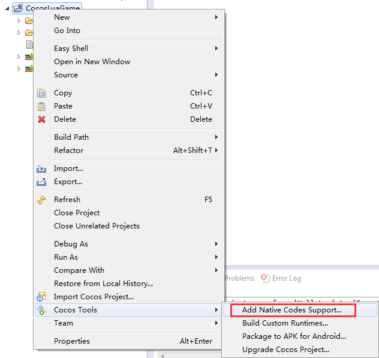
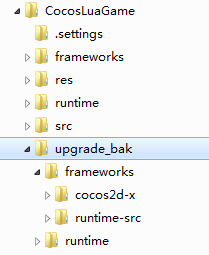
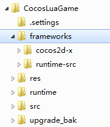
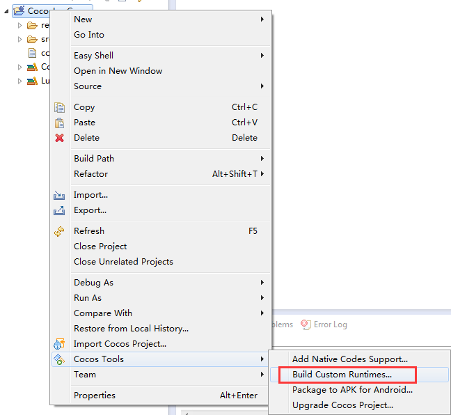

# Cocos Code IDE工程版本升级说明

当新版本的引擎发布，其中有项目需要的新功能或问题修复时，需要把工程升级到新版本才能享受这些更新。Cocos Code IDE提供了升级工程的向导，可以帮助开发者方便的升级工程。

升级前，应该已下载新版本的引擎并安装好。

## 脚本部分升级步骤

--------------------
1. 在"Preference中"，设置新版本的引擎。
    
2. 在想要升级的工程上单击右键，然后选择"Cocos Tools"中的"Upgrade Cocos Project..."。
    
3. 在弹出的升级向导界面中，可以看到对升级工程的一些描述，确认无误后，点击"Finish"开始进行升级。
    
4. 在工程升级时，首先把工程中的"runtime"和"frameworks"目录备份到"upgrade_bak"，然后把"runtime"升级到新版本，最后升级工程的"config.json"到新版本。
    

---------
到此为止，脚本部分升级完成，如果是一个纯脚本工程，工程升级到此结束，如果工程中添加了C++代码部分，请参考以下步骤。

## C++代码部分升级步骤

如果在开发中在工程中添加了C++代码变做了修改，那么这部分的工作需要手动升级到新引擎版本。

--------
1. 注意到脚本部分升级时对"frameworks"目录进行了备份，需要重新添加C++代码。
    
2. 找到备份的C++代码，在当前工程目录下的"upgarde_bak/framework"目录。
    	
3. 在当前工程目录下的frameworks中，找到新添加的C++代码，对照备份的代码进行修改或覆盖操作。
    
4. 修改完成后，重新编译Runtime，供工程调试使用。
    

--------
## 已知问题

1. 引擎3.3版本的main.lua文件有变动，导致旧版本工程升级到此版本会无法运行，需要做如下改动：
	- main.lua
			
			require "Cocos2d"

		修改为：

			cc.FileUtils:getInstance():addSearchPath("src")
			cc.FileUtils:getInstance():addSearchPath("res")
			require "cocos.init"
			
	- src/GameScene.lua

			require "Cocos2d"
			require "Cocos2dConstants"

		以上这类针对引擎的require代码则不需要再添加了。
			
		