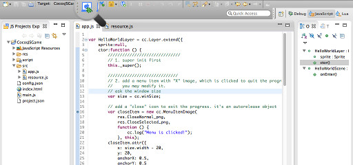
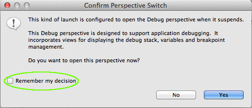
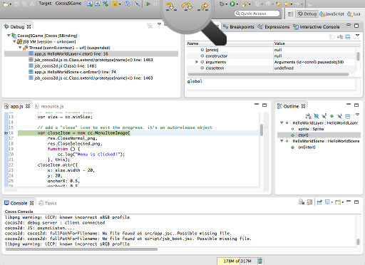
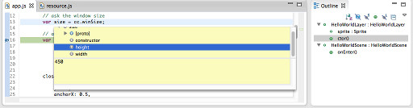

调试游戏代码
========

[《编写游戏逻辑》](../2-typing-game-logic/zh.md)后，可以在模拟器上调试一下，验证逻辑和预想的是否相符。

----------------

1. 在代码的左边栏双击，就可以在此代码处添加断点。然后点击工具栏上的调试按钮就会开始调试。  
  
2. 程序执行到断点的时候，会弹出是否切换到调试视图的对话框。点击"是"，进入调试视图。如果选择"否"则会停留在编辑视图进行调试。等熟悉编辑视图和调试视图的区别后，可以选择保存自己的选择，这样以后就不会再询问了。  
  
3. 进入调试视图，左上角为函数调用栈，右上角为变量察看窗口，中间为代码窗口，下面为日志窗口。可以通过F5, F6, F7等功能键进行单步调试。把鼠标移动到工具栏的相应按钮上就可以知道具体的功能。  
  
4. 在代码窗口还可以通过鼠标指向变量来察看它的值。  
  
5. 在调试的时候如果对代码进行简单的修改，在文件保存后，Code IDE会立即重新加载修改后的代码，这样就可以立即看到修改后的效果，提高调试效率。如果需要重新启动模拟器来调试，只需要再次点击工具栏上的调试按钮就可以了。  

----------------
模拟器的运行环境和设备的运行环境还是有区别的，为了确保游戏在设备上运行正常，需要[《在安卓设备上运行游戏》](../4-running/on-android-zh.md)或[《在iOS设备上运行游戏》](../4-running/on-ios-zh.md)察看实际效果。

