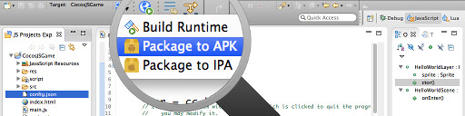
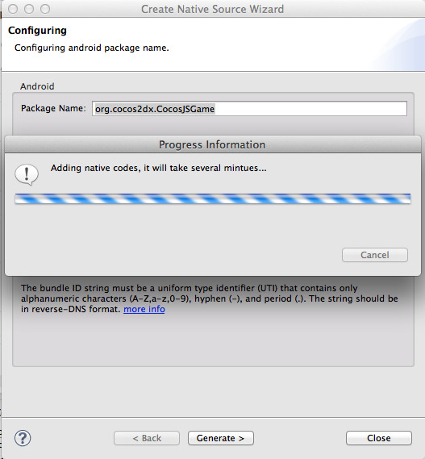
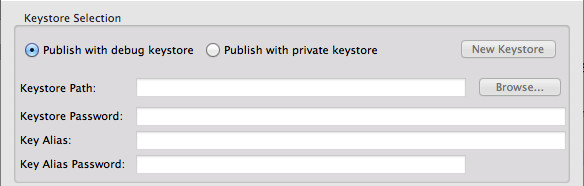
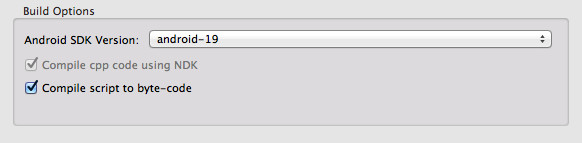
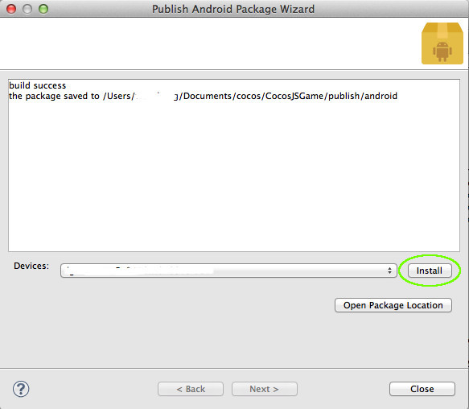

生成游戏安装包
==========

Code IDE可以很方便的把游戏工程打包为APK。

-----------
1. 在工具栏上点击打包APK的按钮。  
  
2. 首先需要添加CPP源码到工程，可能需要花费几分钟时间，如果工程已经有源码则会跳过此步骤。  
  
3. 在打包向导界面首先需要设置打包APK所用的"keystore"文件，默认使用自动生成的用来调试的"keystore"文件，如果需要正式签名的APK安装包，需要选择个人的"keystore"文件，也可以新建一个。  
  
4. 另外，可以在编译选项中设置是否对脚本进行编译，默认设置会把脚本编译为字节码。  
  
5. 打包需要花费一段时间，成功后，可以通过界面的安装按钮把安装包安装到手机上开始玩游戏了:)  
  

----------------
看完入门介绍，应该对使用Code IDE进行开发的工作流有了初步的了解。在Code IDE的功能向导中，会详细说明Code IDE的工作逻辑，如果在开发中碰到问题，可以进一步了解以便尽快的解决问题。

