新建一个Cocos2d-x Lua游戏
============

在此之前，Code IDE和引擎应该已经安装好了。接下来，我们开始建立一个游戏工程。

------------

1. 第一次打开Code IDE，需要选择一个workspace的目录；workspace是一个工作空间，里面保存了开发环境的配置，可以在这里添加一个或多个工程。可以创建多个workspace管理不同的工程，也可以用一个workspace管理所有工程。  
  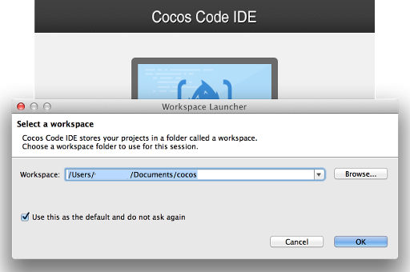
2. 进入Code IDE主界面，可以看到欢迎界面，在这里，可以选择开发Lua游戏或选择开发JavaScript游戏。点击Lua按钮进入Lua开发环境。  
  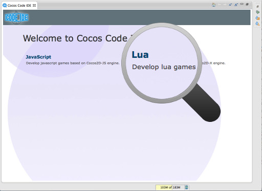
3. 如果没有设置好引擎路径，会弹出引擎设置框，点击下拉列表中的custom然后把引擎的根目录设置好就可以了。（注：1.2.0之前和之后的版本界面有所不同）。

     1.2.0之前的版本：  
    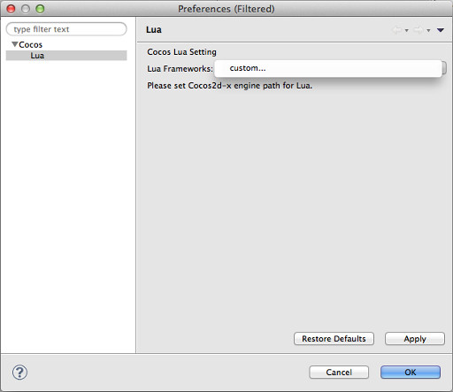
   
     1.2.0以及之后的版本：
    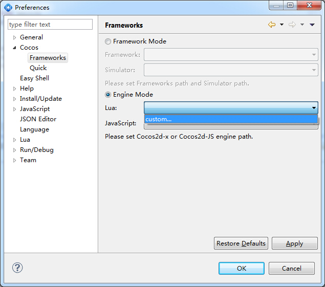
  
     1.2.0后，Code IDE还支持Cocos产品自带的Frameworks，如果你从官网下载并安装了Cocos产品，就可以使用其自带的引擎和模拟器了。
    

    安装Cocos产品后，在商城里下载CocosFramework并安装，你就可以选择Framework Mode。ide会自动识别Framework和模拟器路径。使用Frameworks的优点是：集成了js和lua，自带了预编译好的库，编译和打包的速度有质的提升。

    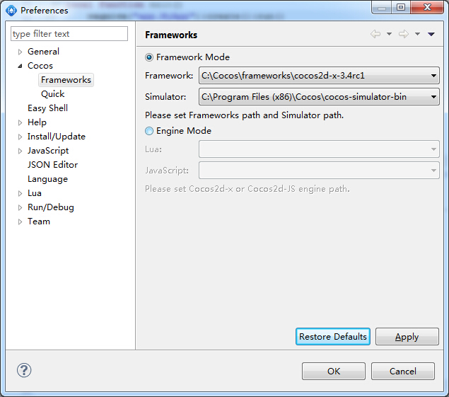

4. 在界面左边的窗口是项目管理器，在空白区域右键单击选择新建Cocos Lua项目开始新建项目。  
  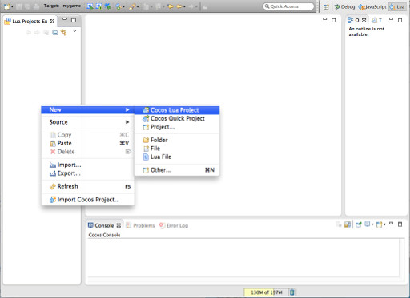
5. 在第一个页面，需要设置项目的名字和保存的路径，默认保存在workspace文件夹下，也可以手动设置保存到另外的目录下。需要注意的是，在一个workspace中，项目的名字是不能重复的。  
  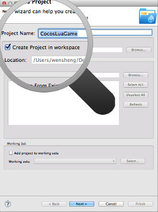
6. 在第二个页面，首先需要设置游戏是横屏的还是竖屏的。然后在桌面平台模拟器的设置项中，可以设置模拟器上显示的标题和模拟器的初始窗口大小，如果电脑屏幕分辨率不是很高，可以把窗口大小设置小一点，以使模拟器启动时整个窗口能完整的显示在屏幕内。最后的添加C++代码选项决定新工程要不要生成对应的C++源码，源码也可以在以后需要的时候添加，现在就不选择了，点击确定开始新建工程。  
  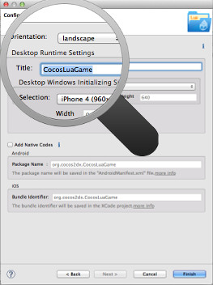
7. 新建项目完成后，就可以在工程管理界面看到新建的工程了。  
  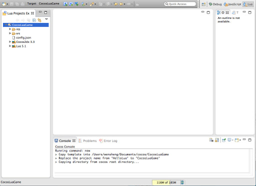
8. 新建的工程里面有一段示例代码，是可以直接运行的。选中工程，然后点击工具栏上的调试按钮，新建的游戏就运行起来了。  
  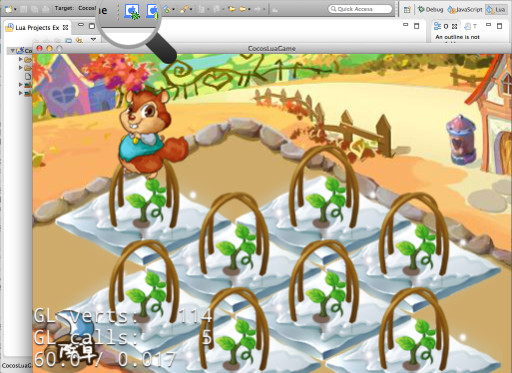

-------------

接下来，就可以[《编写游戏逻辑》](../2-typing-game-logic/zh.md)了。

---------------

小提示
--------

- 新建项目需要在Code IDE中配置好python环境，如果已正确安装python，会自动配置好路径，否则如果出现找不到python的错误，需要手动配置好。
- Working set有什么用？Working set是一种项目分组机制，可以把项目中的项目按需要放入不同的Working set中，以方便管理。  
  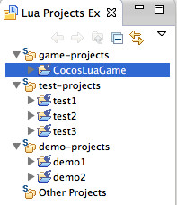
- 如果已有一个Lua工程，但不是Code IDE建立的，可以参考[《如何打开已有的Lua游戏工程(未完成)》]()这个文档。
