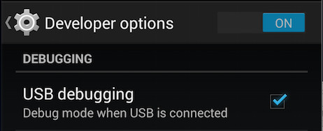
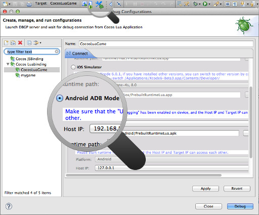

在安卓设备上运行游戏
==========

在模拟器上[《调试游戏代码》](../3-debugging/zh.md)很方便，但不能完全替代在设备上调试代码，像支付,来电等情况必须使用真机来调试一下才行。

------------

1. 在调试前，需要做一些准备工作。首先打开安卓设备的调试模式。  
  
2. 然后把手机通过USB线连接到电脑上，保证电脑可以正确识别出设备。  

        $>adb devices
        List of devices attached 
        0278ac0709e8fdc3	device

3. 然后需要把设备和电脑连接到同一个局域网内，比如手机可以打开WiFi连接到和电脑相通的无线热点上。
4. 有了以上准备就可以开始调试了。点击工具栏上的调试配置按钮。  
  
5. 在要调试的项目的设置页面上，选择"Target Platform"为"Android ADB Mode"，然后就可以点击调试按钮开始调试了。调试平台设置好后，下次直接点击工具栏上的调试按钮就可以开始调试了。

---------------

以这样的方式在设备上运行的程序并不是正式的发布程序，如果想把自己的游戏发给他人来玩需要[《生成游戏安装包》](../5-packaging/to-apk-zh.md)。

小提示
------

* __如何察看电脑已正确设备安卓设备？__在"Android SDK"的"platform-tools"目录有一个叫做"adb"的命令行命令，可以在终端界面进入此目录，然后运行"adb devices"窗口是否已正确识别安卓设备。如果没有的话，可能是设备驱动没有正确安装或设备调试模式没有打开。
* Cocos Lua工程调试时，需要通过网络连接传送调试信息，所以电脑和设备除了USB线缆连接以外，也必须有网络连接。
* Lua游戏在调试时，执行效率比运行时慢，可以使用"运行"模式来察看真实的表现。

[enable android debugging img]: 
[lua debug config img]: 