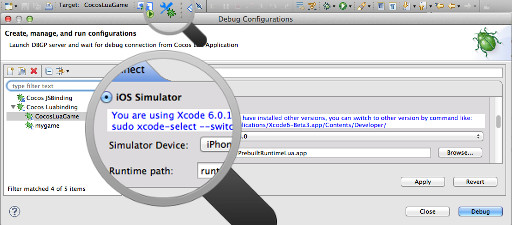
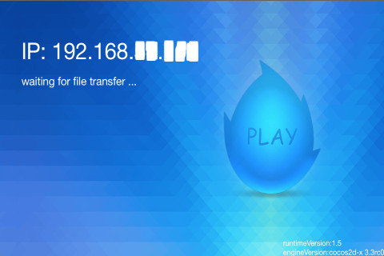
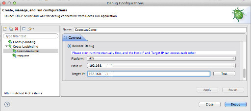

在iOS设备上运行游戏
==========

在模拟器上[《调试游戏代码》](../3-debugging/zh.md)很方便，但不能完全替代在设备上调试代码，像支付,来电等情况必须使用真机来调试一下才行。

如果电脑安装了Xcode，那么可以在ios模拟器上进行调试。

---------------
* 模拟器调试很方便，点击Code IDE工具栏的调试配置按钮，打开调试设置界面，然后选择"Target Platform"为"iOS Simulator"，选定模拟设备，就可以开始调试了。  
  
  
在iOS设备上运行游戏的步骤为：

------------

1. 在调试前，需要把"runtime/ios"目录下的PrebuiltRuntimeLua.ipa安装包[通过itunes安装到设备](http://www.solutionanalysts.com/blog/how-install-ipa-file-iphone-ipod-ipad-using-itunes-mac-windows)。  
2. 然后把设备通过WiFi连接到和电脑相通的无线热点上。
3. 有了以上准备就可以开始调试了。首先在设备上打开刚刚安装的程序。程序会显示等待调试连接。  
  
4. 然后点击Code IDE工具栏的调试配置按钮，打开调试设置界面。选择"Target Platform"为"Remote Debug"，选择平台为iOS，在目标IP的输入框内输入在设备上显示的IP地址，然后就可以点击调试按钮开始调试了。在调试前可以通过"test"按钮测试一下Code IDE和设备是否连通。  
  
5. 因为在iOS设备上调试是通过远程调试来进行的，所以每次调试前，需要先手工启动手机上的程序，然后再通过Code IDE启动调试。  

---------------

以这样的方式在设备上运行的程序并不是正式的发布程序，正式打包请看[《如何申请发布版本的证书和使用Code IDE制作可发布的ipa》](../../function-guides/compiling/package-ios-publish/zh.md)。
 
