##代码编辑器
Cocos Code IDE 2.0.0 是一个基于 IntelliJ IDEA 的跨平台IDE，专门为 Cocos2d-x Lua & JavaScript 开发人员准备，通过IDE 你可以方便的创建游戏工程,编写并且支持在不同平台上调试代码,实时查看代码被改变后的效果，最终直接发布成一个可上架的安装包。

特别告知：IDE 1.x版本的用户们，2.0.0版本并不是在1.2.0版本上的升级，而是把IDE的原有功能从Eclipse框架下迁移到Intellij IDEA的一个版本。

###为什么换框架？

一个字，快。无论是在敲入代码时，立刻出现的提示，还是输入错误语法时，几乎瞬时出现的警告，或者是ALT+ENTER提供的自动修复语意义，都让你在敲代码时的感受特别爽快；再加上IntelliJ IDEA的智能提示，已经在代码编辑这个领域做到极佳的体验。

IDE在1.x版本中代码提示慢，卡顿已经被大家喷出翔，而基于Eclipse框架去开解决这些问题，可改善的空间不大。

此外Google也推出了基于IntelliJ IDEA的Android Studio，对于我们这些在移动设备上混饭吃的厂商，赶紧跟进就是了。

IDE的定位为Cocos2d Lua&JavaScript 调试工具，而代码编辑和调试又是不可分的，所以现在我们会专注提高代码编辑和Debug的开发者体验上；
对于Eclipse的诸多好处，IDE只默默送上一张好人卡，拜拜不送。

###IDE 2.0.0beta开发状态
IDE在1.x版本中提供了这些主要功能：

	1 新建JS/Lua工程，同时支持-x/js/quick/cocos等产品
	2 代码提示,自动完成,资源提示
	3 调试功能，断点设置,步进步出,堆栈,变量查看，包括模拟器和真机。
	4 代码热更新
	5 一键发布，支持mac/iOS/Android/win32/

以及一大堆辅助功能和UI配置等：

	1 添加本地代码
	2 构建自定义模拟器
	3 升级引擎
	4 DS-5调试

从2014.7发布1.0，到2015.2发布1.2，前后7个月时间才把这些功能慢慢累积起来的。而现在我们要把这些模块都移植过来，需要一定时间，也不是所有的功能都在一个版本发布。

###IDE 2.0.0beta版本说明

	1 新建JS/Lua工程，支持-x/js/cocos(已完成)，支持quick（未完成）
	2 代码提示（JS已完成，Lua未完成）,自动完成(Lua未完成)
	3 调试功能，断点设置,步进步出,堆栈,包括模拟器和真机（已完成）。变量查看（未完成）
	4 代码热更新（未完成）
	5 一键发布（未完成）
	6 添加本地代码(已完成)
	7 构建自定义模拟器（已完成）
	8 升级引擎（未完成）
	9 DS-5调试（未完成）

亲爱的开发者们，IDE此次发布2.0.0版本，我们没有提供详细操作文档和以及还有很多功能未完成，感觉很愧疚；请不要放弃我们，我们还有得救。

###下载安装
分为完整安装和插件安装，`推荐插件安装`。

####1 完整安装
[Windows下载链接](http://www.cocos2d-x.org/filedown/cocos-code-ide-2.0.0-beta.exe)

[Mac下载链接](http://www.cocos2d-x.org/filedown/cocos-code-ide-2.0.0-beta.dmg)

点击下载安装即可，此版本的代码提示比插件安装版本稍慢。

####2 插件安装

[下载IntelliJ IDEA Ultimate](https://www.jetbrains.com/idea/download/)

[IDE插件](http://www.cocos2d-x.org/filedown/cocos-intellij-plugin-2.0.0-beta.zip)

需下载IDE插件和IntelliJ IDEA Ultimate（以下简称插件和IntelliJ），下载IntelliJ安装之后，通过IntelliJ界面导入到插件（具体操作看环境配置一节）。
此版本代码提示速度快，配色美观。

特别说明：IntelliJ IDEA Ultimate版本提供30天免费使用，之后要收费（貌似也可以继续免费试用，这对小伙伴们来说不是问题），请支持收费版。

##Windows环境
####环境配置
使用IDE之前，你需要在Window上搭建好开发环境。

主要是Android开发环境和安装Visual Studio。推荐Android NDK r10c以上和Visual Studio 2013。
[Cocos2d-x环境搭建教程汇总](http://cn.cocos2d-x.org/tutorial/lists?id=145)

####加载插件
如果下载了插件，在启动页面上选择Configure->Plugins->Install plugin from disk，选中插件加载；

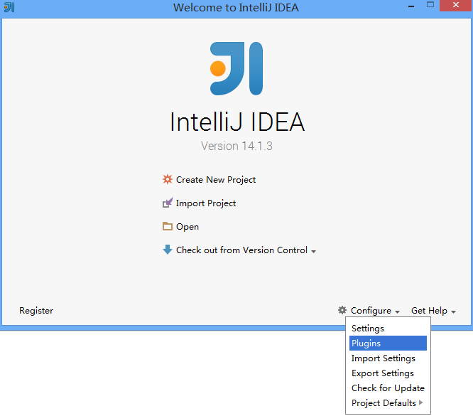

加载成功如下图，点击OK，重启。

另外，从系统菜单File->Settings->Plugins也可以打开此页面

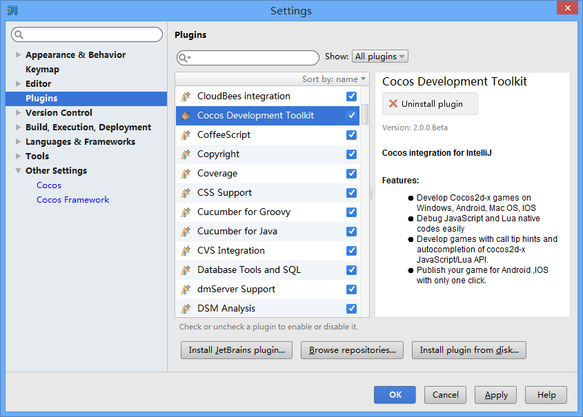

如果要卸载插件，点击Uninsall plugin，然后重启。

####新建工程
启动IDE之后，就可以通过主页面创建工程，点击Create New Project，在弹出页面选择左侧的Cocos，一路点击Next即可（在系统菜单的File->New->Project也可以进入）

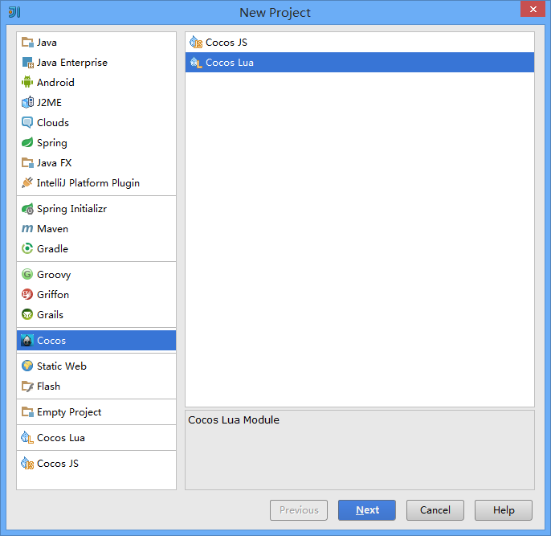

第一次新建工程加载较慢，点击Project显示工程文件

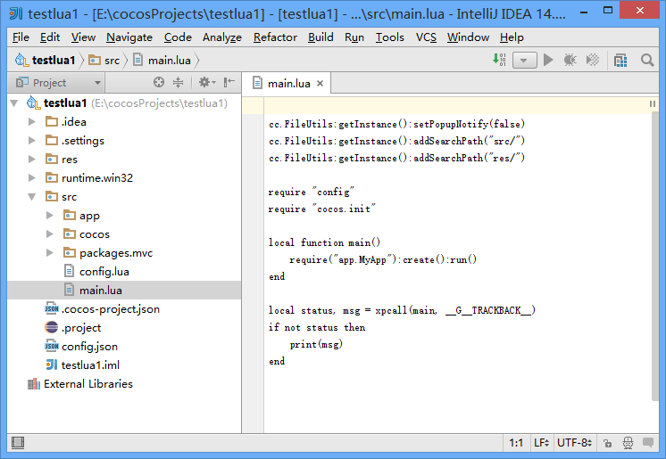

遇到这个提示，点击Yes，然后查看配置引擎了解如何操作。

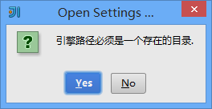

####运行游戏
在Project区域点击右键，在菜单内找到Run ‘工程名’，点击即可

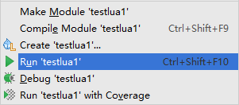

通过系统菜单的Run->Run '工程' 以及工具栏上的绿色三角形按钮也可以执行

第一次运行会要求你配置模拟器，请到对应章节了解

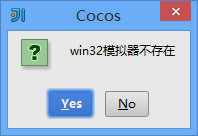

####代码提示
在Project侧边栏中点开Src文件夹，双击打开任意一个Lua或者Js文件，输入一个字符或变量，就可以看到快到飞起的代码提示。

IntelliJ官方对Js提示已经非常好用，我们延用了这个功能；`但是它对Lua的提示并未支持，IDE正在研发此功能`。

####代码调试
在Project区域点击右键，在菜单内找到Debug ‘工程名’，点击即可

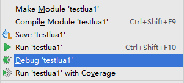

通过系统菜单的Run->Debug '工程' 以及工具栏上的绿色小虫按钮也可以执行

####设置断点
在Project侧边栏中点开Src文件夹，双击打开任意一个Lua或者Js文件，在打开的文件窗口侧边单击，即可设置一个断点

####查看堆栈和内存变量
在调试状态下，设置好断点，就可以进入此页面
点击Debugger窗口进入
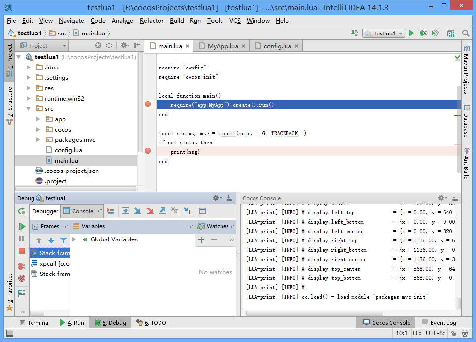

第一次运行会要求你配置模拟器，请到对应章节了解

####配置引擎
此功能从系统菜单File->Settings->Other Settings->Cocos Framework打开

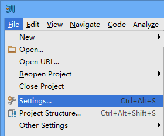

配置了引擎，才能新建工程。如果你需要从创建不同引擎版本的游戏工程，先到这里配置确认，然后去新建工程。

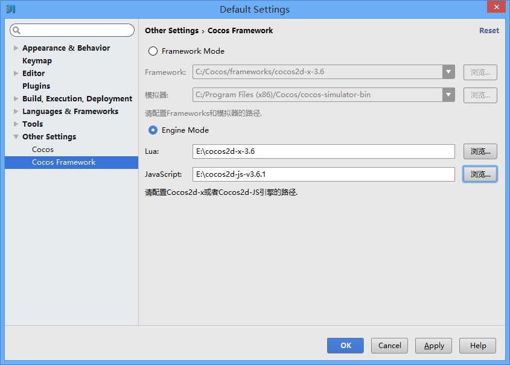

#####Framework Mode
这种模式是通过基于预编译库版本的引擎创建工程，这种方式创建游戏编译速度快，缺点是修改引擎源码不方便，如果你没有修改引擎的需求，推荐用这种方式。

预编译库引擎目录，需要安装Cocos Framework才有：(默认目录如下)

	c:\Cocos\frameworks

#####Engine Mode
	这种模式是通过基于源码的引擎创建工程，用这种方式创建游戏，你可以自由修改引擎，缺点是编译速度较慢。

####配置模拟器
从系统菜单的Run->Edit Configurations进入

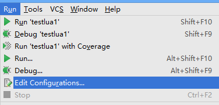

模拟器是运行脚本的一个空壳程序，而空壳程序的具体表现由它所运行的脚本及资源决定。

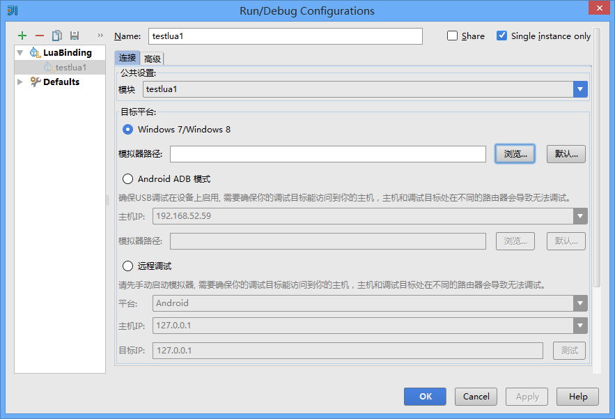

如果你是基于Framework Mode创建的工程，在这个位置有通用的模拟器:(默认路径)

	C:\Program Files (x86)\Cocos\cocos-simulator-bin

如果你是基于Engine Mode创建的工程，在工程根目录下，有一个runtime文件夹，包含了对应的模拟器

	testlua1/runtime

####配置Android开发环境
此功能从系统菜单File->Settings->Other Settings->Cocos打开
如果你需要开发Android游戏，才需要配置这些选项。

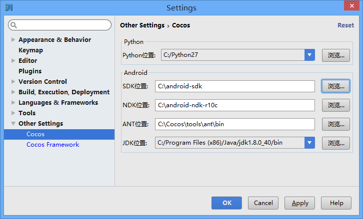

如图是推荐配置，Android SDK版本取决于你需要支持的Android版本。

##Mac环境
####环境配置
使用IDE之前，你需要在Mac上搭建好开发环境。
主要是Android开发环境和安装XCode。推荐Android NDK r10c和XCode6以上。
[Cocos2d-x环境搭建教程汇总](http://cn.cocos2d-x.org/tutorial/lists?id=145)

####加载插件
如果下载了插件，在启动页面上选择Configure->Plugins->Install plugin from disk，选中插件加载；

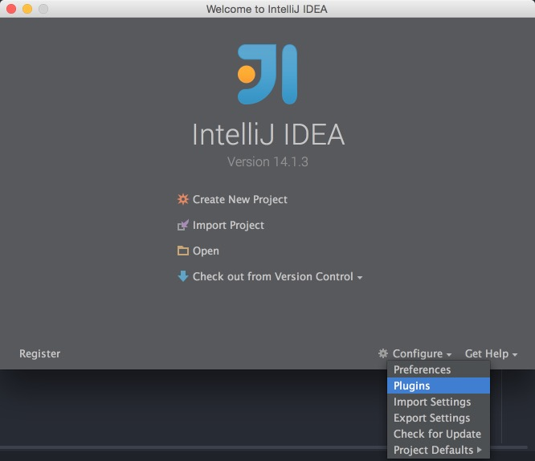

加载成功如下图，点击OK，重启。

另外，从系统菜单IntelliJ IDEA->Preferences->Plugins也可以打开此页面

如果要卸载插件，点击Uninsall plugin，然后重启。

####新建工程
启动IDE之后，就可以通过主页面创建工程，点击Create New Project，在弹出页面选择左侧的Cocos，一路点击Next即可（在系统菜单的File->New->Project也可以进入）

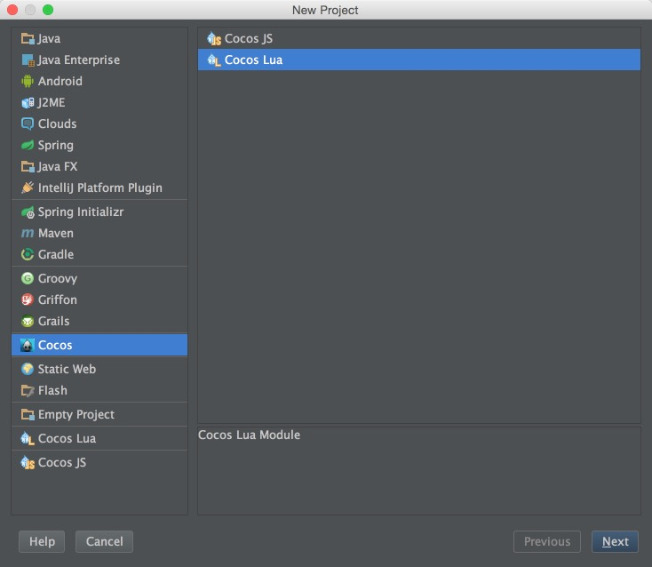

第一次新建工程加载较慢，点击侧边栏Project显示工程文件

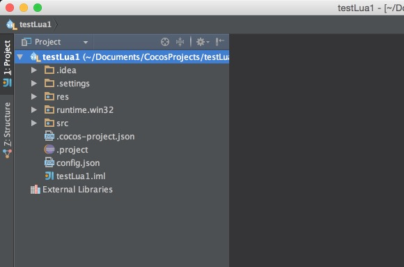

遇到这个提示，点击Yes，然后查看配置引擎了解如何操作。

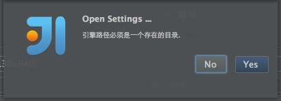

####运行游戏
在Project区域点击右键，在菜单内找到Run ‘工程名’，点击即可

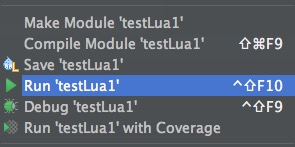

通过系统菜单的Run->Run '工程' 以及工具栏上的绿色三角形按钮也可以执行

第一次运行会要求你配置模拟器，请到对应章节了解

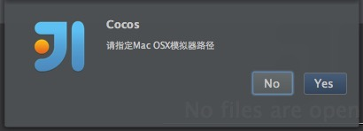

####代码提示
在Project侧边栏中点开Src文件夹，双击打开任意一个Lua或者Js文件，输入一个字符或变量，就可以看到快到飞起的代码提示。

IntelliJ官方对Js提示已经非常好用，我们延用了这个功能；`但是它对Lua的提示并未支持，IDE正在研发此功能`。

####代码调试
在Project区域点击右键，在菜单内找到Debug ‘工程名’，点击即可

通过系统菜单的Run->Debug '工程' 以及工具栏上的绿色小虫按钮也可以执行

####设置断点
在Project侧边栏中点开Src文件夹，双击打开任意一个Lua或者Js文件，在打开的文件窗口侧边单击，即可设置一个断点

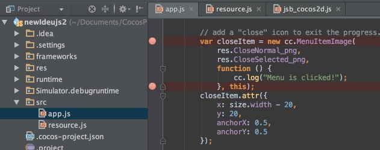

####查看堆栈和内存变量
在调试状态下，设置好断点，就可以进入此页面
点击Debugger窗口进入
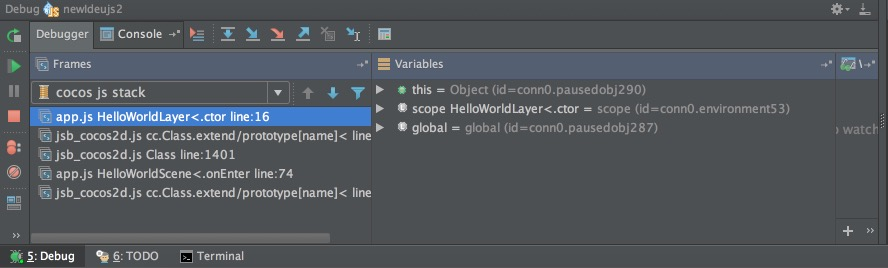

第一次运行会要求你配置模拟器，请到对应章节了解

####配置引擎
此功能从系统菜单IntelliJ IDEA->Preferences->Other Settings->Cocos Framework打开

配置了引擎，才能新建工程。如果你需要从创建不同引擎版本的游戏工程，先到这里配置确认，然后去新建工程。

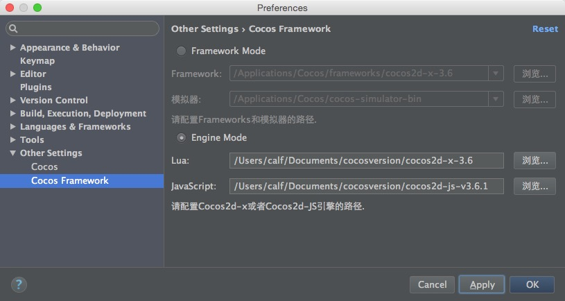

#####Framework Mode
这种模式是通过基于预编译库版本的引擎创建工程，这种方式创建游戏编译速度快，缺点是修改引擎源码不方便，如果你没有修改引擎的需求，推荐用这种方式。

预编译库引擎目录，需要安装Cocos Framework才有：

	/Applications/Cocos/frameworks

#####Engine Mode
	这种模式是通过基于源码的引擎创建工程，用这种方式创建游戏，你可以自由修改引擎，缺点是编译速度较慢。

####配置模拟器
从系统菜单的Run->Edit Configurations进入

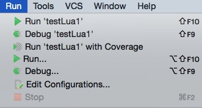

模拟器是运行脚本的一个空壳程序，而空壳程序的具体表现由它所运行的脚本及资源决定。

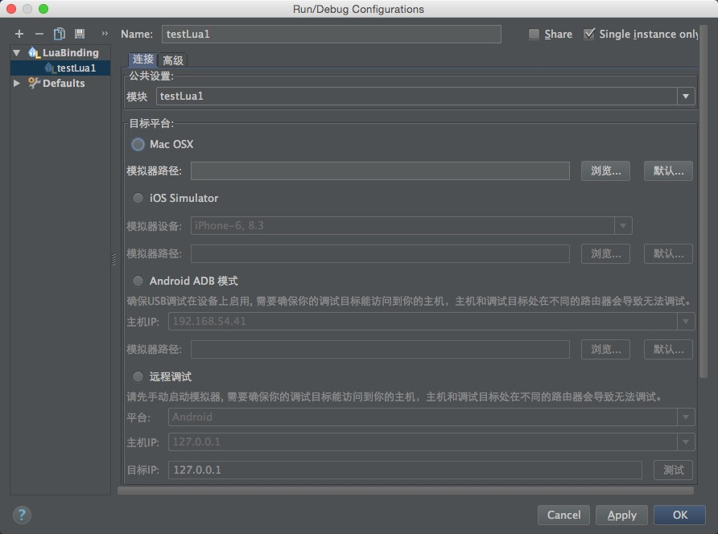

如果你是基于Framework Mode创建的工程，在这个位置有通用的模拟器

	/Applications/Cocos/cocos-simulator-bin

如果你是基于Engine Mode创建的工程，在工程根目录下，有一个runtime文件夹，包含了对应的模拟器

	newideujs1/runtime

####配置Android开发环境
此功能从系统菜单IntelliJ IDEA->Preferences->Other Settings->Cocos打开
如果你需要开发Android游戏，才需要配置这些选项。

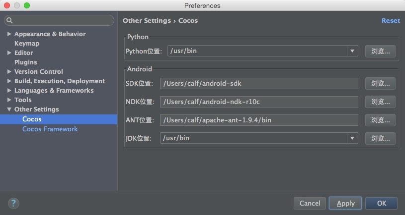

如图是推荐配置，Android SDK版本取决于你需要支持的Android版本。

###FAQ，适用于2.0版本，适用于2.0版本，适用于2.0版本
####安装运行
1 哪个版本的IDE最好用？

	1.x的版本是基于Eclipse的，功能较全，但是使用起来比较卡。2.x的版本是基于IntelliJ的，速度快，缺lua提示和打包功能。
	推荐Lua开发者使用1.2版本；JS开发者使用2.0，下载IntelliJ官方的旗舰版(Ultimate)，然后安装IDE插件。

[IDE1.x版本下载](http://www.cocos2d-x.org/download/version)

[IDE2.0插件](http://www.cocos2d-x.org/filedown/cocos-intellij-plugin-2.0.0-beta.zip)

2 Mac上无法打开IDE。

	Mac系统有一个设置页面，按图所示设置一下。

3 为什么要装旗舰版？

		老版本的智能提示是基于Elipse的提示机制扩展出来的，现在迁移到IntelliJ，要再扩展一次；旗舰版的智能提示已经足够好，而且IntelliJ就靠这个收费，我们在社区版本的基础上开发，赶上它自身的效果很难；所以推荐大家用旗舰版装插件。

4 为什么不直接发布旗舰版IDE？

		因为旗舰版是收费的，我们没有拿到授权去发布这个版本，所以提供了IDE插件，给大家使用。

####模拟器问题

1 模拟器运行崩溃。

	首先请先检查一下配置的模拟器路径，到模拟器目录下双击打开对应的可执行程序（包括ipa/apk，可运行在对应的iOS和Android模拟器
	中或真机中)，如果打开也会崩溃，说明需要重新构建自定义模拟器。右键点击工程，在弹出的菜单中选择Cocos工具->构建自定义模拟器，
	按提示一步步操作，直到模拟器编译成功。

2 模拟器windows版本，点击区域偏移一个菜单的距离。

	这个Bug是glfw造成的，负责模拟器的筒子已经说了，把菜单移到系统菜单里解决，请耐心等待下一个版本。

3 模拟器关闭后，IDE无响应。

	这是一个bug，模拟器关闭时，应该给IDE发一个通知，已经记下来，待解决。
	建议大家通过IDE的Stop Debug按钮来关闭模拟器。

####调试问题
1 js3.6版本无法调试，无法下断点？

	基于cocos2d-js-v3.6引擎创建的工程，调试的时候无法下断点，这是引擎的一个bug。
	请升级到cocos2d-js-v3.6.1解决，十分抱歉。

2 设置断点之后，调试时不会停在断点上？

	首先建议重新编译模拟器，因为某些引擎版本创建的默认模拟器不支持IDE调试。

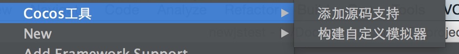

2 怎么调试web版本

	右键点击基于工程中的index.html文件，通过菜单Open In Browser在浏览器中打开js工程进行调试。

3 不能访问端口6050或者6060？

	此端口被其他程序占用，导致IDE无法与模拟器连接；请到工程目录下找到config.json文件夹中的内容。

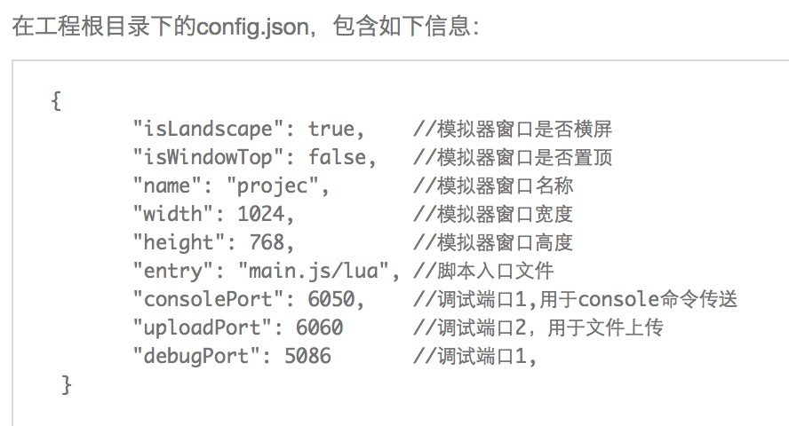

	然后重新开始调试。

4 调试时报错－timeout

	模拟器和IDE之间调试的时候，现在不太稳定，最近我们解决了2个这方面通讯的问题，能缓解这个问题。等我们再查一下看。

5 调试报错－No file found at script/jsb_boot.jsc. Possible missing file

	此报错对调试和开发没有任何影响，属于引擎内部log，请忽略。

####新建导入工程

1 不支持新建Quick工程

	目前还不支持Quick，这块和Quick的负责人正在沟通。你们知道Quick已经整合到Cocos2d-x里面，和lua合并了，所以接下来还要不要单独支持Quick，加一堆配置什么的，还没有最后定下来，有新的进展我们会尽快通知大家。

2 创建工程失败，请查看cocos console，是什么问题？
	a 请确认python已经安装，并能通过命令行调用。

	b 查看IDE的日志窗口，如果有这样的报错

	Read json file null failed, the reason is:null

	请到配置引擎，设置成Engine Mode模式

3 console新建工程，怎么导入工程（包括Studio创建,Cocos Console创建以及Cocos创建的工程）？

	导入功能在下个版本就能提供。不过要注意，console新建工程记得加-t runtime参数(cocos new -l js/lua -t runtime)，才能被IDE支持。
	http://cn.cocos2d-x.org/article/index?type=code-ide&url=/doc/cocos-docs-master/manual/code-ide/install-idea-zh.md

4 导入工程时，config.json文件找不到？

	有些早起版本创建的工程，不支持IDE，需从其他工程中拷贝一个config.json文件过来。

5 导入工程，出现out of memory。

	开发者的资源变增大以后，通过IDE调试可能会出现此问题，把Xmx调大一点再使用。
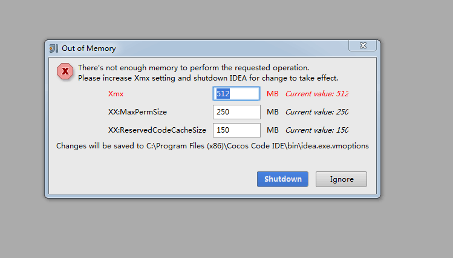

####打包发布

1 如何打包apk／如何打包html5

	目前还不支持打包功能，建议可以用cocos命令，自行打包。
	cocos compile -p android
	cocos compile -p web

####各种问题

1 构建模拟器失败？

	有很多种情况会导致构建模拟器失败，首先打开工程目录下frameworks/runtie-src/proj.win32文件夹，打开 工程名.sln文件，在Visual Studio中编译，查看编译失败的错误提示；根据提示解决问题；在Visual Studio编译成功之后，回到IDE，再次构建自定义模拟器。

2 没有代码提示？

	Lua提示我们还没做，十分抱歉；JS提示要安装IntelliJ旗舰版(ULTIMATE）才有，装了之后，提示速度快到飞起，虽然要收费，对你来说这应该不是问题。

3 IDE就是个垃圾！

	我们非常理解你在使用IDE过程中遇到问题的心情，不过这样的信息不能解决你的麻烦。不如稍微花点时间，把你的操作系统及版本号，IDE版本，以及发生问题的情况描述一下提交上来，如果其他人也许遇到同样的问题，马上就能告诉你解决方案了。实在不行，还有我们官方的技术支持团队给你帮助http://support.cocos.com

4 lua绑定C++代码，怎么用

	不知道你问的是lua怎么绑定C++代码，还是绑定完之后怎么用。前者的话，我记得有篇教程
[链接在这里](http://www.cocos.com/doc/article/index?type=code-ide&url=/doc/cocos-docs-master/manual/code-ide/function-guides/add-3rd-party-lib/binding-custom-class-to-lua/zh.md)

	如果是绑定完成，你只需要在工程上点击右键，使用Cocos工具->构建自定义模拟器，重新编译一个模拟器，就在里面使用你的C++代码了。
