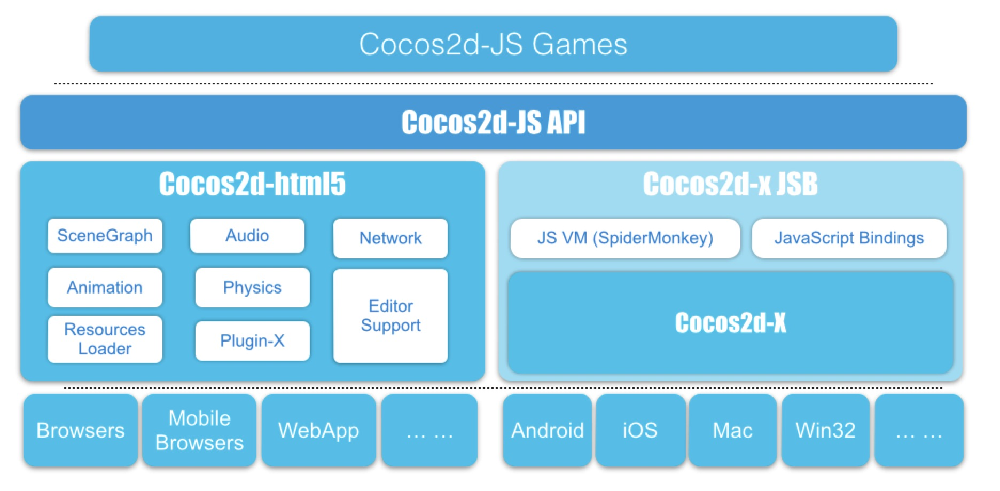

# 2.2 코코스 콘솔로 네이티브 / 브라우져 크로스 플랫폼 게임 만들기 (JSB 개발 환경)

the Cocos Console tool will help you to manager the project creation and publish process.
Cocos2d-JS의 최고 장점은 완벽한 멀티 플랫폼 기술입니다: Cocos2d-JS v3.0에서는 하나의 코드 베이스로 모든 곳에서 정말 실행됩니다. Cocos2d-JS의 첫 버전에서 웹 엔진(Cocos2d-html5)와 네이티브 엔진(Cocos2d-x 자바스크립트 바인딩)을 함께 합쳐서 모든 플랫폼에 통합된 작업흐름을 제공할 수 있습니다. Cocos2d-JS와 함께라면 개발자는 자바스크립트 코드에만 포커스를 맞출 수 있으며 코코스 콘솔 도구가 프로젝트의 생성과 배포 과정을 관리할 수 있도록 도와줄 것입니다.

**Cocos2d-JS v3.0 프레임워크 구조**:



구조 그래프에서 볼 수 있는 것처럼 Cocos2d-JS는 Cocos2d-html5 웹 엔진을 통해 웹 플랫폼을 지원하고 Cocos2d-x와 자바스크립트 바인딩 기술을 베이스로 네이티브 플랫폼을 지원합니다. 자바스크립트 바인딩은 자바스크립트 런타임 엔진인 스파이더몽키와 Cocos2d-x의 API를 자바스크립트 API로 매핑하는 브릿지로서의 함수를 사용합니다. 이미 많은 게임들이 2.x 버전에서 웹과 네이티브 솔루션 모두 사용하는 것으로 확인되었습니다. 그러나 이번에 두 가지 솔루션이 처음으로 진정으로 결합되고 통합되고 단순화된 것입니다. Cocos2d-JS API 레벨은 두 베이스 엔진의 API를 통합하고 단순화하여 개발자를 위해 서로 다른 플랫폼과 서로 다른 디바이스의 차이점을 투명하게 해주는 구조적인 진짜 마법을 보여줍니다. 이 모든 것은 모두 같은 목표를 향합니다: 멀티 플랫폼 개발을 놀랍도록 쉽게 만들자!

**Cocos2d-JS가 지원하는 플랫폼**：

- 데스크탑 브라우져（크롬, 사파리, 파이어폭스, 오페라, IE9+）
- 모바일 브라우져（안드로이드, iOS）
- iOS
- 안드로이드
- 맥 OS X
- 윈도우즈

##1. Cocos2d-JS 엔진 패키지 다운로드

[다운로드 페이지](http://www.cocos2d-x.org/download)로 가셔서 최신 버전을 다운받으세요. 패키지 내용은 다음과 같습니다:

|디렉토리 또는 파일|컨텐츠 설명|
|----------|-------|
|build                  |테스트 케이스와 Moon Warriors 샘플의 Xcode 프로젝트와 비주얼 스튜디오 프로젝트를 포함|
|docs                   |최신 릴리즈 노트와 업그레이드 가이드, 자바스크립트 코딩 스타일 가이드를 포함|
|frameworks             |웹 엔진과 네이티브 엔진을 포함|
| - cocos2d-html5       |웹 엔진|
| - js-bindings         |Cocos2d-x 엔진과 자바스크립트 바인딩|
|samples                |샘플 폴더|
| - js-moonwarriors     |MoonWarriors 샘플 게임|
| - js-tests            |Cocos2d-JS 테스트 케이스|
|templates              |코코스 콘솔을 위한 템플릿|
|tools                  |도구 폴더|
| - bindings-generator  |자동 바인딩 생성 도구|
| - cocos2d-console     |코코스 콘솔 도구|
| - tojs                |자동 자바스크립트 바인딩 설정 파일과 생성 스크립트|
|AUTHORS                |Github 저장소의 모든 컨트리뷰터들을 포함한 만든 이 목록|
|CHANGELOG              |모든 예전 버전의 체인지로그|
|LICENSE                |Cocos2d-JS 라이센스|
|README.md              |Cocos2d-JS 프로젝트 소개|
|setup.py               |코코스 콘솔의 설치 스크립트|

##2. 코코스 콘솔 설치

Cocos2d-JS API의 통합 및 단순화를 언급하기 이전에 한편 다른 플랫폼들의 작업 흐름 또한 통합했습니다. 다음으로 우리는 코코스 콘솔을 통한 프로젝트 생성부터 배포까지를 소개하려고 합니다. 

Please note that you need to re-execute setup.py while you upgrade the engine to make sure it's referencing to the newest engine.
엔진 패키지 다운로드 이후 코코스 콘솔을 설치하기 위해 setup.py(윈도우즈 유저는 먼저 [파이썬 2.7](https://www.python.org/downloads/release/python-278/)를 설치하셔야 합니다)를 실행합니다.
이 스크립트는 `cocos` 커맨드와 모든 의존 환경을 설정합니다. 설치하는 동안 NDK 루트 경로와 안드로이드 컴플레이션을 위한 안드로이드 SDK 경로, 웹 소스 컴플레이션 ANT 경로를 제공해야 합니다. 당신은 최신 엔진으로 업그레이드할 때 setup.py를 재실행할 필요가 있습니다.

설치 팁과 유용한 링크들:

* [파이썬 2.7.6](https://www.python.org/download/releases/2.7.6/)
* [안드로이드 SDK](https://developer.android.com/sdk/index.html?hl=sk)
* [NDK](https://developer.android.com/tools/sdk/ndk/index.html)
* Ant 다운로드와 설치：

    - [Ant 다운로드](http://ant.apache.org/).
    - Ant를 원하는 폴더에 압축을 풉니다.
    - JAVA\_HOME 환경 변수로서 자바 경로를 설정하고, Ant의 압축을 푼 폴더를 ANT\_HOME 환경 변수로 설정합니다. 그리고 ${ANT\_HOME}/bin (유닉스) 또는 %ANT\_HOME%/bin (윈도우즈)를 당신의 시스템 경로에 추가합니다.
    
    ```
    // 예: 터미널에서 실행하거나 .bash_profile에 추가 (맥)
    export ANT_ROOT=/usr/local/ant/bin
    export JAVA_HOME=/usr/local/jdk1.7.0_51
    ```

##3. 프로젝트 생성

코코스 콘솔을 사용하여 프로젝트를 생성하는 방법은 아주 쉽습니다. 설치 이후에 터미널이나 커맨드 라인 도구를 사용하여 프로젝트를 생성할 폴더로 이동하여 `cocos` 명령어를 다음과 같이 실행합니다:

```
cocos new -l js 프로젝트명
```

성공적으로 생성되었다면 프로젝트명 폴더를 찾을 수 있습니다. 이 프로젝트는 모든 플랫폼을 지원하고 배포할 수 있습니다. 새롭게 생성된 폴더의 구조는 엔진 폴더와 다르며 그 리스트는 다음과 같습니다: 

|디렉토리 또는 파일|컨텐츠 설명|
|----------|-------|
|frameworks             |웹 엔진과 네이티브 엔진을 포함|
| - cocos2d-html5       |웹 엔진|
| - js-bindings         |Cocos2d-x 엔진과 자바스크립트 바인딩|
| - runtime-src         |모든 네이티브 플랫폼을 위한 프로젝트 폴더, iOS/맥 OS X/안드로이드/윈도우즈를 포함|
|res                    |프로젝트에서 사용하는 모든 이미지, 오디오, 폰트, 애니메이션을 저장한 프로젝트 리소스 폴더|
|src                    |게임에서 사용하는 모든 자바스크립트 코드를 저장한 프로젝트 스크립트 폴더|
|publish                |릴리즈 모드에서 프로젝트를 배포할 때 생성된 배포 패키지를 포함|
|runtime                |디버그 모드에서 실행 가능한 모든 런타임 패키지를 포함|
|tools                  |도구 폴더|
| - bindings-generator  |자동 바인딩 제네레이터 도구|
| - tojs                |자동 자바스크립트 바인딩 설정 파일과 생성 스크립트|
|index.html             |프로젝트의 메인 웹 페이지로서 웹 서버를 통해 접근할 수 있으며 게임 실행을 보여줍니다|
|main.js                |게임 로직의 진입 스크립트로 초기화 코드를 포함|
|project.json           |프로젝트의 설정 파일, 세부적인 설명은 main.js에서 찾을 수 있습니다|

##4. 빠른 개발 기술


Cocos2d-JS API의 구체적인 부분과 사용법은 이번 챕터에서 다루지 않습니다. 그러나 웹 플랫폼만이 Cocos2d-JS의 유통 채널이 아니라 또한 프로토 타입을 만들고 개발을 촉진하는 개발자를 위한 중요하고 유용한 도구라는 점도 중요한 언급입니다.

그 이유는 개발자들에게 프로토타이핑과 개발을 할 때 다음과 같이 웹 플랫폼을 사용하는 것을 제안할 수 있기 때문입니다:

- 클릭하면 바로 플레이, 컴파일을 기다릴 필요 없이 간단한 페이지 새로고침으로 바뀐 결과를 확인할 수 있습니다.
- 브라우져의 훌륭한 자바스크립트 디버그 도구, [구글 크롬 개발자 도구 소개](https://developer.chrome.com/devtools)를 참조하세요. 이는 개발자가 빠르게 문제점을 찾아서 해결할 수 있도록 도와줍니다. 또한 자바스크립트 코드를 네이티브 IDE에서 디버그하지 않아도 문제점을 해결할 수 있습니다.
- 이런 접근 방식은 자바스크립트 개발자에게 더 적합합니다.

##5. 네이티브 플랫폼 컴플레이션

###5.1 코코스 콘솔

게임을 네이티브 플랫폼으로 배포하거나 테스트하길 원하신다면 웹 플랫폼에서 개바라고 테스트한 후에 선택한 플랫폼으로 프로젝트를 컴파일할 수 있습니다. 다시 코코스 콘솔은 손쉬은 컴플레이션 명령어를 제공합니다: `cocos compile`.

```
// 프로젝트 폴더에서 터미널이나 커맨드 라인 도구를 실행합니다
// -p는 타겟 플랫폼을 지정합니다, web, ios, mac, android, win32 중 하나를 선택하세요
cocos compile -p web|ios|mac|android|win32

// -m 옵션으로 배포 모드를 선택할 수 있습니다: debug 또는 release
// 웹 플랫폼에서 --advanced 옵션을 추가할 수 있으며 이를 통해 클로저 컴파일러의 당신의 자바스크립트 스크립트들을 압축하고 난독화하는 어드밴스드 모드를 사용합니다.
cocos compile -p android -m release
cocos compile -p web -m release --advanced

// 실제 디바이스나 시뮬레이터에서 실행할 때는 컴파일 명령어를 run으로 바꿔주세요
cocos run -p web
cocos run -p ios
```

코코스 콘솔에 대한 상세한 내용은 [코코스 콘솔 문서](http://cocos2d-x.org/wiki/Cocos2d-console)를 참조하세요.

###5.2 IDE를 사용한 프로젝트 컴파일

`frameworks/runtime-src/` 폴더 아래에서 몇가지 플랫폼의 프로젝트 파일을 찾을 수 있습니다:

- proj.ios_mac: iOS와 맥 OS X를 위한 Xcode 프로젝트
- proj.win32：윈도우즈를 위한 비주얼 스튜디오 프로젝트
- proj.android：안드로이드를 위한 이클립스 프로젝트

##6. 프로젝트 배포

###6.1 네이티브 플랫폼 배포

- Mac / Win32

    맥 또는 윈도우즈를 위한 프로젝트에서 아래와 같이 배포 명령어를 실행합니다. 성공적으로 컴플레이션되었다면 `publish` 폴더에서 결과물을 확인할 수 있습니다.

    ```
    cocos compile -p mac|win32 -m release
    ```

- iOS

    iOS를 위한 프로젝트에서 아래와 같이 배포 명령어를 실행합니다. 당신만의 코드 사이닝(code signing identity)를 `--sign-identity` 옵션으로 특정합니다. 성공적으로 컴플레이션되었다면 `publish` 폴더에서 결과물을 확인할 수 있습니다.

    ```
    cocos compile -p ios -m release --sign-identity "iPhone Distribution:xxxxxxxx"
    ```

- 안드로이드
    
    1. `cocos compile -p android -m release --ndk-mode release` 명령어를 실행하여 프로젝트의 apk 파일을 생성합니다.
    2. `publish/` 폴더 아래에서 apk파일을 찾아서 jarsigner 도구를 통해 당신만의 안드로이드 키스토어를 통해 apk를 사인합니다. 세부적인 내용은 [구글 공식 문서](http://developer.android.com/tools/publishing/app-signing.html)를 참조하세요。

###6.2 웹 플랫폼 배포

`cocos compile -p web -m release`를 실행하여 프로젝트를 웹으로 배포하면 `publish/` 폴더 아래에서 결과물을 확인할 수 있습니다. 당신의 웹서버에 개개의 폴더를 배포할 수 있습니다.

앞서 말한 바와 같이 `--advance` 옵션을 배포 명령어에 추가하여 클로저 컴파일러의 확장 압축 모드를 활성화할 수 있습니다. 이는 높은 압축률과 보다 나은 성능이라는 이점이 있지만 코드에 몇가지가 필요합니다. 어드밴스드 모드를 게임에서 사용할 때 문제점에 대한 경험이 있다면 [클로저 컴파일러 어드밴스드 컴플레이션 문서](https://developers.google.com/closure/compiler/docs/api-tutorial3)를 참조하셔서 제안사항과 해결책을 참조하세요.
