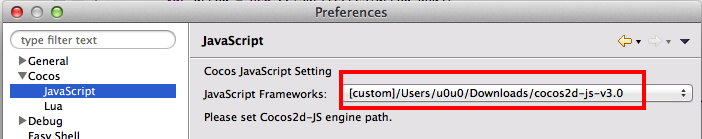
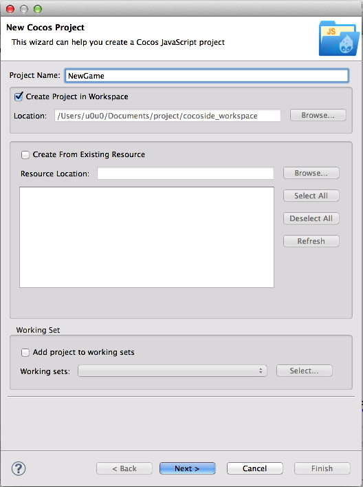
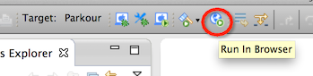
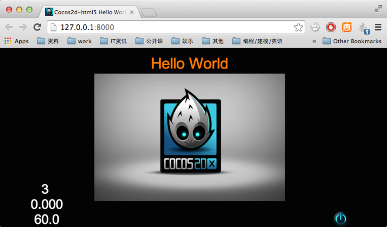

# 3.1 搭建Cocos2d-JS v3.x 开发环境

## 下载所需的软件包

1. 下载 Cocos Code IDE。目前 [Cocos Code IDE](http://cn.cocos2d-x.org/download) 最新发布版本是 1.0.0-RC2。我们为什么 Cocos Code IDE 呢？因为它是 进行Cocos2d-x Lua 和Javascript游戏开发,调试,发布的完整工具组件。它支持Cocos2d-x v3.x, Cocos2d-JS v3.x及以上版本。Cocos Code IDE 提供了很多特性，例如Javascript代码的语法实现,调试,语法高亮以及自动补全,代码调试,一键部署等功能。

2.  从Cocos2d-x的官网下载[Cocos2d-JS v3.0](http://cn.cocos2d-x.org/download/)。下载完成后解压到适当的路径。

> 你可以根据自己的系统(Mac/windwos)选择下载相应版本的Cocos Code IDE。

## 安装&配置Cocos Code IDE

### 安装

以Mac环境为例，下载Mac版的Cocos Code IDE。双击打开已下载的cocos-code-ide-mac64-1.0.0-rc2.dmg文件。如图：
 
 
 
 拖动 Cocos Code IDE 到 Application文件夹进行安装。
 
 安装完成后，打开Cocos Code IDE。

### 配置

打开工具的 Preferences 页，切换到 Cocos/JavaScript 子页面，选择你刚刚下载 Cocos2d-js v3.0 作为 JavaScript Framework。： 

### 创建一个新项目

通过Cocos Code IDE可以创建新项目，点击 File->New->Cocos JavaScript Project 创建一个新的Cocos2d-JS的项目。弹出如下窗口：

点击 finish 完成创建。

### 在浏览器中运行

点击工具栏上的按钮

运行截图：

