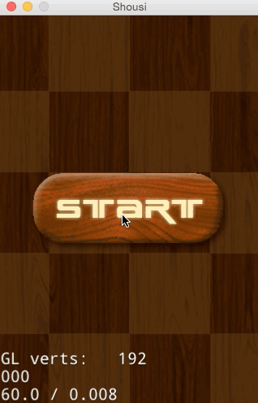
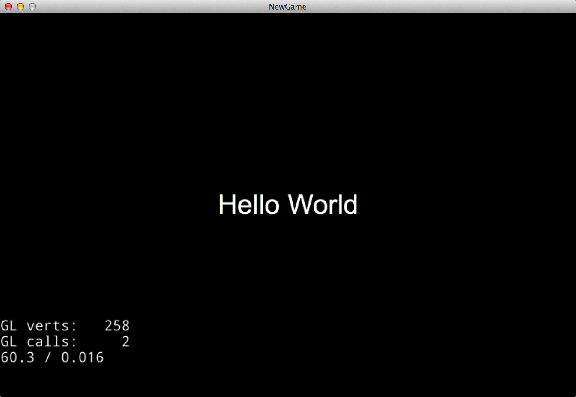

# 3.2 创建第一个场景

##概述

在接下来的章节，我们将学习如何使用Cocos2d-JS制作一个消灭Sushi的小游戏。

游戏运行结果：



[项目资源](./resource.zip)


首先我们来创建游戏的第一个场景。

##基础概念
导演 (Director)是Cocos2d-JS引擎抽象的一个对象，Director是整个Cocos2d-JS引擎的核心，是整个游戏的导航仪，游戏中的一些常用操作就是由Director来控制的，比如OpenGL ES的初始化，场景的转换，游戏暂停继续的控制，世界坐标和GL坐标之间的切换，对节点（游戏元素）的控制等，还有一些游戏数据的保存调用，屏幕尺寸的获取等都要由Director类来管理控制的。

场景（Scene）是Cocos2d-JS引擎抽象的一个对象，用Cocos2d-JS制作游戏就如同拍电影，事实上所有东西都必须放置到一个场景容器中才能最终被显示出来。游戏中我们通常需要构建不同的场景（至少一个），游戏里关卡,界面的切换其实就是一个一个场景的切换，就像在电影中变换舞台或场地一样。

层（Layer）通常包含的是直接在屏幕上呈现的内容，并且可以接受用户的输入事件，包括触摸，加速度计和键盘输入等。每个游戏场景都可以有多个层，每一层都有各自负责的任务，比如专门负责背景显示的层，或显示敌人的层，或UI控件的层等等。

一个场景至少有一个层(Layer)作为孩子节点。

##创建场景

创建一个场景，需要如下步骤：

1. 在src目录下新建一个StartScene.js空文件。
* 打开project.json，在jsList字段加入StartScene.js的路径。
	
	```
	"jsList" : [
        "src/resource.js",
        "src/StartScene.js"
    ]
	```
	**注：**project.json中的jsList用于配置项目所使用的js文件。
* 打开StartScene.js文件，加入下面的场景创建代码。

	```
	var StartLayer = cc.Layer.extend({
		ctor:function () {
			this._super();

			var size = cc.winSize;

        	var helloLabel = new cc.LabelTTF("Hello World", "", 38);
        	helloLabel.x = size.width / 2;
        	helloLabel.y = size.height / 2;
        	this.addChild(helloLabel);

			return true;
		}
	});

	var StartScene = cc.Scene.extend({
		onEnter:function () {
			this._super();
			var layer = new StartLayer();
			this.addChild(layer);
		}
	});
	```
	
	cc.Scene.extend是Cocos2d-JS提供的Scene继承方法，这里重写onEnter方法，并在里面初始化自定义的StartLayer。并将StartLayer作为孩子节点添加到Scene上显示。
	同样的cc.Layer.extend用来继承Layer，在这个层里面，我们用cc.LabelTTF创建一字符串输添加到层。
* 打开main.js，替换初始化场景的类为我们刚创建的StartScene。

	```
	cc.LoaderScene.preload(g_resources, function () {
    	cc.director.runScene(new StartScene());
    }, this);
	```
	Cocos2d-JS通过Director管理场景的运行和切换。上面代码运行了我们的StartScene。

经过上面4个步骤，我们创建了游戏的第一个场景，点击运行可以看到下面的效果。


