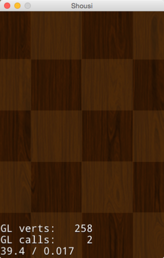
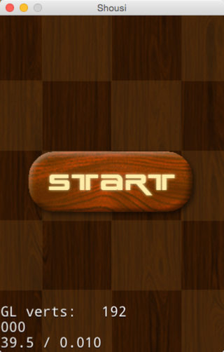

# 3.3 添加内容到场景

##概述

上一节，我们创建了第一个场景，除了显示Hello world的一个文本标签场景还很空，让我们来给消灭Sushi游戏的第一个场景加入背景和开始菜单。

##基础知识

在添加内容到场景前，我们需要先了解一下什么是精灵。

精灵(Sprite),Cocos2d-JS中的精灵（Sprite）和其他游戏引擎中的精灵相似，它可以移动，旋转，缩放，执行动画，并接受其他转换。如果说Scene和Layer代表了宏观的游戏管理元素，那么Sprite则为微观世界提供了丰富灵活的细节表现。从静态的树木,房屋到奔跑的敌人,旋转的落叶，我们都可以通过Sprite来实现。

标签(Label),常用于显示文本。在游戏开发中，文字起了非常重要的作用。游戏介绍,游戏中的提示以及对话等都需要用到文字显示。

菜单(Menu),常用于实现菜单按钮。Menu类驱动一个菜单的主类，它包含描述文字,按钮和触发器的菜单列表。在使用过程中，首先你需要创建一个或多个菜单项(MenuItem)，然后用这些菜单项初始化菜单(Menu)对象，最后将这个初始化了的菜单对象添加到Layer中。

##添加资源文件

将背景图(background.png)和菜单图(start_N.png/start_S.png)添加到项目的res文件夹下。然后编辑resource.js文件，加入资源图片的引用。

```
	var res = {
	    BackGround_png : "res/background.png",
	    Start_N_png : "res/start_N.png",
	    Start_S_png : "res/start_S.png"
	};
```

**注：**Cocos2d-JS项目使用resource.js文件管理资源文件

## 添加背景

1. 开打StartScene.js，在ctor函数中添加下面的代码。

	```
		// add bg
		this.bgSprite = new cc.Sprite(res.BackGround_png);
		this.bgSprite.attr({
			x: size.width / 2,
			y: size.height / 2,
		});
		this.addChild(this.bgSprite, 0);
	```
	
	`new cc.Sprite`创建一个精灵bgSprite，通过bgSprite.attr来设置bgSprite的熟悉，这是Cocos2d-JS 3.x的提供的新方法，更高效简洁。然后addChild到当前Layer。
	
点击运行，可以看到下面的效果。




## 添加开始菜单

1. 在StartScene.js的ctor函数中添加下面的代码

	```
		//add start menu
		var startItem = new cc.MenuItemImage(
				res.Start_N_png,
				res.Start_S_png,
				function () {
					cc.log("Menu is clicked!");
				}, this);
		startItem.attr({
			x: size.width/2,
			y: size.height/2,
			anchorX: 0.5,
			anchorY: 0.5
		});

		var menu = new cc.Menu(startItem);
		menu.x = 0;
		menu.y = 0;
		this.addChild(menu, 1);
	```

	菜单的创建是首先创建一个menuItem对象，然后通过menuItem对象创建menu。最后将menu作为孩子添加到当前的层上。`new cc.MenuItemImage`创建了一个图片创建的菜单项，其中res.Start_N_png是菜单正常图片，res.Start_S_png是选中后的状态，其中匿名函数用于处理菜单的响应事件,Cocos2d-JS中用cc.log打印log信息。通过`new cc.Menu`创建了菜单menu。

运行查看效果，如图：



点击start按钮，Console输出：

```
cocos2d: JS: Menu is clicked!
```