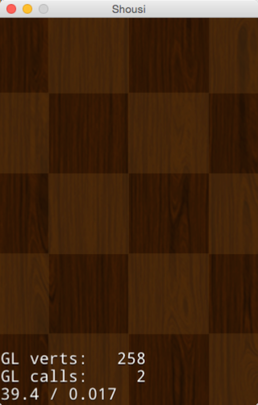
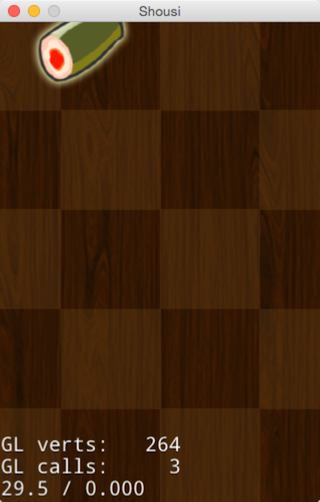
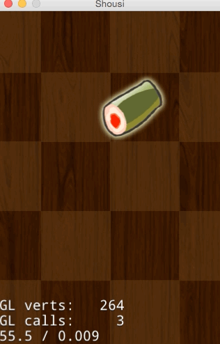
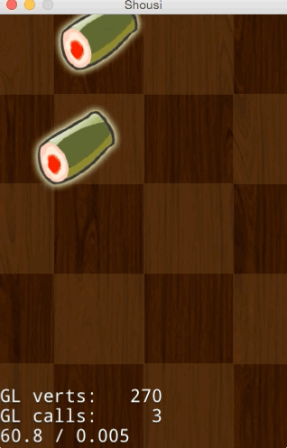

# 3.4 使用动作让场景活起来

##概述
在前面的章节中，我们已经创建了游戏的第一个场景。并介绍了游戏的场景,层和精灵等等构成游戏画面的基本元素的概念，但游戏不仅是由静态画面构成的，更多的时候，游戏是动态效果的呈现，这也是游戏与应用的主要区别。因此，决定一个游戏引擎好坏的重要因素是引擎对动作,动画的支持程度。

在这一节，我将向大家展示如何制作PlayScene，加入掉落的Sushi精灵，学习动画创建。

## 基础知识

动作(Action),Cocos2d-JS中动作是用来描述游戏节点行为规范的一个类，引擎支持很多动作，其中Action类是所有动作的基类，它创建的每个对象都代表一个动作。动作作用于Node，因此每个动作都需要由Node对象来执行，它本身并不是一个能在屏幕中显示的对象。

##创建Play场景

参照前面的创建第一个场景章节，我相信你能很快创建好。

1. 在src目录下新建一个PlayScene.js空文件。
* 打开project.json，在jsList字段加入PlayScene.js的路径。
	
	```
	"jsList" : [
        "src/resource.js",
        "src/StartScene.js",
        "src/PlayScene.js"
    ]
	```
* 打开PlayScene.js文件，加入下面的场景创建代码。

	```
	var PlayLayer = cc.Layer.extend({
		bgSprite:null,
		ctor:function () {
			this._super();

			var size = cc.winSize;

			// add bg
			this.bgSprite = new cc.Sprite(res.BackGround_png);
			this.bgSprite.attr({
				x: size.width / 2,
				y: size.height / 2,
				//scale: 0.5,
				rotation: 180
			});
			this.addChild(this.bgSprite, 0);
			
			return true;
		}
	});

	var PlayScene = cc.Scene.extend({
		onEnter:function () {
			this._super();
			var layer = new PlayLayer();
			this.addChild(layer);
		}
	});
	```
* 运行PlayScene,打开main.js，替换初始化场景的类为我们刚创建的PlayScene。

	```
	cc.LoaderScene.preload(g_resources, function () {
    	cc.director.runScene(new PlayScene());
    }, this);
	```
点击运行可以看到下面的效果。

	

##添加Sushi精灵

上面我们已经创建好了我们的play场景，让我们来加入sushi精灵吧。

添加sushi精灵资源,将sushi_1n.png拷贝到res文件夹，并编辑resource.js文件，加入资源图片的引用

```
	Sushi_png : "res/sushi_1n.png"
```

在PlayLayer的ctor方法后加入addSushi方法。代码如下：

```
addSushi : function() {
		
		var sushi = new cc.Sprite(res.Sushi_png);
		var size = cc.winSize;

		var x = sushi.width/2+size.width/2*cc.random0To1();
		sushi.attr({
			x: x,
			y:size.height - 30
		});
		
		this.addChild(sushi,5);
	}
```
上面代码创建了一个sushi精灵并添加到层上。其中x坐标值随机。`cc.random0To1`返回0~1之间的随机数值。
然后在ctor中调用改方法添加sushi精灵。

```
	this.addSushi();
```

运行效果如图：




##让Sushi精灵动起来
上面的代码，我们创建了静态的sushiSprite，现在我们让它动起来。使它从屏幕顶部下落到屏幕底部。在addSushi方法中添加如下代码：

```
	var dorpAction = cc.MoveTo.create(4, cc.p(sushi.x,-30));
	sushi.runAction(dorpAction);
```

`cc.MoveTo`使一个Node做直线运动，在规定时间内移动到指定位置。最后精灵调用`runAction`方法来运行动画。
`cc.MoveTo`只是Cocos2d-JS中简单动作的一种，还有更多丰富的动作，如`MoveBy`(移动经过某位置)/`JumpTo`(跳动到某位置)/`BezierTo`(贝尔曲线运动到某位置)等持续动作，`FadeIn`(淡入)/`FadeOut`(淡出)/`FadeTo`(渐变)等视觉动作和复合动作`Repeat`(重复执行动作)/`Spawn`(同时执行一批动作)/`Sequence`(使一批动作有序执行)

运行效果如图：



##加入更多下落的SushiSprite

如何有序的产生一批源源不断从屏幕底部下落的Sushi？很简单，我们需要加入个定时器来驱动sushi的产生。

首先，加入个定时器，在PlayLayer的ctor方法后加入update方法，并调用addSushi方法代码如下：

```
	update : function() {
		this.addSushi();
	},
```
在PlayLayer的ctor方法中加入，定时器，代码如下：

```
	this.schedule(this.update,1,16*1024,1);
```
在Cocos2d-JS中提供了三种Schedule，其中：

1. `schedule(callback_fn, interval, repeat, delay)` 根据用户指定的参数定时执行

	里面四个参数对应的含义是：

	callback_fn：调用的方法名

	interval：间隔多久再进行调用

	repeat：重复的次数

	delay：延迟多久再进行调用

2. `scheduleOnce(callback_fn, delay)` 该函数只调用一次callback_fn的方法

3. `scheduleUpdate()`该函数会每一帧都调用，调用的方法名为"update"

上面的代码，创建了一个定时器每隔一秒无限重复执行update函数，添加SushiSprite。当然你也可以使用scheduleUpdate实现。

##移除屏幕底部的SushiSprite

上面代码，不断的往屏幕上添加下落的SushiSprite精灵。大量的精灵显示需要消耗很多资源，而且掉落到屏幕底部的SushiSprite已经完成了它的使命。下面我们就添加代码移除屏幕底部的SushiSprite。

首先，为PlayLayer添加属性，SushiSprites数组容器管理SushiSprite。

```
	SushiSprites:null,
```

在PlayLayer的ctor方法中初始化

```
	this.SushiSprites = [];
```
在addSushi方法中，将新生成的SushiSprite放人数组

```
	this.SushiSprites.push(sushi);
```
添加removeSushi方法，移除屏幕底部的SushiSprite

```
	removeSushi : function() {
		//移除到屏幕底部的sushi
		for (var i = 0; i < this.SushiSprites.length; i++) {
			cc.log("removeSushi.........");
			if(0 == this.SushiSprites[i].y) {
				cc.log("==============remove:"+i);
				this.SushiSprites[i].removeFromParent();
				this.SushiSprites[i] = undefined;
				this.SushiSprites.splice(i,1);
				i= i-1;
			}
		}
	},
```

在update中调用removeSushi方法。

运行效果如图：




