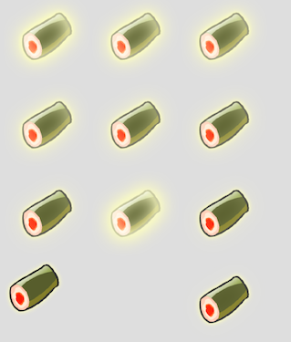
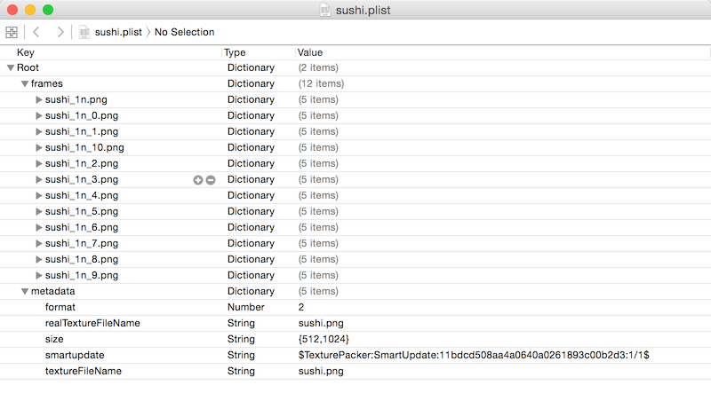
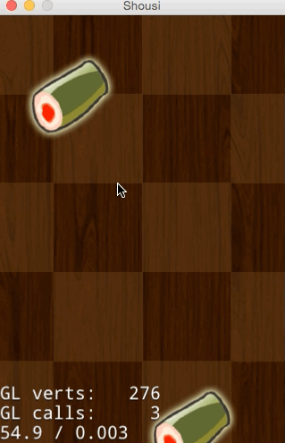
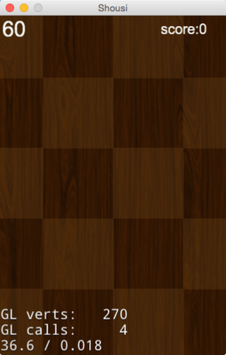

# 3.6 使用事件管理器创建用户交互

##概述

在前面的章节，我们已经创建好了游戏的场景，还缺少玩家交互。常见的是touch事件。在这个小游戏中，我们点击下落的Sushi精灵，消灭Sushi，播放Sushi消失动画。接下来将向大家展示如何添加touch事件和播放帧动画。

##基础知识

###事件
Cocos2d-JS v3.x中事件分发机制进行了重写，事件可以与任意对象绑定，而不是只有Layer才能获取。对象创建自己的事件监听器，然后加入到全局的事件管理器统一管理。

事件监听器有以下几种：

- 触摸事件
- 键盘响应事件
- 鼠标响应事件
- 自定义事件
- 加速计事件

###帧动画
帧动画就是很多张图片的序列图实现轮流播放产生动画效果，帧越多动画越流畅。Cocos2d-JS 提供`cc.spriteFrame`负责管理精灵帧，`cc.Animation`负责管理动画序列，多长时间内播放多少张帧。`cc.Animate`负责管理帧动画的动作创建。

帧动画的创建流程：
将连续的动作图片生成`cc.spriteFrame`对象放入到数组。然后通过`cc.Animation`创建动画序列，再通过`cc.Animate`制作成帧动画的动作。最后由该节点Node播放帧动画。

##SushiSprite响应点击事件

为方便代码管理，在此新建一个SushiSprite.js文件代表SushiSprite。通过使用Cocos2d-JS的类继承方式cc.Sprite.extend实现为精灵类的一个扩展。

1. 新建SushiSprite类，代码如下

	```
		var SushiSprite = cc.Sprite.extend({
			onEnter:function () {
				cc.log("onEnter");
				this._super();
			},
			
			onExit:function () {
				cc.log("onExit");
			}
			
		});
	```

2. 添加触摸事件，代码如下：

	```
	addTouchEventListenser:function(){
		this.touchListener = cc.EventListener.create({
			event: cc.EventListener.TOUCH_ONE_BY_ONE,
			// When "swallow touches" is true, then returning 'true' from the onTouchBegan method will "swallow" the touch event, preventing other listeners from using it.
			swallowTouches: true,
			//onTouchBegan event callback function                      
			onTouchBegan: function (touch, event) { 
				var pos = touch.getLocation();
				var target = event.getCurrentTarget();  
				if ( cc.rectContainsPoint(target.getBoundingBox(),pos)) {
					cc.log("touched")
					return true;
				}
				return false;
			}
		cc.eventManager.addListener(this.touchListener,this);
		});
	```
	上面的代码，首先通过使用`cc.EventListener.create`创建了一个Touch事件监听器touchListener，然后，通过`cc.eventManager.addListener`注册监听器到事件管理器。`cc.EventListener.create`扩展出一个用户监听器。event属性，定义这个监听器监听的类型。swallowTouches属性设置是否吃掉事件，事件被吃掉后不会递给下一层监听器。
	onTouchBegan方法处理触摸点击按下事件，我们在这里可以获取到触摸点的坐标pos。`event.getCurrentTarget()`获取当前事件的接受者，并判断当前的是否点击到了SushiSprite。
	在touch事件中，我们还可以添加`onTouchMoved`/`onTouchEnded`方法监听touch移动和结束的回调。如果onTouchBegan返回false后`onTouchMoved`/`onTouchEnded`不会执行。

	在onTouchBegan方法中获取点击点的坐标pos,然后通过`cc.rectContainsPoint(target.getBoundingBox(),pos)`判断点击的点是否在SushiSprite上。

3.在onEnter方法中调用addTouchEventListenser
4.修改PlayScene.js中的addSushi的SushiSprite创建

	```
	var sushi = new SushiSprite(res.Sushi_png);
	```
运行并点击下落的SushiSprite,在Console输出下面的log

	```
	cocos2d: JS: touched
	```


##SushiSprite消失动画

玩家点击SushiSprite，消灭下落的Sushi，点中的Sushi产生烟雾效果消失。下面我们就来实现SushiSprite消失动画。这里我们采用烟雾帧动画实现。

首先，准备好Sushi消失的帧动画图片。有11张渐变的Sushi消失帧图片，如果我们一张张的从磁盘读取加载，那会非常的慢，还浪费内存资源。还好Cocos2d-JS支持精灵表单(Spritesheet),使用[TexturePacker](www.texturepacker.com)工具,将多张帧图片打包成一张大图和一个.plist文件，通过加载大图可以提高读取速度，并减少内存消耗。Cocos2d-JS中提供了`cc.spriteFrameCache`管理精灵缓存，通过`cc.spriteFrameCache`可以方便的读取打包好的大图到内存，根据.plist文件中的信息可以方便获取到各帧图片。
`cc.spriteFrameCache.getSpriteFrame(str)`方法可以获取到各个精灵帧。

打包的图片和.plist文件如下：





将生成好的资源放到项目的res文件下，并在resource.js文件中添加资源的引用

	```
		var res = {
			...
		    Sushi_plist : "res/sushi.plist",
		    Sushi_png : "res/sushi.png"
		};
	```

首先，在PlayScene.js的ctor方法中加载帧图片到缓存

	```
	cc.spriteFrameCache.addSpriteFrames(res.Sushi_plist);
	```

然后，在SushiSprite.js中添加帧动画的创建代码

	```
		createDisappearAction : function() {
		var frames = [];
		for (var i = 0; i < 11; i++) {
			var str = "sushi_1n_"+i+".png"
			//cc.log(str);
			var frame = cc.spriteFrameCache.getSpriteFrame(str);
			frames.push(frame);
		}

		var animation = new cc.Animation(frames, 0.02);
		var action = new cc.Animate(animation);

		return action;
	},
	```
其次，为SushiSprite添加一个属性disappearAction保存消失动画，

	```
	disappearAction:null,//消失动画
	```

在onEnter方法中创建disappearAction

	```
	onEnter:function () {
		...
		this.disappearAction = this.createDisappearAction();
		this.disappearAction.retain();
	}
	```
上面的`retain()`方法表示对生成的消失动画增加一次引用。Cocos2d-JS遵循Cocos2d-x的内存管理原则。上面创建的disappearAction是自动释放的，我们需要为它增加一次引用，以避免它被回收，在我们不需要的时候对它执行`release()`方法,释放对它的引用。避免内存泄露。
在使用Cocos2d-JS的jsb模式时，部分情况是需要我们手动管理内存的。

在onExit方法中释放对disappearAction的引用

	```
		onExit:function () {
			cc.log("onExit");
			this.disappearAction.release();
			this._super();
		},
	```

最后，在SushiSprite被点中的响应函数onTouchBegan中实现，SushiSprite消失动画的播放，和移除SushiSprite

	```
	onTouchBegan: function (touch, event) { 
		...

		target.removeTouchEventListenser();
						//响应精灵点中
						cc.log("pos.x="+pos.x+",pos.y="+pos.y);

						target.stopAllActions();

						var ac = target.disappearAction;
						var seqAc = cc.Sequence.create( ac, cc.CallFunc.create(function () {
							cc.log("callfun........");
							target.removeFromParent();

						},target) );

		target.runAction(seqAc);

		...
	}
	```
	在SushiSprite被点中后，`removeTouchEventListenser()`移除注册的touch事件避免被再次点击。`stopAllActions()`停止SUshiSprite正在播放的动作。`cc.Sequence`是按序列播放动作。`cc.CallFunc`是Cocos2d-JS中提供的动画播放结束的处理回调。上面的代码通过cc.Sequence创建了Sushi消失的动作序列，并在动作结束后从层上移除SushiSprite.

运行结果：



##添加得分和倒计时标签

这部分很简单，在前面章节就介绍了Label的用法。在PlayScene的ctor方法中添加得分和倒计时标签的代码如下：

	```
		this.scoreLabel = new cc.LabelTTF("score:0", "Arial", 20);
		this.scoreLabel.attr({
			x:size.width / 2 + 100,
			y:size.height - 20
		});
		this.addChild(this.scoreLabel, 5);

		// timeout 60
		this.timeoutLabel = cc.LabelTTF.create("" + this.timeout, "Arial", 30);
		this.timeoutLabel.x = 20;
		this.timeoutLabel.y = size.height - 20;
		this.addChild(this.timeoutLabel, 5);
	```
上面代码分别创建了一个显示得分和计时的标签。

运行结果：



##游戏结束逻辑处理

游戏已经完成得差不多了，还差玩家得分的更新和计时器结束游戏。

### 更新游戏得分

在PlayScene中新建addScore方法

	```
		addScore:function(){
			this.score +=1;
			this.scoreLabel.setString("score:" + this.score);
		}
	```

在SushiSprite的点中响应函数中调用addScore更新得分


###计时器结束游戏

我们需要游戏添加一个结束处理，简单的就是使用倒计时，比如60S倒计时结束游戏。倒计时可以使用前面介绍的Schedule实现。

在PlayScene中添加timer方法

	```
		timer : function() {

		if (this.timeout == 0) {
			//cc.log('游戏结束');
			var gameOver = new cc.LayerColor(cc.color(225,225,225,100));
			var size = cc.winSize;
			var titleLabel = new cc.LabelTTF("Game Over", "Arial", 38);
			titleLabel.attr({
				x:size.width / 2 ,
				y:size.height / 2
			});
			gameOver.addChild(titleLabel, 5);
			var TryAgainItem = new cc.MenuItemFont(
					"Try Again",
					function () {
						cc.log("Menu is clicked!");
						var transition= cc.TransitionFade(1, new PlayScene(),cc.color(255,255,255,255));
						cc.director.runScene(transition);
					}, this);
			TryAgainItem.attr({
				x: size.width/2,
				y: size.height / 2 - 60,
				anchorX: 0.5,
				anchorY: 0.5
			});

			var menu = new cc.Menu(TryAgainItem);
			menu.x = 0;
			menu.y = 0;
			gameOver.addChild(menu, 1);
			this.getParent().addChild(gameOver);
			
			this.unschedule(this.update);
			this.unschedule(this.timer);
			return;
		}

		this.timeout -=1;
		this.timeoutLabel.setString("" + this.timeout);

	},
	```
	上面代码,在60s倒计时结束时，在游戏PlayScene上加入了一个GameOver的提示层，并提供了tryagain菜单。并停止添加SushiSprite和倒计时的Schedule。

然后在PlayScene的ctor方法中实现定时器

	```
		//timer倒计时60
		this.schedule(this.timer,1,this.timeout,1);
	```
	每个1s调用一次timer方法。


游戏完整运行效果图：


##总结

到此，我们的Sushi掉落小游戏就完成了。我们对Cocos2d-JS也有一定的了解，在游戏的制作中，学习了场景，精灵，菜单，标签，动作，事件等，对Cocos2d-JS的API有一定的了解。相信大家不会满足于此，会使用Cocos2d-JS制作出更好的游戏。

[完整代码](./sushi.zip)
