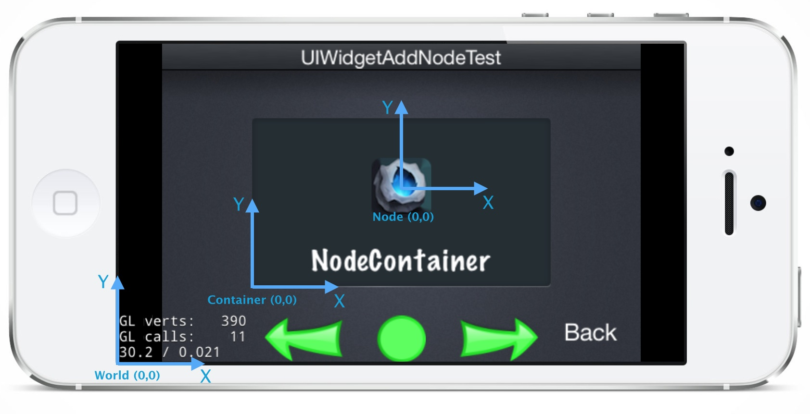
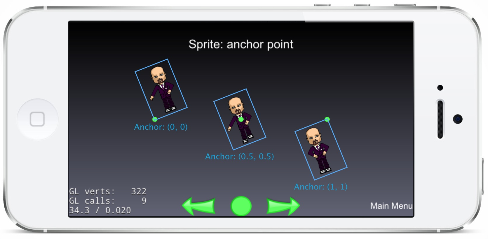

#4.3 Cocos2d-JS坐标系统

## 4.3.1 坐标系概念

在游戏开发过程中，坐标系是至关重要的基础概念之一。可以说，有了坐标系，才有了整个游戏世界，坐标系就是游戏世界的标尺，让游戏元素正确有序得显示在屏幕上而不会分崩离析。下面将介绍几个重要的坐标系概念以及如何理解Cocos2d-JS中的坐标系。

### 标准屏幕坐标系

如果接触过iOS，Android，Windows Phone等系统的应用开发，或使用DOM，CSS开发过Web网页，开发者会非常熟悉所谓的标准屏幕坐标系：左上角为原点，向右为X轴正方向，向下为Y轴正方向。


### Cocos2d坐标系

Cocos2d引擎家族，包括Cocos2d-x，Cocos2d-JS的坐标系统是统一的，但是却不同于前面的屏幕坐标系，而是继承于OpenGL的右手[笛卡尔坐标系](http://zh.wikipedia.org/wiki/%E7%AC%9B%E5%8D%A1%E5%84%BF%E5%9D%90%E6%A0%87%E7%B3%BB)（Right-handed Cartesian Coordinate System）。


Cocos2d坐标系的特点是：

- 原点为屏幕左下角
- 向右为X轴正方向
- 向上为Y轴正方向

所以使用Cocos2d-JS开发游戏请首先注意坐标系与标准屏幕坐标系的区别。

### 世界坐标系和本地坐标系

世界坐标系和本地坐标系的概念是源于Cocos2d体系中的场景树，先简单介绍一下，后面章节中会详细讨论场景树。游戏画面是由一个场景根节点以及场景包含的子结点组成的，节点又可以包含其他子结点，是一个典型的树形结构，如此构建出的节点结构就是场景树。Cocos体系中子结点的定位是基于父节点的位置的，所以子结点的坐标实际上是相对坐标，也就是本地坐标系中的坐标，而其相对于场景的绝对坐标就是世界坐标系中的坐标。



世界坐标系就是游戏根节点场景的坐标系，坐标系原点位于场景左下角。而本地坐标系是节点所处的定位坐标系，这个坐标系的原点位于父节点的坐标位置。如上图所示，场景的本地坐标系等同于世界坐标系，而Container的子结点Node所处的本地坐标系就是Container坐标系，Node坐标系的原点也就是Node在Container坐标系中的位置。


## 4.3.2 锚点（Anchor Point）

锚点是在坐标系之上非常重要的概念，锚点就是给节点定位和[仿射变换](http://zh.wikipedia.org/wiki/%E4%BB%BF%E5%B0%84%E5%8F%98%E6%8D%A2)的基准点。锚点包含X轴和Y轴两个方向上的基准点，两个方向上的取值均为[0, 1]，意味着锚点位置在节点的X轴和Y轴上的占其宽度和长度的比例。锚点的默认值对于`cc.Layer`来说是(0,0)，也就是场景的左下角；对于其他节点类型来说是(0.5,0.5)，即节点的中央。

将一个节点添加到父节点里面时，需要设置其在父节点上的位置，本质上就是设置节点的锚点在父节点坐标系上的位置。节点的显示位置是其位置属性和锚点属性共同作用的结果，位置属性决定锚点位置，锚点属性决定节点相对于锚点位置如何定位。以下图为例：



图中三个精灵的Y轴位置是相同的，左边的精灵锚点为(0,0)，所以锚点位于精灵的左下角；中间的精灵锚点为(0.5,0.5)，所以锚点位于精灵中央；右边的精灵锚点为(1,1)，所以锚点位于精灵右上角。与此同时，图中可以看到，精灵的旋转也是围绕锚点的，所以锚点的作用不仅仅在于定位，它还会影响针对节点做出的旋转，防缩等操作。

### 忽略锚点

`cc.Node`还拥有`ignoreAnchor`属性，默认值为`false`，即使用锚点来定位。若改变其取值为`true`，则在定位和仿射变换时忽略锚点，始终认为锚点为(0,0)。


## 4.3.3 Z值

`cc.Node`包含两种深度值：`vertexZ`和`zIndex`

- `verextZ`是OpenGL坐标系中的Z值，仅在Web端的WebGL模式下或原生平台中有效。
- `zIndex`是Cocos2d-JS本地坐标系中Z值。

在实际开发中开发者只需关注`zIndex`，在本地坐标系中，即在某个节点的所有子结点中，它决定了子节点从前向后的排列以及绘制顺序。`zIndex`值越大，节点越靠前，反之，`zIndex`值越小，节点越靠后，绘制顺序则是从后向前逐个节点进行绘制，这也同样符合右手笛卡尔坐标系的逻辑。


## 4.3.4 给节点定位

在Cocos2d-JS中，有两个非常方便的属性辅助开发者为某个节点定位：

- `cc.winSize`：Cocos2d-JS游戏窗口的大小。
- `cc.visibleRect`：Cocos2d-JS游戏的可视范围矩形以及相对于游戏窗口的位置等信息。

需要注意的是，`cc.winSize`可能不等同于`cc.visibleRect`的大小，这取决于游戏所使用的屏幕适配策略，关于屏幕适配策略的细节我们留待后面章节详细阐述。概括来说，`cc.winSize`等同于游戏场景的大小，但是游戏场景可能并不是完整可见，其可见范围信息被保存在`cc.visibleRect`中。`cc.visibleRect`包含以下属性：

|属性|类型|描述|
|---|----|---|
|topLeft|Point|可视范围左上角坐标|
|topRight|Point|可视范围右上角坐标|
|bottomLeft|Point|可视范围左下角坐标|
|bottomRight|Point|可视范围右下角坐标|
|center|Point|可视范围中心点坐标|
|top|Point|可视范围上方中心点坐标|
|bottom|Point|可视范围下方中心点坐标|
|left|Point|可视范围左边中心点坐标|
|right|Point|可视范围右边中心点坐标|
|width|Number|可视范围的宽度|
|height|Number|可视范围的高度|

举个例子，想要在屏幕上方居中显示一个精灵或文本标签，那么可以使用`cc.pAdd(cc.visibleRect.top, cc.p(0, 50))`来获得上方中心点向下偏移50个像素的位置，这个位置就可以作为精灵的位置，同时将精灵的锚点设置为(0.5,1)，那么这个精灵就会居中显示，并且精灵顶端距离可视范围顶端50个像素。

使用`cc.winSize`配合`cc.visibleRect`可以更有效率得为节点定位，我们强烈推荐配合锚点使用这些属性来给节点进行定位。


## 4.3.5 坐标系转换

`cc.Node`还提供了用于坐标系转换的四个API，这些API可以用于在本地和世界坐标系之间相互转换，以方便用户的计算。这些API在诸如碰撞检测，触点所属权判断等方面非常有用。

1. `convertToNodeSpace`：将世界坐标转换为本地坐标系中的坐标

    比如在判断触点时，由于`cc.eventManager`触点事件回调中的触点都是世界坐标，此时转换为本地坐标就会更容易判断触点是否位于节点内部。

    举个例子，在下图中，node1和node2都是场景根节点的子结点，node1的位置是(20,40)，锚点是(0,0)，node2的位置是(-5,-20)，锚点是(1,1)。

    

    如果想要获得node2在node1本地坐标系中的位置，我们使用下面代码：

    ```
    var point = node1.convertToNodeSpace(node2.getPosition());
    ```

    就可以将node2的世界坐标转换为node1本地坐标系中的坐标，其结果是point等于(-25,-60)。

2. `convertToWorldSpace`：将本地坐标转换为世界坐标系中的坐标

    在做碰撞检测时，时常会遇到不同图层的节点之间需要做碰撞检测，那么节点之间的坐标比较就一定要在同一个坐标系中做比较，此时将不同图层的节点的本地坐标系位置转换为世界坐标就会非常利于比较。

    在下图的例子中（请忽略node2），node1是根节点的子结点，它的位置是(20,40)，锚点是(0,0)。node2\_是node1的子结点，node2\_的位置是(-5,-20)，锚点是(1,1)。

    

    想要获得node1的子结点node2_在世界坐标系中的坐标，我们可以使用下面的代码：

    ```
    var point = node1.convertToWorldSpace(node2_.getPosition());
    ```

    就可以将node2\_在node1本地坐标系中的坐标转换为世界坐标，其结果是point等于(15,20)。

3. `convertToNodeSpaceAR`：将世界坐标转换为本地坐标系中相对于锚点的坐标

4. `convertToWorldSpaceAR`：将本地坐标相对于锚点的位置转换为世界坐标系中的坐标