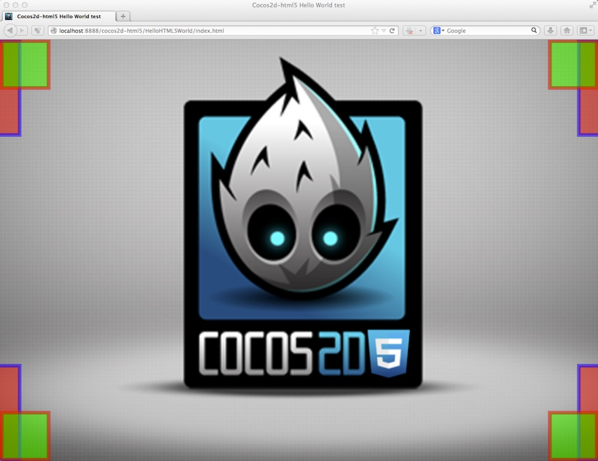

# 4.4 Cocos2d-JS의 해상도 정책

해상도 정책은 당신의 게임씬을 어떠한 디바이스 또는 어떠한 해상도에도 적응하도록 디자인 되어있습니다. Cocos2d-JS가 다른 사용 케이스를 위한 다른 적응(adaptation) 정책을 제공합니다. 해상도 정책은 개발자들이 그들의 게임에만 집중할 수 있도록 도와줍니다. 

Cocos2d-JS는 두 개의 다른 엔진을 가지고 있어서 두 개의 다른 해상도 정책의 임플리멘테이션을 가져야 하지만 같은 API를 공유합니다. 네이티브 엔진의 임플리멘테이션은 훨씬 쉽고 깔끔하므로 이번 챕터의 논의는 웹 엔진의 해상도 정책에 집중될 예정입니다. 네이티브 엔진과 웹 엔진 사이의 차이점은 이번 챕터의 끝에서 다룹니다. 

## 4.4.1 웹 엔진 해상도 정책에 대해서

게임 개발자라면 알고 있는 것처럼, 크로스 플랫폼과 크로스 브라우저 환경에서 좋은 경험을 제공하는 것은 정말로 어렵습니다. 가장 큰 이슈는 다른 크기의 브라우져 창에서 컨텐츠를 제공하는 것입니다. 웹 페이지의 반응형 디자인이 있지만, 캔버스 게임에서는 사용할 수 없습니다. 그래서 Cocos2d-JS의 개발자를 위해 해상도 정책을 소개합니다.

해상도 정책의 주된 목표는 게임의 캔버스를 브라우져 창에 맞게 조정하는 것입니다.


우리가 만든 게임이 다음과 같이 보일 때 정말로 고통스럽습니다.


대부분의 경우 원하는 방식이며, 하얀 여백을 싫어하는 이를 위한 다른 선택지를 가지고 있습니다.

새로운 기능을 얼마나 간단하게 사용할 수 있는지 지금부터 살펴보겠습니다.

## 4.4.2 사용법

####1. 정책(policy) 설정하기

Cocos2d-JS가 당신의 게임을 자동으로 브라우져에 맞춰 조정하기 위해서, `cc.game.onStart` 콜백 ( main.js )이 호출되고 있거나 호출된 후에 다음과 같은 코드를 사용하면 됩니다.

```
cc.view.setDesignResolutionSize(320, 480, cc.RESOLUTION_POLICY.SHOW_ALL);
```

첫번째와 두번째 파라미터는 당신의 게임 코드에서 사용하기 원하는 해상도 정책 나타냅니다. 세번째 파라미터는 사용하길 원하는 해상도 정책입니다. 미리 정의된 5가지 정책이 있으며 세부 내용은 이후에 다루겠습니다.

이미 해상도를 설정했다면 아래와 같은 함수를 사용하여 간단하게 해상도 정책을 바꿀 수 있습니다:

```
cc.view.setResolutionPolicy(cc.RESOLUTION_POLICY.NO_BORDER);
```

네이티브 엔진과는 꽤 다른데, 웹 엔진은 브라우져에서 실행되며, 그래서 게임 창을 제외한 다른 컨텐츠는 캔버스에 보여니다. 또는 화면의 여백을 모두 제외하기 위해 캔버스에 스타일을 추가할 수 있습니다. 그래서 해상도 정책은 기본값에 의한 캔버스의 외부 컨테이너를 조정합니다. 브라우져 창을 조정하길 원한다면, body에 직접 게임 캔버스를 추가할 수도 있습니다:

```
<body>
    <canvas id="gameCanvas"></canvas>
</body>
```

####2. 좋은 점

모든 브라우져의 다양성과 디바이스 크기를 무시할 수 있다는 점에서, 해상도 정책을 사용하는 장점은 분명합니다. 그리고 Cocos2d-JS를 사용 중인 모든 게임에서 화면 크기를 모두 수동으로 설정할 필요가 없다는 점에서 더욱 중요합니다. 만약 해상도 크기를 320 * 480으로 설정한다고 상상해보세요, 게임 로직 코드에서 언제나 그 사이즈를 이용할 수 있습니다. 게임의 우측 상단 모서리는 언제나 (320, 480)이 될 것입니다.(FIXED_WIDTH 모드에서, 세로 크기는 리사이즈될 수 있습니다. 그리고 FIXED_HEIGHT 모드에서는, 가로 크기가 리사이즈될 수 있습니다)

####3. 브라우저 창 리사이즈

새로운 디자인은 브라우져 크기가 바뀌는 동안 자동으로 재조정하는 것을 허락합니다. 예를 들자면, 사용자가 브라우져 크기를 조정할 때, 또는 사용자가 모바일 기기의 방향을 바꾸는 경우를 들 수 있습니다. 기능을 작동시키기 위해서, `cc.view`의 `resizeWithBrowserSize` 함수를 사용합니다:

```
cc.view.resizeWithBrowserSize(true);
```
    
더 유연한 디자인을 가능하게 하기 위해서, `cc.view`에서 새로운 함수를 제공합니다. 리사이즈 이벤트를 감지하기 위해서 콜백 함수인 `setResizeCallback`를 설정할 수 있습니다:

```
cc.view.setResizeCallback(function() {
    // Do things according to your need, 
    // e.g. change a resolution policy when user's mobile orientation changed.
});
```

####4. 전체화면(Fullscreen) API

[Fullscreen API](https://developer.mozilla.org/en-US/docs/Web/Guide/API/DOM/Using_full_screen_mode)는 웹 컨텐츠를 전체 화면에서 표현하는 것을 허용하는 새로운 웹 API입니다.

Cocos2d-JS는 사용자가 더 나은 경험을 할 수 있도록 모바일 브라우져에서 전체화면 모드를 작동할 수 있도록 할 것입니다.(모든 브라우져에서 작동하지는 않습니다)

반면에, 최신 데스크톱 브라우져는 전체화면 API를 지원하며, 사용하길 원한다면 다음과 같이 간단히 사용할 수 있습니다:

전체화면 모드 진입: `cc.screen.requestFullScreen(targetElement, onFullScreenCallback);`

페이지가 전체화면 모드인지 체크: `cc.screen.fullScreen();`

전체화면 모드 종료: `cc.screen.exitFullScreen();`

## 4.4.3 원칙(Principles)

####1. 프레임(Frame)

프레임은 캔버스 요소(element)의 외부 컨테이너로서, 보통 html의 `body` 요소입니다. 그러나 cocos2d 게임이 웹 페이지의 일부에 불과한 경우, 텍스트나 이미지 등 다른 어떤 것이든지 가질 수 있습니다. 그러면 DOM 요소( 프레임 )안으로 캔버스를 포함시킬 수 있으며, 캔버스 요소의 초기 사이즈에 상관 없이 해상도 정책은 프레임에 맞는 크기를 가질 수 있습니다.

브라우져 창에 게임의 화면 크기를 맞추고 싶다면, `body` 요소 아래에 직접 캔버스 요소를 넣어야 합니다.

####2. Cocos2d 컨테이너

프로세스를 개시할 때, cocos2d는 추가적으로 cocos2d 컨테이너 내부로 캔버스를 포함시키며, 컨테이너 스스로 원래 캔버스의 외부 요소 ( 프레임 )에 추가됩니다. 컨테이너는 cc.container로 접근할 수 있으며, 해상도 정책을 돕습니다.

####3. 게임 컨텐츠

게임 컨텐츠는 게임 세계의 좌표를 보여줍니다.

####4. 뷰포트

뷰포트는 캔버스의 픽셀 좌표와 관련된 게임 세계의 사각형(rect)입니다.

####5. 컨테이너 전략(Container Strategy)

컨테이너 전략은 cocos2d 컨테이너의 크기 조정 방법과 게임 캔버스 요소에서 프레임까지를 제어합니다.

####6. 컨텐츠 전략(Content Strategy)

컨텐츠 전략은 뷰포트를 설정하고 컨테이너에 맞춰서 게임 세계의 크기를 어떻게 조정할 것인가를 제어합니다.

## 4.4.4 사전정의된 정책(Predefined policies)

각 캡쳐된 이미지와 같은, 다섯가지 사전정의된 정책을 소개하려고 합니다. 빨간 사각형은 게임 컨텐츠의 모서리, 녹색은 캔버스의 모서리를 나타냅니다.

모든 해상도 정책은 컨테이너 전략과 컨텐츠 전략에 따라 결합하며, 브라킷에서 각 정책의 결합이 보여집니다.

####1. SHOW\_ALL (PROPORTION\_TO\_FRAME + SHOW\_ALL)


Show all 정책은 설정한 원래 가로/세로 비율에 따라 프레임 내의 컨테이너가 최대 크기로 커지며 화면상의 모든 컨텐츠가 보여집니다. 그래서 축에 빈 공간이 나타날 수 있습니다. 그래서 빈 공간에 프레임의 CSS 속성을 통해 배경 이미지나 색상을 설정할 수 있습니다.

####2. NO\_BORDER (EQUAL\_TO\_FRAME + NO\_BORDER)



No border 정책은 전체 프레임을 채우기 위해서 컨테이너의 크기를 비례적으로 조정합니다. 프레임의 가로/세로 비율이 디자인한 비율과 다를 경우, 게임의 어떤 영역은 잘릴 수 있습니다. 한편 no border 정책 아래 `cc.visibleRect`에서 보여지는 게임 세계 캔버스의 뷰포트가 `cc.winSize`보다 작을 수 있습니다.

####3. EXACT\_FIT (EQUAL\_TO\_FRAME + EXACT\_FIT)


Exact fit 정책은 프레임에 정확히 컨테이너를 맞추기 위해서, 게임의 가로/세로 비율이 깨질 수 있습니다.

####4. FIXED\_WIDTH (EQUAL\_TO\_FRAME + FIXED\_WIDTH)


Fixed width 정책은 프레임의 가로에 컨테이너의 가로를 맞추며, 세로 크기는 그에 비례하여 조정됩니다.

SHOW_ALL 정책과 비슷해보이지만, 캔버스 사각형이 모든 프레임을 채우고, 게임 세계의 좌표 시스템과 캔버스 좌표 시스템이 일치합니다.

####5. FIXED\_HEIGHT (EQUAL\_TO\_FRAME + FIXED\_HEIGHT)


Fixed height 정책은 프레임의 세로에 컨테이너의 세로를 맞추며, 가로 크기는 그에 비례하여 조정됩니다.

설명의 경우, 게임의 가로가 게임의 세로보다 크면, FIXED_WIDTH 정책은 SHOW_ALL과 같으며, FIXED_HEIGHT 정책은 NO_BORDER 정책과 같습니다. 그와는 반대로, 게임의 가로가 게임의 세로보다 작으면, FIXED_WIDTH 정책은 NO_BORDER 정책과 같으며, FIXED_HEIGHT 정책은 SHOW_ALL 정책과 같습니다.

## 4.4.5 사용자 정의 해상도정책

####1. 사전 정의된 전략 결합(Combien predefined strategies)

보시는 것처럼, 사전정의된 정책은 사전정의된 전략의 결합으로서 사용되기 때문에 동일한 방식을 사용하실 수 있습니다. 사전정의된 전략의 리스트는 다음과 같습니다:

- 컨테이너 전략(Container strategies)
    - cc.ContainerStrategy.EQUAL\_TO\_FRAME
    - cc.ContainerStrategy.PROPORTION\_TO\_FRAME
    - cc.ContainerStrategy.ORIGINAL\_CONTAINER

- 컨텐츠 전략(Content strategies)
    - cc.ContentStrategy.SHOW\_ALL
    - cc.ContentStrategy.NO\_BORDER
    - cc.ContentStrategy.EXACT\_FIT
    - cc.ContentStrategy.FIXED\_WIDTH
    - cc.ContentStrategy.FIXED\_HEIGHT

해상도 정책을 생성하고 사용하시려면, 다음과 같이 따라해보세요:

```
var policy = new cc.ResolutionPolicy(cc.ContainerStrategy.PROPORTION_TO_FRAME, cc.ContentStrategy.EXACT_FIT);
cc.view.setDesignResolutionSize(320, 480, policy);
```

이 정책은 정확하게 show all 정책과 같습니다.

####2. 당신만의 전략 임플리먼트(Implement your own strategy)

사전정의된 전략으로 만족하지 않는다면, 당신이 필요한 당신만의 전략을 구현할 수 있습니다.

컨테이너 전략 확장:

```
var MyContainerStg = cc.ContainerStrategy.extend({
    preApply: function (view) {
        // This function is called before the process of adaptation,
        // you can remove this function if you don't need
    },

    apply: function (view, designedResolution) {
        // Apply process
    },

    postApply: function (view) {
        // This function is called after the process of adaptation,
        // you can remove this function if you don't need
    }
});
```

컨텐츠 전략 확장:

```
var MyContentStg = cc.ContentStrategy.extend({
    preApply: function (view) {
        // This function is called before the process of adaptation,
        // you can remove this function if you don't need
    },

    apply: function (view, designedResolution) {
        var containerW = cc.canvas.width, containerH = cc.canvas.height;
      
        // The process to calculate the content size, the x axe scale and the y axe scale

        return this._buildResult(containerW, containerH, contentW, contentH, scaleX, scaleY);
    },

    postApply: function (view) {
        // This function is called after the process of adaptation,
        // you can remove this function if you don't need
    }
});
```

마지막으로, 커스텀 전략과 함께 커스텀 정책 생성할 수 있습니다.

```
var policy = new cc.ResolutionPolicy(new MyContainerStg(), new MyContentStg());
cc.view.setDesignResolutionSize(320, 480, policy);
```

새로운 해상도 정책 구현에 대한 더 많은 정보가 필요하시다면, `frameworks/cocos2d-html5/cocos2d/core/platform/CCEGLView.js`에 위치한 CCEGLView.js의 소스 코드를 참조해주세요.

## 4.4.6 네이티브 엔진과 웹 엔진 사이의 차이점

Cocos2d-JS는 Cocos2d-x처럼 같은 해상도 정책을 사용하여 모바일 디바이스의 네이티브 플랫폼에서 게임 컨텐츠는 언제나 모든 게임 창을 점유하거나 전체 화면을 사용합니다.  다른 다른 임플리먼트를 가지고 있기는 하지만 `cc.view`의 같은 API를 공유합니다. 하지만 네이티브 엔진은 사용자 정의 해상도 정책 같은 기능을 지원하지 않습니다. 주요 차이점은 다음과 같습니다:

- 네이티브 엔진은 오직 5개의 사전 정의된 전략만 지원합니다.
- 컨테이너 전략과 컨텐츠 전략은 네이티브 엔진에서는 존재하지 않습니다.
- 개발자는 컨테이너 전략이나 컨텐츠 전략에서 커스텀 해상도 정책을 만들도록 확장할 수 없습니다.
