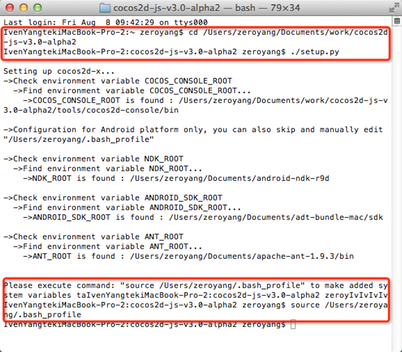
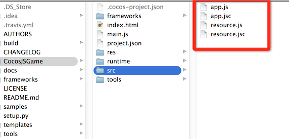
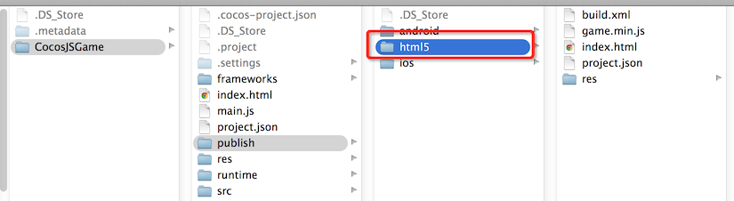
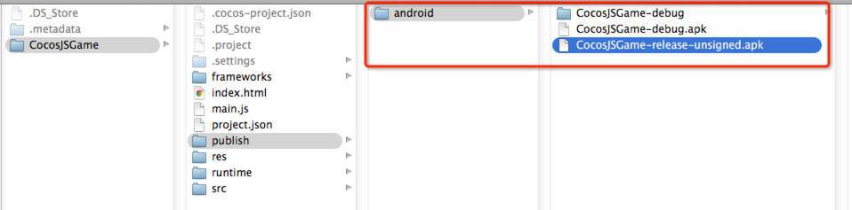
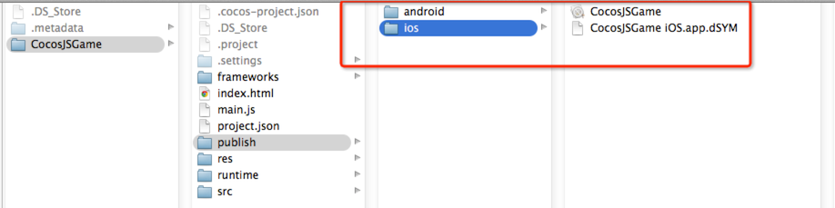
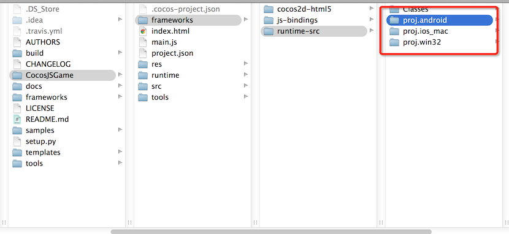

#Cocos2d-JS打包#

Cocos2d-JS是Cocos2d-x的Javascript版本，融合了Cocos2d-html5和Cocos2d-x JSBinding。它支持Cocos2d-x的所有特性并提供更简单易用的Javascript风格API。

使用Cocos2d-JS，我们可以很方便用Javascript来开发游戏。然后通过Cocos2d-x JSBinding的方式可以将游戏编译到手机上。 下面就来介绍如何打包Cocos2d-JS的项目。

##环境要求
* Python 2.7
* iOS & Mac 需要Xcode 5以上支持
* Android需要
	- [Android NDK](https://developer.android.com/tools/sdk/ndk/)
	- [Android SDK](https://developer.android.com/tools/sdk/)
	- [Apache Ant](http://ant.apache.org/)

##环境搭建

* 下载[Cocos2d-JS v3.0 Final](http://www.cocos2d-x.org/filedown/cocos2d-js-v3.0.zip)
* 解压cocos2d-js-v3.0.zip，终端进入cocos2d-js-v3.0目录，执行命令`./setup.py`

* 执行`source /Users/zeroyang/.bash_profile`命令，加入环境变量。

操作步骤如图：



##打包

我们先来创建一个Cocos2d-JS的CocosJSGame工程。然后对CocosJSGame进行打包。

```
IvenYangtekiMacBook-Pro-2:cocos2d-js-v3.0 zeroyang$ cocos new CocosJSGame -l js
Runing command: new
> Copy template into /Users/zeroyang/Documents/work/cocos2d-js-v3.0/CocosJSGame
> Copying cocos2d-html5 files...
> Copying files from template directory...
> Copying directory from cocos root directory...
> Copying cocos2d-x files...
> Rename project name from 'HelloJavascript' to 'CocosJSGame'
> Replace the project name from 'HelloJavascript' to 'CocosJSGame'
> Replace the project package name from 'org.cocos2dx.hellojavascript' to 'org.cocos2dx.hellojavascript'
```

上面的操作创建了一个基于cocos2d-js-v3.0的CocosJSGame工程。下面我们来学习如何打包。

###生成JSC(字节码)

Javascript作为一个解释型的语言，如果直接打包发布，别人可以轻松的拿到Javascript源码。幸好Cocos2d提供了cocos2d-console工具，通过该工具可以将js编译为字节码(jsc)。


`cocos jscompile`命令，将js文件编译为js格式。

例如：

`cocos jscompile -s /Users/zeroyang/Documents/work/cocos2d-js-v3.0-alpha2/CocosJSGame/src -d ./`

参数：

-s：指定js文件夹src
-d：指定生成jsc格式文件存放的目标文件夹

执行上面操作将CocosJSGame/src下的js文件编译为字节码(jsc)。



###web打包

通过`cocos compile`命令可以进行web的打包，将打包好的内容部署到服务器通过web方式发布！

例如：

```
cocos compile -p web -m release
Runing command: compile
Building mode: release
running: '/Users/zeroyang/Documents/apache-ant-1.9.3/bin/ant -f /Users/zeroyang/Documents/cocos/CocosJSGame/publish/html5/build.xml'

Buildfile: /Users/zeroyang/Documents/cocos/CocosJSGame/publish/html5/build.xml

compile:
   [jscomp] Compiling 90 file(s) with 40 extern(s)
   [jscomp] 0 error(s), 0 warning(s)

BUILD SUCCESSFUL
Total time: 10 seconds
```

打包生成发布文件位置：




###JSB模式打包

jsb 模式是通过打包spidermonkey来运行js代码。 我们可以打包到(android, ios, mac, web, win32,
linux)。

通过`cocos compile`命令可以进行jsb模式的打包。 终端执行`cocos compile -h`查看cocos编译命令的帮助。

```
IvenYangtekiMacBook-Pro-2:CocosJSGame zeroyang$ cocos compile -h
usage: cocos compile [-h] [-s SRC_DIR] [-q] [-p PLATFORM] [-m MODE] [-j JOBS]
                     [--ap ANDROID_PLATFORM] [--source-map] [--no-res]

Compiles the current project to binary

optional arguments:
  -h, --help            show this help message and exit
  -s SRC_DIR, --src SRC_DIR
                        project base directory
  -q, --quiet           less output
  -p PLATFORM, --platform PLATFORM
                        select a platform (android, ios, mac, web, win32,
                        linux)
  -m MODE, --mode MODE  Set the compile mode, should be debug|release, default
                        is debug.
  -j JOBS, --jobs JOBS  Allow N jobs at once.

Android Options:
  --ap ANDROID_PLATFORM
                        parameter for android-update.Without the parameter,the
                        script just build dynamic library for project. Valid
                        android-platform are:[10|11|12|13|14|15|16|17|18|19]

Web Options:
  --source-map          Enable source-map

lua/js project arguments:
  --no-res              Package without project resources.
```

常用打包命令如下：

```
 cocos compile -p android -m debug
```

参数：

-p : 指定打包平台(android, ios, mac, web, win32,
                        linux)
                        
-m : 可选参数，指定打包模式  debug|release(默认debug)

####Android

在终端cd进入工程目录，执行如下命令，进行Android的发布版本打包。

```
cocos compile -p android -m release
```

* 执行结果：

```
IvenYangtekiMacBook-Pro-2:CocosJSGame zeroyang$ cocos compile -p android -m release
Runing command: compile
Building mode: release
building native
The Selected NDK toolchain version was 4.8 !

....
....

-release-sign:

-post-build:

release:

BUILD SUCCESSFUL
Total time: 8 seconds
Move apk to /Users/zeroyang/Documents/cocos/CocosJSGame/publish/android
Please input the absolute/relative path of ".keystore" file:
```
* 打包生成文件位置：




* 支持android x86打包

如果要支持android x86打包，需修改`CocosJSGame/frameworks/runtime-src/proj.android/jni/Application.mk`文件，加入APP_ABI定义，告诉NDK这个APK支持多少芯片架构。 如下声明表明可以在arm或x86架构的设备上安装。

```
APP_ABI := armeabi x86
```
编译时将会编译生成arm和x86的指令集，并最终打包到一个apk!

####iOS

在终端cd进入工程目录，执行如下命令，进行iOS的发布版本打包。

```
cocos compile -p ios -m release
```

* 执行结果：

```
IvenYangtekiMacBook-Pro-2:CocosJSGame zeroyang$ cocos compile -p ios -m release
Runing command: compile
Building mode: release
building
running: 'xcodebuild -project "/Users/zeroyang/Documents/cocos/CocosJSGame/frameworks/runtime-src/proj.ios_mac/CocosJSGame.xcodeproj" -configuration Release -target "CocosJSGame iOS" -sdk iphonesimulator -arch i386 CONFIGURATION_BUILD_DIR=/Users/zeroyang/Documents/cocos/CocosJSGame/publish/ios'

...
...


** BUILD SUCCEEDED **

build succeeded.
```
* 打包生成文件位置：




**注意： iOS暂不支持打包成ipa.**


##其他打包方式

- Cocos2d-JS工程下的各平台项目文件：




我们可以使用各自平台支持的IDE打开项目进行打包。


###使用Cocos Code IDE 进行打包

- 详见[Cocos Code IDE入门指南](http://cn.cocos2d-x.org/article/index?type=cocos2d-x&url=/doc/cocos2d-x-ch/manual/studio/cocos-code-ide/getting-started/zh.md)


