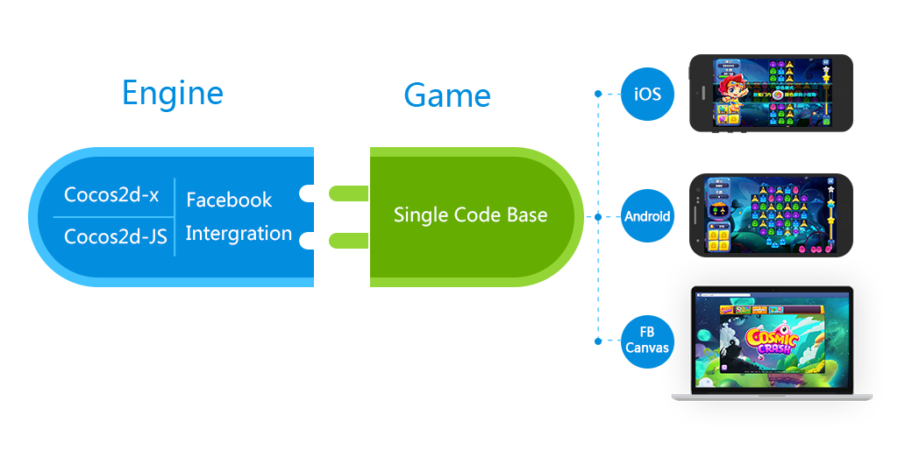

# Cocos2d-x with Facebook

Cocos2d-x's built-in support for Facebook's platform provides a comprehensive collection of Facebook's social features, giving your players the ability to share content with their friends and allowing you to create a personal, social gaming experience. With this addition, you can build cross-platform games by sharing a single code base and integrate Facebook features without importing additional frameworks or SDKs.

## Cocos2d-JS

Cocos2d-JS is Cocos2d-x engine's JavaScript version. It supports full Cocos2d-x functionality with a set of simplified JavaScript friendly APIs. Cocos2d-JS and its built-in Facebook support provides a consistent "Code once, run everywhere" development experience. With one single JavaScript code base, you'll be able to deploy socially integrated gaming experiences to your players, cross the key gaming platforms of Web, Android and iOS.

In addition to providing a base set of Facebook features that are invoked consistently across platforms, it also offers support for Facebook features that are unique to a particular platform (e.g. payments on Facebook Canvas). This will allow you to keep your code clean, using a simple, consistent model for everything your app can do on Facebook.

## Cocos2d-x (C++ and Lua)

The C++ and Lua versions of Cocos2d-x engine are widely adopted by mobile developers to build their mobile games cross Android and iOS by sharing a single code base. The built-in Facebook support further extends the same "Code once, run everywhere" development experience by providing Facebook mobile platform features across Android and iOS.

At the current stage, Facebook support in Cocos2d-x (C++ and Lua) is still under beta and we are still doing more iterations based on developers' feedback.

## Getting started 

### Cocos2d-JS

- Step 1: Before coding with Facebook integration in Cocos2d-JS, you may need to first learn the basic knowledge about Cocos2d-JS architecture and the workflow of Cocos2d-JS development. Please read the doc [Cocos2d-JS cross platform development tutorial](http://cocos2d-x.org/docs/manual/framework/cocos2d-js/2-working-environment-and-workflow/2-2-cross-native-browser-game-with-cocos-console/en).

- Step 2: Follow the docs below to learn how to setup Facebook integration in Cocos2d-JS for different platforms:

    - [Facebook integration instruction for Cocos2d-JS on Android](facebook-sdk-on-android/en.md)
    - [Facebook integration instruction for Cocos2d-JS on iOS](facebook-sdk-on-ios/en.md)
    - [Facebook integration instruction for Cocos2d-JS on Web](facebook-sdk-on-web/en.md)

- Step 3: Build our sample app to learn [How to integrate with Facebook - sample app](facebook-test-case/en.md)

- Step 4: Learn all the supported Facebook APIs and details in [Facebook API Reference for Cocos2d-JS](api-reference/en.md)

### Cocos2d-x (C++ and Lua)

At the current stage, the documentation of Cocos2d-x (C++ and Lua) is still under beta and we are improving it. For now, please visit [Facebook integration instruction for Cocos2d-x](http://cocos2d-x.org/wiki/Facebook_Support_for_Cocos2d-x_Beta) to learn more details.

## Report bugs or need help?

Please visit our [Online forum](http://discuss.cocos2d-x.org/category/cocos2d-x)

## Related resources

- General
    - [Cocos2d-x website](http://cocos2d-x.org/)
    - [Cocos2d-x download page](http://www.cocos2d-x.org/download)

- Cocos2d-JS
    - [Cocos2d-JS introduction](http://cocos2d-x.org/docs/manual/framework/html5/en)
    - [Cocos2d-JS v3.1 release note](http://cocos2d-x.org/news/363)
    - [Cocos2d-JS cross platform development tutorial](http://cocos2d-x.org/docs/manual/framework/cocos2d-js/2-working-environment-and-workflow/2-2-cross-native-browser-game-with-cocos-console/en)
    - [Facebook API Reference for Cocos2d-JS](api-reference/en.md)
    - [How to integrate with Facebook - sample app](facebook-test-case/en.md)
    - [Facebook integration instruction for Cocos2d-JS on Android](facebook-sdk-on-android/en.md)
    - [Facebook integration instruction for Cocos2d-JS on iOS](facebook-sdk-on-ios/en.md)
    - [Facebook integration instruction for Cocos2d-JS on Web](facebook-sdk-on-web/en.md)

- Cocos2d-x
    - [Cocos2d-x introduction](http://cocos2d-x.org/wiki/Cocos2d-x)
    - [Cocos2d-x v3.3rc0 release note](http://cocos2d-x.org/news/362)
    - [Facebook integration instruction for Cocos2d-x](http://cocos2d-x.org/wiki/Facebook_Support_for_Cocos2d-x_Beta)
