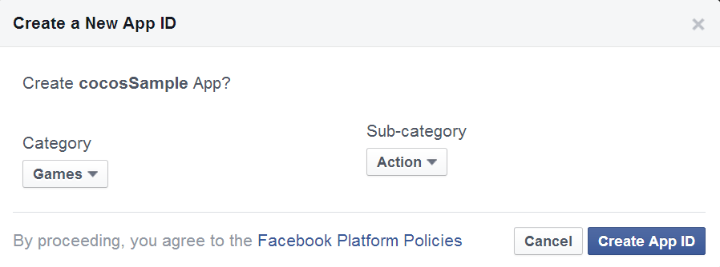

#Integrate the Facebook SDK Alpha for Cocos2d-JS on Android

This document will walk you through the integration of Facebook SDK Alpha for Cocos2d-JS, from creating app, configuring SDK to the apk packing. 

**Notice**: Facebook SDK Alpha for Cocos2d-JS can only work with Cocos2d-JS v3.0 RC2 and later versions. 

##Create an application on Facebook


Click Apps->Create a New app at [Facebook Developers Page](https://developers.facebook.com/), choose Android platform, enter the app name and create your own app.




Now we can see its App ID at the dashboard page.


At the app's Setting page, click "add platform", choose "Android", and enter the app's package name, MainActivity's class name and key hash.


You need keytool provided by JDK to generate key hash.

On Mac OS X:
```
keytool -exportcert -alias <RELEASE_KEY_ALIAS> -keystore <RELEASE_KEY_PATH> | openssl sha1 -binary | openssl base64
```

On Windows：
```
keytool -exportcert -alias <RELEASE_KEY_ALIAS> -keystore <RELEASE_KEY_PATH> | openssl sha1 -binary | openssl base64
```

You need to type in the password you create with key.

Now you are finished creating Facebook App.


##Add Facebook SDK Alpha to A Cocos2d-JS Project

Use Cocos command line tool to great a js project, and you need to make a few modifications to the Android project before you can use Facebook SDK Alpha in js code.

**step1**: Add app name and app id to `frameworks/runtime-src/proj.android/res/values/strings.xml`:

```
<string name="app_name">cocos sample</string>
<string name="app_id">1450063488603945</string>
```

**step2**: Add the following informations to `frameworks/runtime-src/proj.android/AndroidManifest.xml`:

```
<meta-data android:name="com.facebook.sdk.ApplicationId" android:value="@string/app_id" />
<meta-data android:name="PluginUser" android:value="UserFacebook" />
<meta-data android:name="PluginShare" android:value="ShareFacebook" />

<activity android:name="com.facebook.LoginActivity" />
<provider android:authorities="com.facebook.app.NativeAppCallContentProvider1450063488603945"
          android:name="com.facebook.NativeAppCallContentProvider"
          android:exported="true"/>
<receiver android:name="org.cocos2dx.plugin.ShareFacebookBroadcastReceiver">
    <intent-filter>
        <action android:name="com.facebook.platform.AppCallResultBroadcast" />
    </intent-filter>
</receiver>
```

**step3**: Add Plugin-x link lib to `frameworks/runtime-src/proj.android/jni/Android.mk`:

```
LOCAL_WHOLE_STATIC_LIBRARIES += jsb_pluginx_static
$(call import-module,cocos2d-x/plugin/jsbindings)
```

**step4**: Add to `frameworks/runtime-src/proj.android/jni/hellojavascript/main.cpp`:

```
#include "PluginJniHelper.h"
void cocos_android_app_init (JNIEnv* env, jobject thiz) {
    LOGD("cocos_android_app_init");
    AppDelegate *pAppDelegate = new AppDelegate();
    JavaVM* vm;
    env->GetJavaVM(&vm);
    PluginJniHelper::setJavaVM(vm);
}
```

**step5**: Add to `frameworks/runtime-src/proj.android/classes/AppDelegate.cpp`:

```
#if (CC_TARGET_PLATFORM == CC_PLATFORM_ANDROID)
#include "jsb_cocos2dx_pluginx_auto.hpp"
#include "jsb_pluginx_extension_registration.h"
#endif

bool AppDelegate::applicationDidFinishLaunching()
{
	//...
#if (CC_TARGET_PLATFORM == CC_PLATFORM_ANDROID)
    sc->addRegisterCallback(register_all_pluginx_protocols);
    sc->addRegisterCallback(register_pluginx_js_extensions);
#endif
	//...
}
```

**step6**: Add to `copy_resources` section of `frameworks/runtime-src/proj.android/build-cg.json`:

```
{
    "from": "../../js-bindings/cocos2d-x/plugin/jsbindings/script", 
    "to": ""
},
{
    "from": "../../js-bindings/cocos2d-x/plugin/protocols/proj.android/src", 
    "to": "../src"
},
{
    "from": "../../js-bindings/cocos2d-x/plugin/plugins/facebook/proj.android/src", 
    "to": "../src"
}, 
{
    "from": "../../js-bindings/cocos2d-x/plugin/plugins/facebook/proj.android/sdk", 
    "to": "../libs"
}
```

**step7**: Add the following code to `frameworks/runtime-src/proj.android/project.properties`:

```
android.library.reference.2=../../js-bindings/cocos2d-x/plugin/plugins/facebook/proj.android/DependProject
```

**step8**: Add the following code to `frameworks/runtime-src/proj.android/src/org/cocos2dx/javascript/AppActivity.java`:

```
import org.cocos2dx.plugin.PluginWrapper;
import com.facebook.Session;
import android.content.Intent;
import android.os.Bundle;

public class AppActivity extends Cocos2dxActivity {

	//...

	@Override
	public Cocos2dxGLSurfaceView onCreateView() {
        Cocos2dxGLSurfaceView glSurfaceView = new Cocos2dxGLSurfaceView(this);
        glSurfaceView.setEGLConfigChooser(5, 6, 5, 0, 16, 8);
        PluginWrapper.init(this);
        PluginWrapper.setGLSurfaceView(glSurfaceView);

        return glSurfaceView;
    }
	
	@Override
	public void onActivityResult(int requestCode, int resultCode, Intent data) {
	    super.onActivityResult(requestCode, resultCode, data);
	    Session.getActiveSession().onActivityResult(this, requestCode, resultCode, data);
	}
	
	@Override
	public void onSaveInstanceState(Bundle outState) {
	    super.onSaveInstanceState(outState);
	    Session session = Session.getActiveSession();
	    Session.saveSession(session, outState);
	}

	//...
}
```

And now we are finished with the project configuration and ready to use the Facebook SDK Alpha to write Facebook-supportive apps.

## How to Use Facebook SDK Alpha

About how to use Facebook API please reference to [Facebook SDK Alpha for Cocos2d-JS](../api-reference/en.md)

## Package your project into apk

You can use Cocos2d-JS built in tool: Cocos Console to package your project to an apk file, type the following command in terminal or command line under your project folder:

```
cocos compile -p android
```

You can have more details in [Cocos Console Document](http://www.cocos2d-x.org/docs/manual/framework/html5/v2/cocos-console/en)
