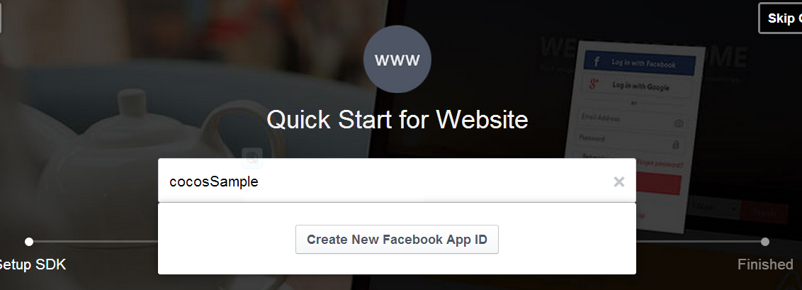
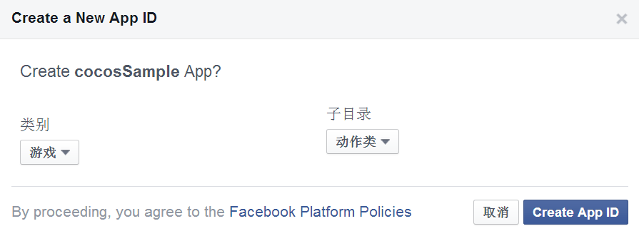
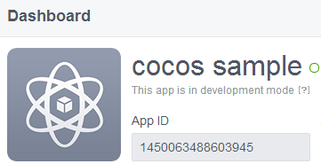
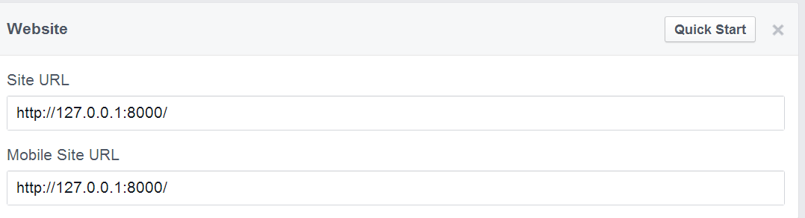

#Web平台上如何配置Facebook平台集成

Web端除了直接使用Facebook提供的Javascript SDK外，Cocos2d-JS也提供了Facebook平台支持。
使用Cocos2d-JS的Facebook平台支持可以使你的游戏无缝的衔接Android以及iOS平台，你的所有Facebook功能模块可以不修改一行代码就直接运行，使得一份代码能够完整的运行在不同的平台之上。

## 1. 在Facebook上创建应用

在[Facebook开发者页面](https://developers.facebook.com/)点击Apps->Add a New app, 选择 网址 平台， 输入应用名，创建自己的新应用。




然后在新创建的app的dashboard页面我们就可以看到它的App ID了。



在app的Settings页面点击add platform,选择"Website", 如果使用的是cocos命令运行web程序那么可以填上如下地址：



具体细节请参考Facebook官方文档：[Getting Started with Canvas](http://developers.facebook.com/docs/games/canvas/)。

## 2. 在页面中引入Facebook support

可以有两种方式引入Facebook support

- 开发者可以在`frameworks/cocos2d-html5/extenrnal`文件夹下找到所有的Facebook support的依赖文件，使用下面的代码完成手动加载Facebook support（注意JS文件顺序）：

```
cc.loader.loadJs("", [
    "external/pluginx/platform/facebook_sdk.js",
    "external/pluginx/platform/facebook.js"
], function(){
    //do something
});
```

- 或者也直接在`project.json`文件内`modules`字段里增加`plugin-facebook`，引擎将会自动加载文件，但是这样可能会造成游戏初始化速度变慢，请大家根据自己实际情况做取舍。

## 3. 配置Facebook support参数

在`project.json`文件内增加`plugin`字段,其中`appid`属性需要添加Facebook提供的应用id：

```
{
    "module" : ["cocos2d", "pluginx", "plugin-facebook"],
    "plugin" : {
        "facebook": {
            "appId" : "", 
            "xfbml" : true,
            "version" : "v2.0"
        }
    }
}
```

更多细节请参考：[Quickstart: Facebook SDK for JavaScript](http://developers.facebook.com/docs/javascript/quickstart/)。 

## 4. 如何使用Facebook API

关于如何使用Facebook API请参考[Facebook API Reference for Cocos2d-JS](../api-reference/en.md)。