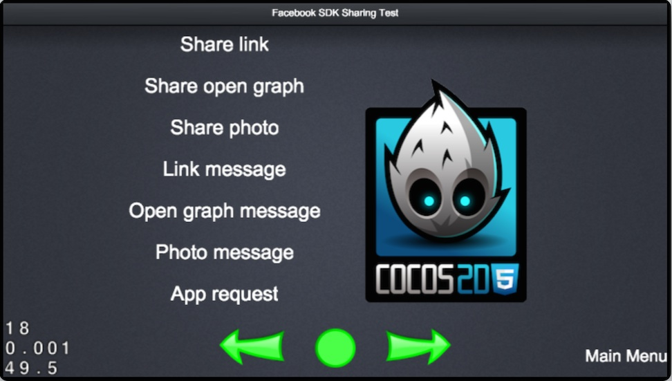
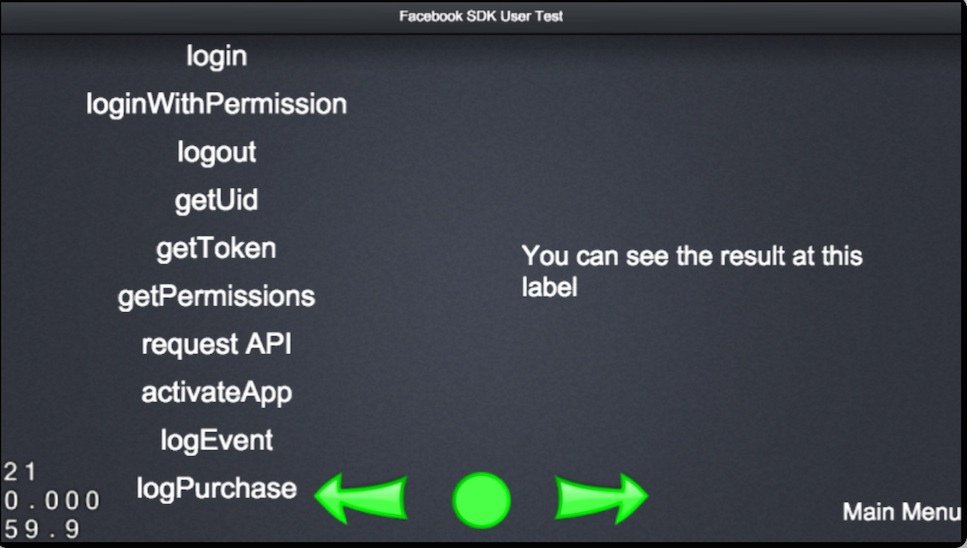

# How to integrate with Facebook - sample app

## A full featured test case

To make it easier for all developers to start developing games with the Facebook support, we have provided a complete test case. It have covered all APIs and demonstrated how to correctly use them.

If you are not until familiar with Facebook support for Cocos2d-JS, we strongly suggest you to take a look at the [Cocos2d-x with Facebook](../zh.md) document and the [Facebook API Reference for Cocos2d-JS](../api-reference/zh.md) document.

## How to run test case

First of all, you need the Cocos2d-JS engine package which can be downloaded [here](http://www.cocos2d-x.org/download).

- Follow the [Cross native / browser game with Cocos Console](http://cocos2d-x.org/docs/manual/framework/cocos2d-js/2-working-environment-and-workflow/2-2-cross-native-browser-game-with-cocos-console/en) document to install the Cocos Console tool.
- Open your terminal / command line tool, open the directory `samples/js-tests/`.
- Run the following command : 
    + `cocos run -p web --port 8080` to run the test case on web. (Setting the port to 8080 is very import)
    + `cocos run -p ios` to run the test case on an iOS simulator (Mac environment and Xcode required).
    + `cocos run -p android` to run the test case on an Android device or Android simulator.

## Explorer the Facebook test case

By running the test case project, you will find a `Facebook SDK Test` in the list of test cases.

There are two test cases which demonstrate how to use the Facebook Integration.

**1. Facebook SDK Sharing Test**

All test in this page do not require user to login, you can test the following functionalities:

- Share different links, an open graph story, a photo to your timeline or to your friends.
- Send a message to your friends with links, an open graph story or a photo.
- Send different app requests to your friends.

APIs covered in this test page:

- [.getInstance()](../api-reference/get-instance.md)
- [.canPresentDialog(info)](../api-reference/can-present-dialog.md)
- [.dialog(info, callback)](../api-reference/dialog.md)
- [.appRequest(info, callback)](../api-reference/app-request.md)

**2. Facebook SDK User Test**

In the second test page, you can test other functionalities of the Facebook Integration:

- Login or logout an user to Facebook.
- Retrieve the user id.
- Retrieve the access token.
- Invoke Open Graph API.
- Retrieve permissions of your app via Open Graph API.
- Send an activation event to Facebook.
- Send an app event log to Facebook.
- Send an in app purchase log to Facebook.
- Invoke Facebook payment in canvas app.

The last four tests can be invoked only in a Facebook Canvas App, and you can test them [on this test page](https://apps.facebook.com/cocostestmyfc/).

APIs covered in this test page:

- [.getInstance()](../api-reference/get-instance.md)
- [.isLoggedIn()](../api-reference/isloggedin.md)
- [.login(permissions, callback)](../api-reference/login.md)
- [.logout(callback)](../api-reference/logout.md)
- [.getUserId()](../api-reference/get-userid.md)
- [.getAccessToken()](../api-reference/get-accesstoken.md)
- [.api(path, method, params, callback)](../api-reference/api.md)
- [.activateApp()](../api-reference/activate-app.md)
- [.logEvent(eventName, valueToSum, parameters)](../api-reference/log-event.md)
- [.logPurchase(amount, currency, parameters)](../api-reference/log-purchase.md)
- [.canvas.pay(info, callback)](../api-reference/pay.md)

## Online test

Besides the test cases in Cocos2d-JS package, we also have a Facebook Canvas App for you to test our Facebook support.

[Facebook Canvas Test Case](https://apps.facebook.com/cocostestmyfc/)

## The next step

Next up, I believe you can not wait to create your own Facebook games, so please follow the integration guides to create your Cocos2d-JS project with Facebook SDK integrated.

- [Facebook integration instruction for Cocos2d-JS on Android](../facebook-sdk-on-android/en.md)
- [Facebook integration instruction for Cocos2d-JS on iOS](../facebook-sdk-on-ios/en.md)
- [Facebook integration instruction for Cocos2d-JS on Web](../facebook-sdk-on-web/en.md)