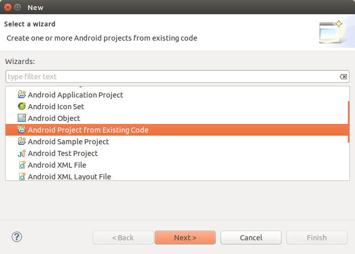
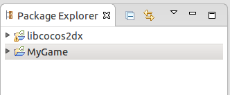
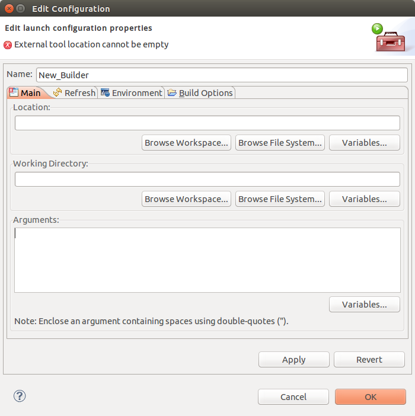
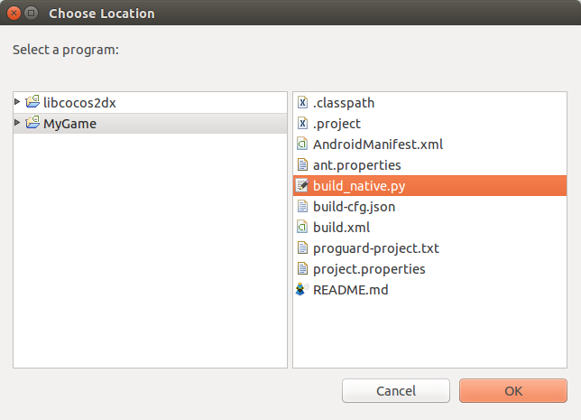
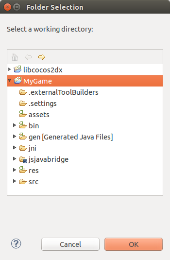
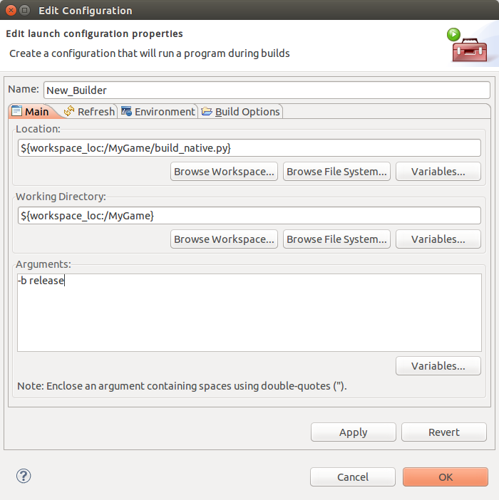
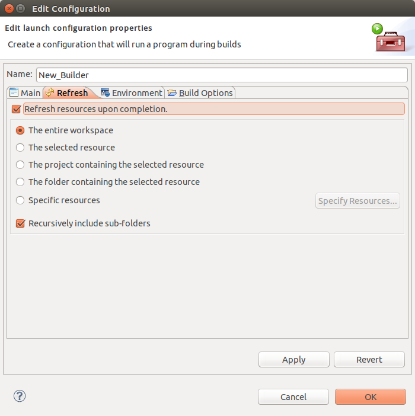
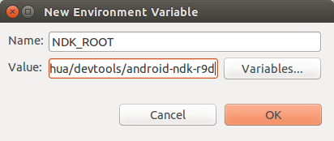

#在Eclipse中编译安卓项目

这篇文档会展示如何在eclipse中编译一个cocos2d-js的android项目。

##需要的环境:
- ADT bundle
- NDK r9d
- python 2.7

##创建项目
像我们通常做的那样，在终端运行`cocos new MyGame -l js -d ~/workspace`。

##在eclipse中导入项目

打开ADT bundle中的eclipse，点击File->new->other，选择`Android Project from Existing Code`。

在Root Directory中选择`~/workspace/MyGame`。我们可能会看到很多eclipse找到了很多项目，这里我们暂时只需要选择`MyGame`和`libcocosd2dx`。

然后我们就可以在Package Explorer看到这两个项目被导入了。

##在eclipse中设置一个NDK builder

我们需要设置一个NDK builder来编译C++代码。在`MyGame`点击右键，选择`Properties`。

在`Builders`设置中，点击`New`新建一个builder。在弹出对话框选择program，点击OK会看到下面的窗口。

现在我们开始设置这个Builder。在Location下面点击`Browse Worksapce`，选择MyGame中的`build_native.py`。

然后在Working Directory下面点击`Brwose Worksapce`，选择MyGame文件夹。

在Arguments中填入`-b release`或者`-b debug`。如果不填，默认debug编译。

切换到Refresh标签， 选中`Refresh resources upon completion`。

切换到Environment标签，点击New按钮， 添加`NDK_ROOT`。

现在我们就完成了NDK builder的设置，点击OK按钮关闭对话框。

##运行

像普通的android项目那样clean & run就可以了。所有的资源和脚本会自动拷贝到assets文件夹，C++代码会自动编译，然后生成apk。