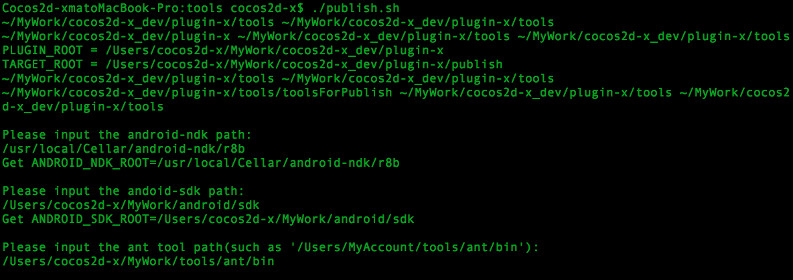
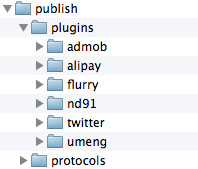
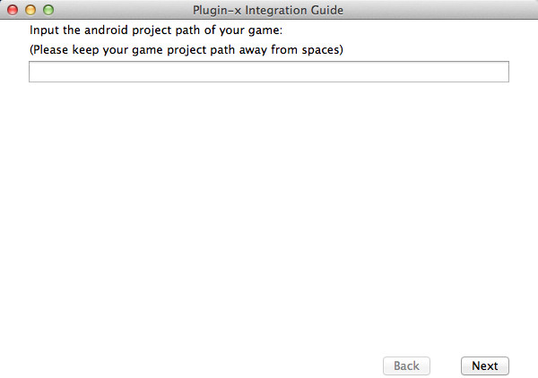
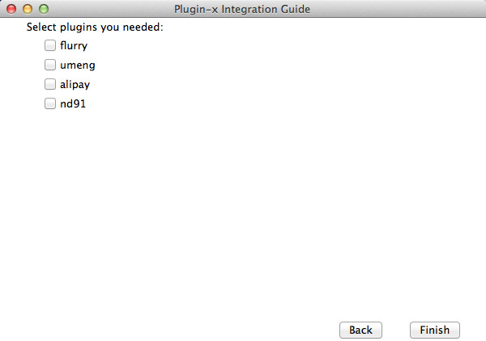

#안드로이드에서 Plugin-x 사용하기

##필요 환경
- python 2.7 [http://www.python.org](http://www.python.org)
- Ant [http://ant.apache.org](http://ant.apache.org)
- Cygwin (if you work on windows)

##플러그인 컴파일하기
우선 libPluginProtocol과 사용하기 원하는 플러그인을 컴파일 해야 합니다. 필요 하지 않은 플러그인은 `frameworks/js-bindings/cocos2d-x/plugin/tools/config.sh`의 `ALL_PLUGINS`에서 삭제합니다. 그리고 `frameworks/js-bindings/cocos2d-x/plugin/tools/publish.sh` 스크립트를 실행하면, 환경 설정을 위한 어떤 파라미터 입력을 요구할 것입니다(윈도우즈 환경에서는 Cygwin 실행이 필요합니다).



윈도우즈에서도, 리눅스 방식으로 경로를 입력해야 합니다. 예를 들자면 : `C:\adt-bundle-windows\sdk`이 아니라 `C:/adt-bundle-windows/sdk`로 입력합니다.

입력을 완료하면, Plugin-x의 루트 디렉토리 내의 publish 디렉토리가 생성됩니다. publish 디렉토리가 다음과 같다면, 성공적으로 작업을 완료한 것입니다.



##게임 프로젝트 수정하기

###무엇을 해야할까요?

- .mk 파일(Android.mk & Application.mk)를 Plugin-x로 정적 라이브러리(static libs)에 연결하도록 수정하기.
- 안드로이드 프로젝트 설정에서 써드파티 SDK 라이브러리 Plugin-x로 만들어진 라이브러리와 연결하기. (.jar 파일) 
- 게임의 사용자 권한과 액티비티의 선언을 추가하기 위해 AndroidManifest.xml 수정하기.
- 특정 플러그인이라면, 외부 설정과 리소스 파일을 추가하기.
- 몇몇 초기화 코드 추가하기.

###스크립트 툴 사용하기
안드로이드 개발의 전문가라면, 모든 것을 수동으로 할 수 있을 것입니다. 그러나 그 방법이 쉽냐고 물어본다면, 그렇지는 않습니다. 절대로, 절대로 쉽지 않습니다! 다행히도 우리는 수정을 위핸 스크립트 툴을 제공합니다. 터미널(윈도우즈에서는 Cygwin)에서 `frameworks/js-bindings/cocos2d-x/plugin/tools/gameDevGuide.sh`를 실행합니다. UI는 다음과 같습니다:



에디트 박스에 당신의 안드로이드 게임 프로젝트의 경로를 입력합니다. 경로에 스페이스가 없도록 주의하시고, 'Next' 버튼을 클릭합니다.



사용할 플러그인을 선택하고, 'Finish' 버튼을 클릭하시면, 필요한 설정은 완료됩니다.

###수동으로 수정하기

- ndk-build 실행 파라미터(command parameter)를 수정합니다 : 다음과 같이 NDK\_MODULE\_PATH에 publish 디렉토리를 추가합니다. NDK\_MODULE\_PATH=${PLUGIN_ROOT}/publish. 쉬운 방법은 build-cfg.json 파일의 `ndk_module_path`에 publish 디렉토리를 추가하는 것입니다.
- `build-cfg.json` 파일에서，`copy_resources`에 다음과 같이 코드를 추가합니다：

```
{
    "from": "../../../../frameworks/js-bindings/cocos2d-x/plugin/jsbindings/script", 
    "to": ""
}
```


- AppDelegate.cpp에 코드 추가하기：

```
#if (CC_TARGET_PLATFORM == CC_PLATFORM_IOS || CC_TARGET_PLATFORM == CC_PLATFORM_ANDROID)
#include "jsb_cocos2dx_pluginx_auto.hpp"
#include "jsb_pluginx_extension_registration.h"
#endif


bool AppDelegate::applicationDidFinishLaunching()
{
    //...
#if (CC_TARGET_PLATFORM == CC_PLATFORM_IOS || CC_TARGET_PLATFORM == CC_PLATFORM_ANDROID)
    sc->addRegisterCallback(register_all_pluginx_protocols);
    sc->addRegisterCallback(register_pluginx_js_extensions);
#endif
    //...
}
```

- jni/main.cpp에 코드 추가하기:

```
#include "PluginJniHelper.h"
void cocos_android_app_init (JNIEnv* env, jobject thiz) {
    LOGD("cocos_android_app_init");
    AppDelegate *pAppDelegate = new AppDelegate();
    JavaVM* vm;
    env->GetJavaVM(&vm);
    PluginJniHelper::setJavaVM(vm);
}
```

- AppActivity.java에 코드 추가하기:

```
import org.cocos2dx.plugin.PluginWrapper;

public class AppActivity extends Cocos2dxActivity {
    public Cocos2dxGLSurfaceView onCreateView() {
        Cocos2dxGLSurfaceView glSurfaceView = new Cocos2dxGLSurfaceView(this);
        glSurfaceView.setEGLConfigChooser(5, 6, 5, 0, 16, 8);

        PluginWrapper.init(this);
        PluginWrapper.setGLSurfaceView(glSurfaceView);
        return glSurfaceView;
    }
}
```

##자바스크립트 코드에서 Plugin-x 사용하기

###플러그인 로드(load)와 언로드(unload)
모든 플러그인은 PluginManager 클래스에서 관리합니다. 플러그인을 로드/언로드할 때 해당 클래스 이름을 사용하며, 예제 코드는 다음과 같습니다 :

```
// load plugin AnalyticsFlurry
var g_pAnalytics = plugin.PluginManager.getInstance().loadPlugin("AnalyticsFlurry");

// unload plugin AnalyticsFlurry
plugin.PluginManager.getInstance().unloadPlugin("AnalyticsFlurry");
```

###플러그인 사용하기

프로토콜에서 선언된 메소드를 직접 실행할 수 있습니다. 예제 코드는 다음과 같습니다 :

```
// enable the debug mode
g_pAnalytics.setDebugMode(true);
g_pAnalytics.startSession(s_strAppKey);
g_pAnalytics.setCaptureUncaughtException(true);

// call function with params
g_pAnalytics.callFuncWithParam("setUserId", new plugin.PluginParam(plugin.PluginParam.ParamType.TypeString, "123456"));
```