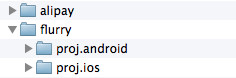
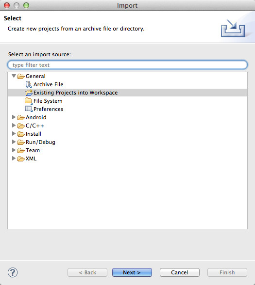
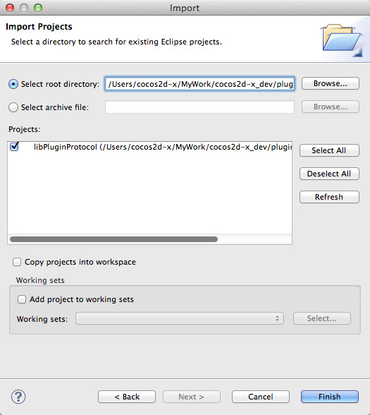
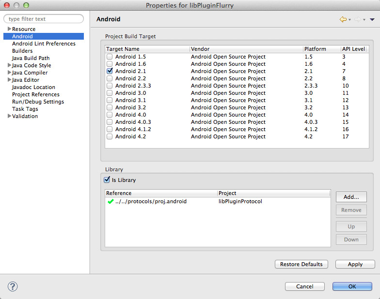
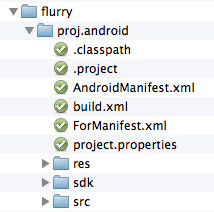

#안드로이드에서 당신만의 플러그인을 만들어보세요

현재 Plugin-x는 네가지 프로토콜로 이루어져있습니다: ProtocolAds, ProtocolAnalytics, ProtocolIAP, ProtocolSocial. 어떠한 C++/JNI 코드 또는 자바스크립트 바인딩 코드를 쓰지 않아도 됩니다. 그러기 위해서는 코어 코드에 다음과 같은 사항이 필요합니다:

- 새로운 안드로이드 프로젝트.
- 정의한 인터페이스/프로토콜을 임플리먼트(implement)하는 자바 코드 작성

##플러그인 디렉토리 소개
플러그인을 사용하실 때 다음과 같은 디렉토리 구조를 지켜주세요:




- proj.android : 안드로이드 프로젝트의 플러그인 디렉토리.
- proj.ios : iOS 프로젝트의 플러그인 디렉토리.

주의 : 배포 도구(publish tools)의 임플리먼테이션(Implementation)은 위의 디렉토리 구조에 따릅니다.

##플러그인의 임플리먼테이션(Implementation)

###이클립스(Eclipse)에 플러그인 프로토콜을 안드로이드 프로젝트로 임포트(Import)





###안드로이드 라이브러리 프로젝트 새로 만들기.
libPluginProtocol 프로젝트를 만들어봅시다.



프로젝트 디렉토리는 다음과 같습니다 :



1. build.xml : 배포 도구에서 사용합니다. 다른 플러그인으로부터 복사할 수 있으며, 프로젝트명(project name)을 수정하시면 됩니다.
2. ForManifest.xml : tools/gameDevGuide.sh에서 사용합니다. 플러그인에서 액티비티 선언(activity declaration)이 필요하거나 AndroidManifest.xm에서 사용자 권한(user permission)이 필요할 때 이 파일에 해당 내용을 추가하시면 됩니다.
3. sdk : 써드 파티 SDK의 .jar 파일이 위치합니다.
4. src : 자바 코드가 위치합니다. 반드시 관련 인터페이스(relevant interface)를 임플리먼트하는 클래스로 작성해야 합니다. 반드시 org.cocos2dx.plugin 패키지를 사용합니다. 
 
###인터페이스를 임플리먼트하는 클래스 작성하기

클래스는 Context 파라미터를 포함한 생성자를 필요로 합니다. 예제를 살펴보겠습니다:

```
package org.cocos2dx.plugin;
public class AnalyticsFlurry implements InterfaceAnalytics {
        ...
        public AnalyticsFlurry(Context context) {
        mContext = context;
    }
}
```

다음과 같이, 사용자 정의 메소드를 추가하거나 인터페이스에서 정의한 메소드를 오버라이드할 수 있습니다:

```
@Override
public String getSDKVersion() {
    return "3.2.1";
}

protected void setUserId(String userId) {
    LogD("setUserId invoked!");
    final String curUser = userId;
    PluginWrapper.runOnMainThread(new Runnable() {
        @Override
        public void run() {
            try {
                FlurryAgent.setUserId(curUser);
            } catch(Exception e){
                LogE("Exception in setUserId", e);
            }
        }
    });
}
```

현재 plugin-x는 int, float, boolean, String, JSONObject 파라미터만을 지원하며, 리턴값(return value)로는 int, float boolean, String을 지원합니다.