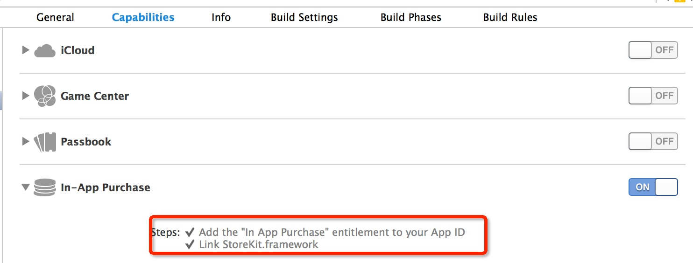

PluginX IOS IAP 사용하기
===========

## 시작하기에 앞서

- [애플 개발자 센터](https://developer.apple.com/in-app-purchase/)의 앱 내 구매에 대한 문서를 참고해서 먼저 계정 환경을 설정해주세요.

## PluginX 통합

- **pluginProtocol**와 **pluginIAP**를 프로젝트로 Import
- Target Build Phase에서 **StoreKit.framework**  **libPluginProtocol.a**와 **libPluginIAP.a** 추가
- **Capabilities** 탭의 In-App Purchase 항목이 OFF면 ON으로 바꿉니다 :

- 이제 준비가 끝났고 코딩을 시작해봅시다.
 
##코딩 시작하기

- 먼저 **PluginManager** 인스턴스의 **loadPlugin**를 사용해서 필요한 플러그인을 불러온 후 **setListener**으로 콜백 함수를 설정합니다. 콜백 함수에 대해서는 이후에 자세히 설명합니다.

    ```
    var pluginManager = plugin.PluginManager.getInstance();
    this.PluginIAP = pluginManager.loadPlugin("IOSIAP");
    //set the callback listener
    this.PluginIAP.setListener(this);
    ```
	
- 다음으로 **setServerMode**를 사용해서 사용할 서버 모드를 설정해야 합니다. 기본값은 다음과 같습니다;

    ```
	this.PluginIAP.callFuncWithParam("setServerMode");
    ```
		
- 세번째로 아래와 같이 **requestProducts** 함수를 부르기에 앞서 당신의 제품 ID를 배열에 넣고 **toString** 함수를 불러 배열을 문자열 타입으로 변환하면 당신은 앱스토어로부터 제품 정보를 콜백 함수로 받을 수 있습니다.

    ```
    var pidList = ["001", "002"];
    this.PluginIAP.callFuncWithParam("requestProducts", plugin.PluginParam(plugin.PluginParam.ParamType.TypeString, pidList.toString()));
	```
			
- 그리고 **requestProducts** 함수의 콜백인 **onRequestProductResult**라는 이름의 콜백 함수를 설정합니다. 이를 통해서 앱스토어로부터 당신이 요청한 정보를 받을 수 있습니다. **ret** 파라미터가 **plugin.ProtocolIAP.RequestProductCode.RequestSuccess**이면 **productInfo** 파라미터에 앱스토어로부터 받은 제품 정보가 들어옵니다.
	
    ```
    onRequestProductResult: function (ret, productInfo) {
        var msgStr = "";
        if (ret == plugin.ProtocolIAP.RequestProductCode.RequestFail) {
            msgStr = "request error";
            cc.log(msgStr);
        } else if (ret == plugin.ProtocolIAP.RequestProductCode.RequestSuccess) {
            this.product = productInfo
            msgStr = "list: [";
            for (var i = 0; i < productInfo.length; i++) {
                var product = productInfo[i];
                msgStr += product.productName + " ";
            }
            msgStr += " ]";
            cc.log(msgStr);
        }
    }
    ```
    
- 유저가 구입을 원하는 제품을 결제할 때 제품의 id를 파라미터로 설정해서 payForProduct 함수를 호출하면 콜백을 통해 데이터를 받을 수 있습니다.

    ```
    this.PluginIAP.payForProduct(this.product[0]);
    ```
		
- 그리고 **onPayResult** 콜백 함수를 설정하면, **payForProduct**의 콜백으로서 동작하며，이 함수는 사용자가 그들의 지불을 종료할 때 데이터를 받을 수 있습니다. serverMode가 켜져 있고 지불 상태가 정상이(**plugin.ProtocolIAP.PayResultCode.PaySuccess**)이라면 **msg** 파라미터를 통해 영수증(receipt) 정보를 확인할 수 있습니다.

    ```
    onPayResult: function (ret, msg, productInfo) {
        var str = "";
        if (ret == plugin.ProtocolIAP.PayResultCode.PaySuccess) {
            str = "payment Success pid is " + productInfo.productId;
            //if you use server mode get the receive message and post to your server
            if (this._serverMode && msg) {
                str = "payment verify from server";
                this.postServerData(msg);
            }
        } else if (ret == plugin.ProtocolIAP.PayResultCode.PayFail) {
            str = "payment fail";
        }
        cc.log(str);
    }
    ```

- serverMode가 켜져 있지 않을 때 지불을 완료하면, **finishTransaction**를 자동으로 불러옵니다.

- **serverMode**를 켜고 당신의 서버를 통해 확인하기를 원한다면, json 타입의 어떤 정보를 당신의 서버로 보냅니다 그러면 당신의 서버는 데이터를 받아서 앱스토어 지불 주소 또는 샌드박스(테스트를 위한)로 보냅니다， 만약 제대로 동작한다면, 애플로부터 응답 데이터를 받을 수 있습니다.

- 응답 데이터가 유효한지 체크하고, 유효하다면 제품을 유저에게 추가하고 클라이언트로 메시지를 보낼 수 있습니다.

- 마지막으로 **serverMode**를 켰다면 당신은 반드시 클라이언트가 당신의 서버 응답을 받을 때 **finishTransaction**를 수동으로 호출해야 합니다.

- 앱스토어 지불 주소
    - 샌드박스：https://sandbox.itunes.apple.com/verifyReceipt 
    - 실서버：https://buy.itunes.apple.com/verifyReceipt

    ```
    postServerData: function (data) {
        var that = this;
        var xhr = cc.loader.getXMLHttpRequest();

        //replace to your own server address
        xhr.open("POST", "http://localhost/");
        that.toggleToast(true);
        xhr.onreadystatechange = function () {
            if (xhr.readyState == 4 && xhr.status == 200) {
                that.toggleToast(false);
                var result = JSON.parse(xhr.responseText);
                // important ! remember to finishTransaction
                that.PluginIAP.callFuncWithParam("finishTransaction", new plugin.PluginParam(plugin.PluginParam.ParamType.TypeString,result.receipt.in_app[0].product_id));
            }
        };
        // you can add your data and post them to your server;
        var result = {userid: 100, receipt: data};
        xhr.send(JSON.stringify(result));
    },
    ```

## 마무리

 - 테스트 케이스를 보고 싶다면 cocos2d_jsb_samples-->pluginXTestsManager-->IOSIAPTest를 참조하세요.
	
