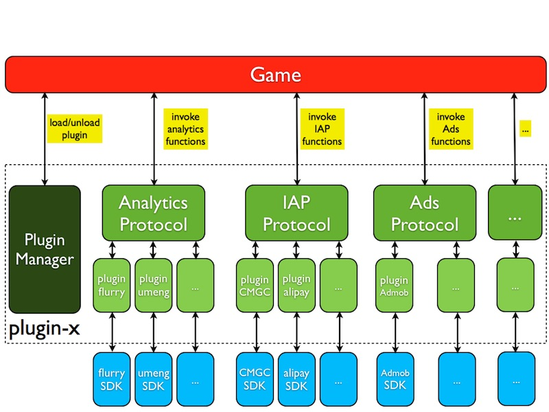
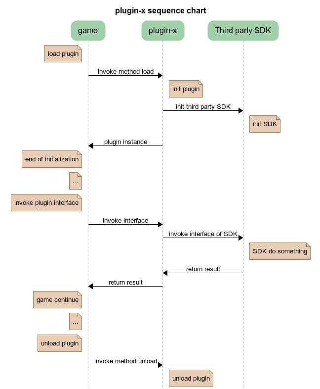

#Plugin-x Architecture

##What is Plugin-x
Plugin-x is a protocol of third-party SDKs used in games. We can easily use third-party SDK with plugin-x, and no longer need to write JNI code or JavaScript binding code. Right now there is analytics, IAP, ads and social SDKs integrated in plugin-x. And you can integrate any SDK into plugin-x as you wish.

##plugin-x architecture

Because most third-party SDKs are written in Objective-C or Java, we have make some wrapper in C++ to use reflection easily, and abstract analytics protocol, IAP protocol, adds protocol and so on. To integrate a third-party SDK as a plugin, we only need to implement the interfaces of protocols. When we use a SDK in our game, we just load the  plugin, and invoke the interfaces of protocols.

The architecture of plugin-x is showing below:

The process of loading plugin, invoking interface, uploading plugin is showing below:

