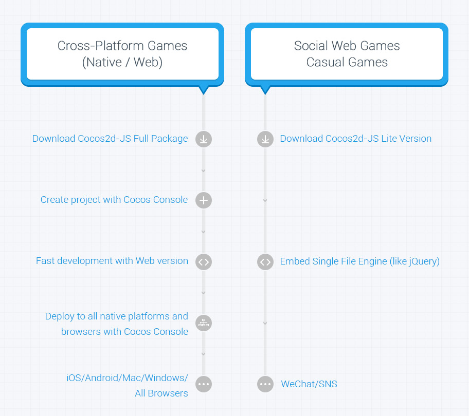

# Cocos2d-JS v3.1发布说明

 

Cocos2d-JS是Cocos2d-x的JavaScript版本，融合了Cocos2d-html5和Cocos2d-x JavaScript Bindings。它支持Cocos2d-x的所有核心特性并提供更简单易用的JavaScript风格API，并且天然支持原生,浏览器跨平台应用。

在3.x版中，Cocos2d-JS完成了不同平台工作流的彻底整合，为不同平台提供了统一的开发体验。无论开发web应用还是原生应用，都可以便捷地采用Cocos2d-JS实现“一次开发，全平台运行”。采用Cocos2d-JS开发的同一套JavaScript游戏代码，可以同时运行在Mac OS X, Windows, iOS, Android等原生平台,以及所有现代浏览器上，这将使得我们的开发者轻松覆盖几乎所有发行渠道，带来前所未有的机遇。另一方面，若开发者只想开发一款Web轻度休闲游戏，Cocos2d-JS也专门为此类游戏定制了Lite Version，直接将Cocos2d-JS Lite Version集成到页面中即可使用。

作为工作流整合后的版本，Cocos2d-JS v3.x兼具了简单和强大：新的JavaScript风格API使得编码，测试和发布环节都变得异常轻松简单；同时v3.x还提供了诸多强大的新特性，比如Spine动画支持，支持热更新的资源管理器，对象缓冲池，JS到Objective-C/JAVA反射等等。

随3.1版本发布的还有Facebook Integration for Cocos2d-JS v1.0，Cocos2d-JS正式在全平台支持Facebook的完整功能接入。对于希望为游戏添加社交功能的开发者来说，这将带来前所未有的机遇。使用同一套JavaScript代码，开发者将可以发布自己的游戏到Facebook Canvas，iOS和Android平台，真正实现全平台支持。

## 核心特性

* 发布Facebook Integration for Cocos2d-JS v1.0，API经过几个月的打磨和验证已经稳定，完善了测试例和文档。
* 重构Web引擎的渲染器，带来显著的渲染性能提升。
* 升级Cocos2d-x到v3.3rc0，使JSB引擎效率更高，更加稳定。
* 支持Cocos Studio 2.0的proto buffers格式解析以及Timeline动画
* 在iOS 8上开启WebGL支持，相比于Canvas模式带来极大的性能提升。

## 工作流

- 跨平台游戏开发者可以使用Cocos Console来创建项目，用Web引擎加速游戏开发，最终用Cocos Console将游戏发布到所有原生平台和Web平台。

- Web端轻度休闲游戏开发者可以直接下载单文件的Cocos2d-JS Lite Version，嵌入Web页面中，像使用jQuery那样进行开发。

## 注意事项

关于编译和打包，还有一些限制条件需要满足：

- [Android编译] NDK版本必须使用r9d
- [iOS编译] Xcode版本必须在5.1.1以上
- [Web代码混淆] JRE或JDK版本必须使用1.6或1.7

## 从旧版本升级你的项目

如果你想升级你使用旧版本（从v3.0 Alpha开始）创建的项目到v3.1，你需要执行以下步骤：

1. 下载Cocos2d-JS v3.1引擎包。
2. 执行引擎包中的`setup.py`更新你的cocos命令。
3. 使用`cocos new`命令创建一个新的基于v3.1的项目。
4. 从你的旧项目中拷贝"src"，"res"，"index.html"，"project.json"，"main.js"到第三步创建的新项目并覆盖。
5. 最后你可能需要按照升级指南来升级你的项目以避免API不兼容的问题。

## 下载

- [Cocos2d-JS v3.1](http://www.cocos2d-x.org/filedown/cocos2d-js-v3.1.zip)
- [在线API索引](http://www.cocos2d-x.org/reference/html5-js/V3.0/index.html)
- [下载版API索引](http://www.cocos2d-x.org/filedown/Cocos2d-JS-v3.0-API.zip)
- [在线测试例](http://cocos2d-x.org/js-tests/)

## 详细更改

更详细的改动列表和升级文档可以参见:

- [Cocos2d-JS v3.1改动说明](http://www.cocos2d-x.org/docs/manual/framework/html5/release-notes/v3.1/changelog/en)
- [Cocos2d-JS v3.1升级指南](http://www.cocos2d-x.org/docs/manual/framework/html5/release-notes/v3.0rc0/upgrade-guide/zh)

## 关于Cocos2d家族

- Cocos2d-JS v3.1使用Cocos2d-x v3.3rc0作为JSB的底层实现
- Cocos2d-JS v3.1兼容Cocos Code IDE v1.0.0-final
- Cocos2d-JS v3.1兼容Cocos Studio v1.2 - v2.0

如果遇到任何问题，你都可以向Cocos2d-JS开发者社区寻求帮助： 

- [官方论坛](http://discuss.cocos2d-x.org/category/cocos2d-x/javascript)
- [文档目录](http://cocos2d-x.org/docs/manual/framework/html5/zh)
- [Github仓库地址](https://github.com/cocos2d/cocos2d-js)
