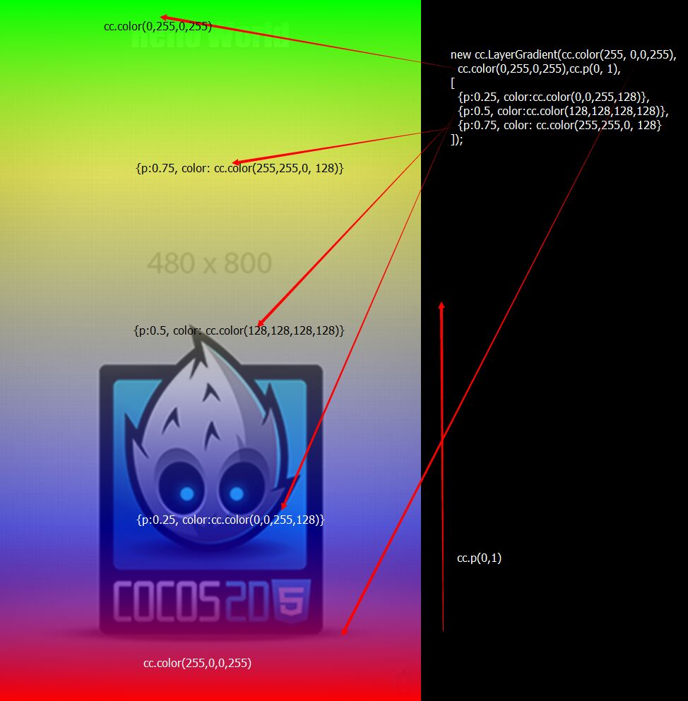

#从Cocos2d-JS v3.3到v3.5升级指南

## 0. 升级到Cocos2d-JS v3.3

如果你还在使用Cocos2d-html5或者较早版本的Cocos2d-JS，你可以首先参考之前版本的升级指南来升级 : [历史版本升级指南](../../zh.md)

## 1. Windows Phone 8和Windows 8.1 Universal平台支持

按照以下步骤可以轻松升级到v3.5，创建一个新的游戏工程，并开始为Windows Phone 8平台开发游戏。

1. 你需要使用Cocos2d-JS v3.5包中的`setup.py`升级cocos console终端工具：

    ```
    $ cd cocos2d-js-v3.5
    $ ./setup.py
    ```
    
2. 创建一个Cocos2d-JS v3.5新工程：

    ```
    $ cocos new -l js WinPhone8Game
    ```
    
3. 打开`WinPhone8Game/frameworks/runtime-src/proj.wp8-xaml/WinPhone8Game.sln`这个Windows Phone 8工程文件。你的环境中需要安装有Visual Studio 2012。

4. 现在你就可以使用Visual Studio来调试，运行或发布Cocos2d-JS项目到Windows Phone 8平台了。

5. 打开`WinPhone8Game/frameworks/runtime-src/proj.win8.1-universal/WinPhone8Game.sln`这个Windows 8.1工程文件。你的环境中需要安装有Visual Studio 2012。

6. 现在你就可以使用Visual Studio来调试，运行或发布Cocos2d-JS项目到Windows 8.1 Universal平台了。

## 2. [原生平台特性] 创造3D游戏

Cocos2d-JS v3.5中最大的新特性就是对3D模块的支持。我们绑定了Cocos2d-x的3D模块到JSB中，这样你就可以使用JavaScript来编写3D游戏功能了。**请注意**，这是一个原生平台独占的特性，你不能够在Web引擎中使用这些3D功能，我们在短期内也没有计划在Web引擎中支持3D。

已绑定的3D类或对象列举如下：

```
jsb.Animate3D
jsb.Animation3D
jsb.Sprite3D
jsb.Skeleton3D 
jsb.Mesh
jsb.AttachNode
jsb.BillBoard
jsb.sprite3DCache
jsb.ParticleSystem3D
jsb.PUParticleSystem3D
jsb.BaseLight
jsb.DirectionLight
jsb.PointLight
jsb.SpotLight
jsb.AmbientLight
```

很抱歉我们暂时还没有3D功能的完整文档，我们将会尽快添加。

现在想要知道如何使用3D模块，你可以参考下面的文档和范例代码：

- Cocos [3D模块API文档](http://www.cocos2d-x.org/reference/native-cpp/V3.4/dir_0cec398151724e9e1c180a4e8f99801b.html)
- Cocos [Camera类API文档](http://www.cocos2d-x.org/reference/native-cpp/V3.4/d6/d2b/classcocos2d_1_1_camera.html)
- Cocos [Light类API文档](http://www.cocos2d-x.org/reference/native-cpp/V3.4/d2/d85/classcocos2d_1_1_base_light.html)
- Cocos2d-JS v3.5测试用例，可以通过`build`文件夹中的Visual Studio工程来运行，或者在`samples/js-tests`目录下执行`cocos run`命令。运行成功后你可以参考下面的测试用例：
    - BillBoardTest：源代码位于`samples/js-tests/src/BillBoardTest`.
    - Camera3DTest：源代码位于`samples/js-tests/src/Camera3DTest`.
    - LightTest：源代码位于`samples/js-tests/src/LightTest`.
    - Sprite3DTest：源代码位于`samples/js-tests/src/Sprite3DTest`.
- Cocos2d-JS v3.5移植[FantasyWarriors 3D实例游戏源码](https://github.com/joshuastray/fantasywarrior)
    
## 3. [Web平台特性] cc.LayerGradient支持多阶颜色渐变

在Cocos2d-JS v3.5 Web引擎中，你现在可以为颜色渐变图层添加多阶的中间颜色。这是一个Web平台特性，但是同样的代码在原生引擎中也不会造成任何问题（不会有效果），可以放心使用。

API：

```
new cc.LayerGradient(beginColor, endColor, positionInPercent, colorStops);
```

示例代码：

```
// 色阶是通过一个数组来表示的，数组中每一项是一个由色阶位置和颜色构成的对象。
var colorStops = [
                    {p: 0.25, color: cc.color(0, 0, 255, 128)},
                    {p: 0.5, color: cc.color(128, 128, 128, 128)},
                    {p: 0.75, color: cc.color(255, 255, 0, 128)}
                ];

var gradient = new cc.LayerGradient(cc.color(255, 0, 0, 255), cc.color(0, 255, 0, 255), cc.p(0, 1), colorStops);
this.addChild(gradient, 10);
```

结果：



## 4. cc.sys.OpenURL

你可以使用`cc.sys.OpenURL(url)`来在浏览器中打开一个页面。
在Web引擎中，这个接口将会在新窗口或标签中打开这个页面。
在Native引擎中，这个接口将会在外部浏览器中打开这个页面。

## 5. [Web平台特性] cc.TextFieldTTF的提示标签

你现在可以获取或设置`cc.TextFieldTTF`的提示标签了。API如下：

```
textFieldTTF.setTipMessage(tipMessage);
var message = textFieldTTF.getTipMessage();
```

## 6. 为ccs.load设置资源相对路径

现在`ccs.load`开始接受第二个参数`path`来指定资源相对于工程的相对路径。如果不指定，Cocos导出的JSON文件中的路径都默认是相对于JSON文件路径的。

```
ccs.load(jsonFile, path);
```
