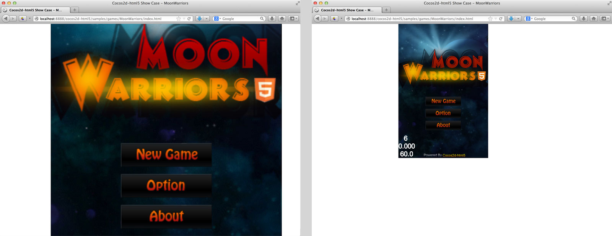
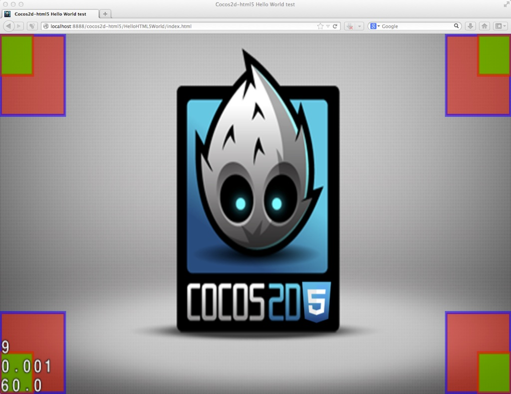
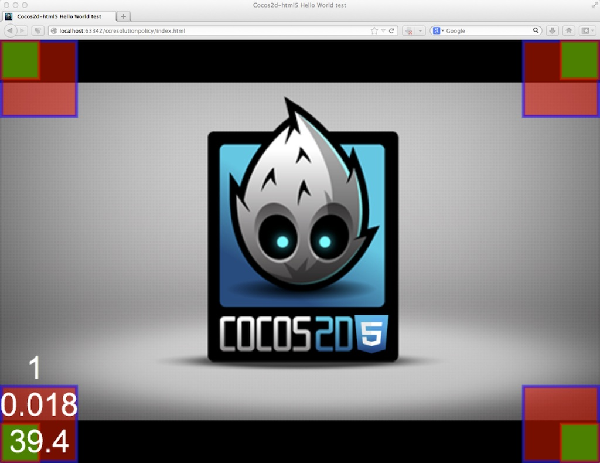
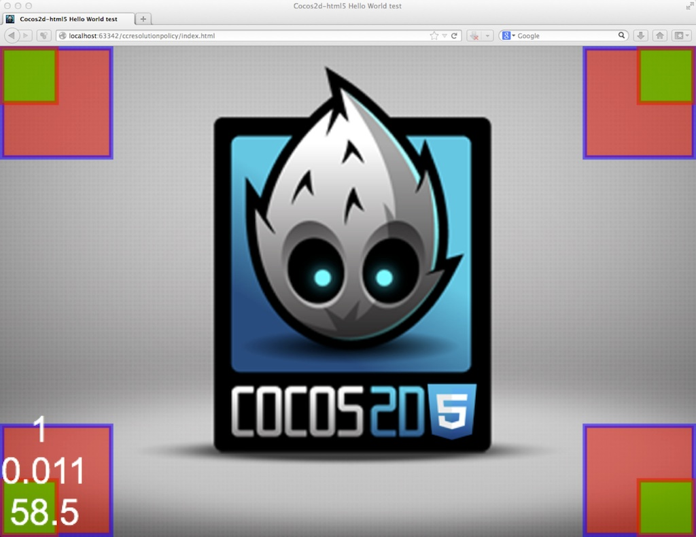

# Resolution Policy for Cocos2d-JS

Resolution policy is designed for adapting your game scene to any device on any resolution, Cocos2d-JS provide different adaptation policies for different use cases. The resolution policy helps developers to focus on their game.

Cocos2d-JS have two different engine, thus two different implementations of resolution policy, but they share the same API. As the native engine's implementation is much easier and clearer, this chapter's discussion will focus on the web engine resolution policy. The difference between native engine and web engine will be covered at the end of this chapter.

## About web engine resolution policy

As we all know as game developer, it's really hard to provide good experience cross browser and cross platform. A main issue about this is the dynamic adaptation of our content in different window sizes. There is things like responsive design for web pages, but it can't be used for canvas games. So for developers of Cocos2d-JS, we have brought you the resolution policy.

The main quest of the resolution policy is to adapt your game canvas to fit the browser window.


When we see our game like this, it's really painful.


That's what we want, well, most of the time, somebody hate the white siders, we have other choices for you.

Let's go straight forward to see how simple it is to use resolution policy.

## Usage

####1. Set the policy

To let Cocos2d-JS adapt your game automatically to the browser, you just need to use this line of code while or after the `cc.game.onStart` callback (main.js):

```
cc.view.setDesignResolutionSize(320, 480, cc.RESOLUTION_POLICY.SHOW_ALL);
```

The first and second parameters are the resolution you want to use in your game codes. And the third parameter is the resolution policy you want to use. There are 5 predefined policies, each has it's own behavior. See details after.

If you have already set your design resolution, you can simply change your resolution policy by using this function:

```
cc.view.setResolutionPolicy(cc.RESOLUTION_POLICY.NO_BORDER);
```

Pretty different with native engine, web engine runs in browser, so except game window you may have other content to show along with the canvas. Or you may need to apply styles on your canvas and don't expect it to take all the space on screen. So our resolution policy adapt to the canvas's outer container by default. If you want to adapt to the browser window, you need to put your game canvas directly in body:

```
<body>
    <canvas id="gameCanvas"></canvas>
</body>
```

####2. The benefit

The benefit in using resolution policy is obvious, you can ignore all varieties of browser and device size. And even more important, you don't need to scale everything in your game manually, everything is occupied by Cocos2d-JS. Imagine if you setup the designed resolution size to 320 * 480, you should always focus on this size in your game logic code. The right top corner of your game will always be (320, 480) (In FIXED\_WIDTH mode, height may be resized, and in FIXED\_HEIGHT mode, width may be resized.).

####3. Resize with browser window

The new design allows automatic re-adaptation to browser while browser size changed. For example, when user resize their browser, or more useful, when user turn their mobile's orientation. To activate this feature, use `resizeWithBrowserSize` function of `cc.view`:

```
cc.view.resizeWithBrowserSize(true);
```
    
For permitting a more flexible design, we provided another function in `cc.view`, you can observe the resize event by setting a callback function with `setResizeCallback`:

```
cc.view.setResizeCallback(function() {
    // Do things according to your need, 
    // e.g. change a resolution policy when user's mobile orientation changed.
});
```

####4. Fullscreen API

[Fullscreen API](https://developer.mozilla.org/en-US/docs/Web/Guide/API/DOM/Using_full_screen_mode) is a new Web API that allows web content to be presented with the entire screen.

Cocos2d-JS will try to activate the full screen mode on mobile browsers so that user can have better experience. (Note that not every browser allow this behavior)

On the other hand, modern desktop browsers also support Full Screen API, if you want to do that, simply use the following:

Try to enter full screen mode: `cc.screen.requestFullScreen(targetElement, onFullScreenCallback);`

Check if the page is on full screen mode: `cc.screen.fullScreen();`

Exit full screen mode: `cc.screen.exitFullScreen();`


## Principles

####1. Frame

The frame is the outer container of your canvas element, normally, it's the html `body` element. But in some case, the cocos2d game is just a part of your web page, you may have some text, image or whatever else alongs with it. Then you can wrap your canvas into a DOM element( the frame ), the initial size of your canvas element doesn't matter, the resolution policy will scale your canvas to fit the frame.

If you want to make your game fit the browser window, you should put your canvas element directly under the `body` element.

####2. Cocos2d container

In the initiate process, cocos2d will additionally wrap your canvas into a cocos2d container, and the container itself will be added to the original outer element of canvas( the frame ). This container is a helper to make the magic of resolution policy, it can be accessed by cc.container.

####3. Game content

The game content represent the game world's coordinates.

####4. Viewport

The viewport is the game world's rect related to the canvas's coordinates in pixel.

####5. Container Strategy

The container strategy controls the behavior of how to scale the cocos2d container and game canvas element relatively to the frame.

####6. Content Strategy

The content strategy controls the behavior of how to scale the game world relatively to the container and setup the viewport.


## Predefined policies

Now I will introduce all five predefined policies, in each captured image, the red rects are the game content's corner, and the green ones are the corners of the canvas.

All resolution policies are combined with a container strategy and a content strategy, the combination of each policy is shown in the brackets.

####1. SHOW\_ALL (PROPORTION\_TO\_FRAME + SHOW\_ALL)


Show all policy will scale up the container to the maximum size in the frame which shows all your content on screen with the original width/height ratio you have set. So there will be some blank area in one axe, the color or background image can be set via the CSS property of the frame.

####2. NO\_BORDER (EQUAL\_TO\_FRAME + NO\_BORDER)


No border policy will scale proportionally the container so that it fills up the entire frame. In this case, if the width/height ratio of the frame doesn't equal to your designed ratio, some area of your game will be cut off. In the meantime, under no border policy, `cc.visibleRect` represent the viewport of canvas in the game world, and it can be smaller than `cc.winSize`.

####3. EXACT\_FIT (EQUAL\_TO\_FRAME + EXACT\_FIT)



Exact fit policy will scale the container to fit exactly the frame, so your game's w/h ratio will probably lost.

####4. FIXED\_WIDTH (EQUAL\_TO\_FRAME + FIXED\_WIDTH)



Fixed width policy will scale the width of the container to fit the frame's width, and vertially it will be scaled proportionally, but the width value will be extended to fill the frame.

It may seem alike to the SHOW\_ALL policy, but the canvas's rect fills up the whole frame, and game world's coordinate system equals the canvas coordinate system.

####5. FIXED\_HEIGHT (EQUAL\_TO\_FRAME + FIXED\_HEIGHT)



Fixed height policy will scale the height of the container to fit the frame's height, and horizontally it will be scaled proportionally, but the width value will be extended to fill the frame.

In the case of our caption, the game width is larger than the game height, so the FIXED\_WIDTH policy act like SHOW\_ALL, and the FIXED\_HEIGHT policy act like NO\_BORDER. On the contrary, if the game width is smaller than the game height, the FIXED\_WIDTH policy will act like NO\_BORDER, and the FIXED\_HEIGHT policy will act like SHOW\_ALL. But FIXED\_HEIGHT and FIXED\_WIDTH policies will all take the whole frame as the viewport and game world rect.

## Customized resolution policy

####1. Combine predefined strategies

As you can see, the predefined policies just uses the combination of predefined strategies, you can do the same thing also. The predefined strategies are listed below:

- Container strategies
    - cc.ContainerStrategy.EQUAL\_TO\_FRAME
    - cc.ContainerStrategy.PROPORTION\_TO\_FRAME
    - cc.ContainerStrategy.ORIGINAL\_CONTAINER

- Content strategies
    - cc.ContentStrategy.SHOW\_ALL
    - cc.ContentStrategy.NO\_BORDER
    - cc.ContentStrategy.EXACT\_FIT
    - cc.ContentStrategy.FIXED\_WIDTH
    - cc.ContentStrategy.FIXED\_HEIGHT

To construct and use a resolution policy with strategies, you should do the following:

```
var policy = new cc.ResolutionPolicy(cc.ContainerStrategy.PROPORTION_TO_FRAME, cc.ContentStrategy.EXACT_FIT);
cc.view.setDesignResolutionSize(320, 480, policy);
```

This policy should work exact like the show all policy.

####2. Implement your own strategy

If you are not satisfied with our predefined strategies, you can even implement your own strategy to fit whatever you need.

Extend the container strategy:

```
var MyContainerStg = cc.ContainerStrategy.extend({
    preApply: function (view) {
        // This function is called before the process of adaptation,
        // you can remove this function if you don't need
    },

    apply: function (view, designedResolution) {
        // Apply process
    },

    postApply: function (view) {
        // This function is called after the process of adaptation,
        // you can remove this function if you don't need
    }
});
```

Extend the content strategy

```
var MyContentStg = cc.ContentStrategy.extend({
    preApply: function (view) {
        // This function is called before the process of adaptation,
        // you can remove this function if you don't need
    },

    apply: function (view, designedResolution) {
        var containerW = cc.canvas.width, containerH = cc.canvas.height;
      
        // The process to calculate the content size, the x axe scale and the y axe scale

        return this._buildResult(containerW, containerH, contentW, contentH, scaleX, scaleY);
    },

    postApply: function (view) {
        // This function is called after the process of adaptation,
        // you can remove this function if you don't need
    }
});
```

At last, you should construct your own policy with your custom strategies.

```
var policy = new cc.ResolutionPolicy(new MyContainerStg(), new MyContentStg());
cc.view.setDesignResolutionSize(320, 480, policy);
```

If you want more details about the new resolution policy implementation, you can refer to the source code of CCEGLView.js in `frameworks/cocos2d-html5/cocos2d/core/platform/CCEGLView.js`.


## Difference between web engine and native engine

On native platforms, game content always occupy all the game window or full screen on mobile devices, Cocos2d-JS uses the same resolution policies as Cocos2d-x. Although they have different implementation, they share the same API in `cc.view`. But native engine doesn't support features like customized resolution policy. The main differences are listing below:

- Native engine only supports all 5 predefined policies.
- Container strategy and content strategy don't exist in native engine.
- Developers can not extend from container strategy or content strategy to construct a custom resolution policy.