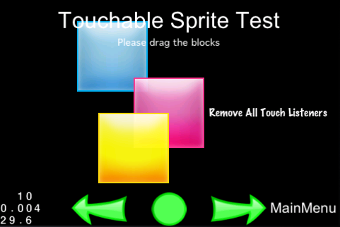

# 이벤트 매니저의 매커니즘

* 버전: Cocos2d-html5 v3.0 alpha0 이후

## 소개

Cocos2d-html5 3.0은 유저 이벤트에 응답하는 새로운 매커니즘을 소개합니다. 이 문서는 어떻게 이런 작업을 할 수 있는지를 설명합니다.

기본:

- **이벤트 리스너(Event listeners)**는 당신의 이벤트 처리 코드를 캡슐화합니다.
- **이벤트 매니저(Event Manager)**는 유저 이벤트의 리스너를 관리합니다.
- **이벤트 오브젝트(Event objects)**는 이벤트에 대한 정보를 포함합니다.

이벤트에 응답할 때, 먼저 **cc.EventListener**를 만들어야 합니다. 다섯가지 다른 종류의 이벤트 리스너가 있습니다:  

* `cc.EventListenerTouch` - 터치 이벤트에 응답
* `cc.EventListenerKeyboard` - 키보드 이벤트에 응답
* `cc.EventListenerAcceleration` - 가속도 센서 이벤트에 응답
* `cc.EventListenMouse` - 마우스 이벤트에 응답
* `cc.EventListenerCustom` - 커스텀 이벤트에 응답


그러면 이벤트 리스너의 해당 콜백에 당신의 이벤트 처리 코드를 추가합니다(예를 들자면 `EventListenerTouch` 리스너의 `onTouchBegan`, 또는 키보드 이벤트 리스너의 `onKeyPressed`).

다음으로 **cc.eventManager**에 당신의 이벤트리스너를 등록합니다.

이벤트가 발생하면(예를 들어 유저가 화면을 터치하거나 키보드를 입력했을 때), `cc.eventManager`는 **이벤트 오브젝트**(예를 들어 `EventTouch`, `EventKeyboard`)를 콜백을 호출한 이벤트 리스너로 분류합니다. 각 이벤트 오브젝트는 이벤트에 대한 정보를 포함합니다(예를 들어 터치가 발생했을 때 좌표).

## 예제

다음 예제에서 우리는 씬에 세 개의 버튼을 추가합니다. 각각 터치 이벤트에 응답하게 됩니다.  

### 버튼을 위한 세 개의 스프라이트 생성

```자바스크립트

	var sprite1 = cc.Sprite.create("Images/CyanSquare.png");
	sprite1.x = size.width/2 - 80;
	sprite1.y = size.height/2 + 80;
    this.addChild(sprite1, 10);
    
    var sprite2 = cc.Sprite.create("Images/MagentaSquare.png");
	sprite2.x = size.width/2;
	sprite2.y = size.height/2;
    this.addChild(sprite2, 20);
    
    var sprite3 = cc.Sprite.create("Images/YellowSquare.png");
	sprite3.x = 0;
	sprite3.y = 0;
    sprite2.addChild(sprite3, 1);	
```
                                                


### 싱글 터치 이벤트 리스너를 생성하고 콜백 코드 작성
```자바스크립트

	//"one by one" 터치 이벤트 리스너 생성(한번에 하나의 터치를 처리)
    var listener1 = cc.EventListener.create({
	    event: cc.EventListener.TOUCH_ONE_BY_ONE,
		// "swallow touches"가 true면, onTouchBegan 메소드가 "swallow" 터치 이벤트면 'true'를 반환하여 다른 리스너가 이것을 사용하는 것을 방지할 수 있습니다.
	    swallowTouches: true,
		//onTouchBegan 이벤트 콜백 함수						
	    onTouchBegan: function (touch, event) {	
			// event.getCurrentTarget()는 *listener's* sceneGraphPriority 노드를 반환합니다.	
		    var target = event.getCurrentTarget();	
		    
			//버튼을 기준으로 현재 지점의 위치를 알아냅니다
		    var locationInNode = target.convertToNodeSpace(touch.getLocation());	
		    var s = target.getContentSize();
		    var rect = cc.rect(0, 0, s.width, s.height);
		    
			//클릭 영역 검사
		    if (cc.rectContainsPoint(rect, locationInNode)) {		
			    cc.log("sprite began... x = " + locationInNode.x + ", y = " + locationInNode.y);
			    target.opacity = 180;
			    return true;
		    }
		    return false;
	    },
		//터치 이동의 트리거
	    onTouchMoved: function (touch, event) {			
		    // 현재 버튼 스프라이트의 위치 이동
			var target = event.getCurrentTarget();
		    var delta = touch.getDelta();
		    target.x += delta.x;
		    target.y += delta.y;
	    },
		//터치 종료 이벤트 진행
	    onTouchEnded: function (touch, event) {			
		    var target = event.getCurrentTarget();
		    cc.log("sprite onTouchesEnded.. ");
		    target.setOpacity(255);
			//zOrder를 재설정하여 화면에 보이는 순서를 재설정
		    if (target == sprite2) {					
		    	sprite1.setLocalZOrder(100);
		    } else if (target == sprite1) {
		    	sprite1.setLocalZOrder(0);
		    }
	    }
    });
	
```
**cc.EventListener.create**는 모든 종류의 이벤트 리스너를 생성합니다. 'event' 파라메터는 이벤트 리스너의 종류를 설정할 수 있습니다. 예를 들어 'cc.EventListener.TOUCH_ONE_BY_ONE'이 있습니다.

이벤트 종류 리스트: 

1. cc.EventListener.TOUCH_ONE_BY_ONE
2. cc.EventListener.TOUCH_ALL_AT_ONCE
3. cc.EventListener.KEYBOARD
4. cc.EventListener.MOUSE
5. cc.EventListener.ACCELERATION
6. cc.EventListener.CUSTOM

### 이벤트 디스패처에 이벤트 리스너 추가

```자바스크립트

	// cc.eventManager에 리스너 추가
	cc.eventManager.addListener(listener1, sprite1);
	cc.eventManager.addListener(listener1.clone(), sprite2);
	cc.eventManager.addListener(listener1.clone(), sprite3);
```

**cc.eventManager**는 Cocos2d-html5의 싱글톤 오브젝트입니다. 이를 사용하여 모든 이벤트의 상태를 관리할 수 있습니다. cc.eventManager에 `addListener`를 통하여 리스너를 추가할 수 있습니다. `addListener`는 두 개의 파라메터를 지원합니다: `listener`와 `nodeOrPriority`. `nodeOrPriority`가 cc.Node나 cc.Node의 서브클래스 오브젝트라면 SceneGraphPriority로서 `listener`를 추가할 것입니다. 그리고 `nodeOrPriority`가 숫자값이라면 FixedPriority로서 `listener`를 추가할 것입니다.

*주의사항:* 위의 예제에서 `addListener`의 두번째와 세번째 호출에서 `clone()` 메소드를 사용했는데 왜냐하면 각 이벤트 리스너는 오직 한번만 추가될 수 있기 때문입니다. `addListener` 메소드는 이벤트 리스너의 등록 플래그를 설정하고 플래그가 이미 설정되어 있으면 이벤트 리스너를 다시 추가하지 않습니다.

명심해야 할 한가지 더: _fixed priority_ 리스너를 노드에 추가한다면 노드가 제거될 때 리스너를 수동으로 제거해야 합니다. 그러나 _scene graph priority_의 경우는 노드의 파괴자가 호출될 때 리스너를 자동으로 제거합니다.

### cc.eventManager에 리스너를 추가하는 빠른 방법
```자바스크립트

    cc.eventManager.addListener({
	    event: cc.EventListener.TOUCH_ALL_AT_ONCE,
	    onTouchesMoved: function (touches, event) {
		    var touch = touches[0];
		    var delta = touch.getDelta();
		    
		    var node = event.getCurrentTarget().getChildByTag(TAG_TILE_MAP);
		    var diff = cc.pAdd(delta, node.getPosition());
		    node.setPosition(diff);
	    }
    }, this);
```
**cc.eventManager**의 `addListener`의 첫번째 파라메터인 `listener`는 두 가지 타입을 지원합니다: cc.EventListener 오브젝트와 json 오브젝트. `listener`가 json 오브젝트라면 cc.EventListener를 생성합니다.

### 새로운 터치 매커니즘

버전 2.x의 이벤트 매커니즘과 비교해서 더 어렵게 보일 수도 있습니다. 예전 버전에서는 정의된 `onTouchBegan()` 메소드 등 딜리게이트 클래스로부터 상속할 수 있습니다. 당신의 이벤트 처리 코드는 이러한 딜리게이트 메소드들로 갈 수 있습니다.

이번 새로운 이벤트 매커니즘은 리스너로 딜리게이트와 캡슐화하는 이벤트 진행 로직을 제거합니다. 그러나 함수를 임플리먼트하는 로직은 다음을 따릅니다:

1. 이벤트 리스너를 사용하여 스프라이트는 이벤트 매니저에 *SceneGraphPriority*로 추가할 수 있습니다. 스프라이트 버튼을 클릭하면 콜백 함수가 그려진 순서와 같은 순서로 호출 됩니다. (이는 다른 스프라이트의 앞에 있는 스프라이트가 처음으로 터치 이벤트를 가질 수 있음을 의미합니다).
2. 이벤트 로직을 다룰 때, 터치되었을 때 클릭 효과(클릭 영역을 인식하고 클릭된 요소를 다른 투명도로 설정하는 등)를 보여주는 로직을 처리하는 상황의 각 종류에 대해 처리합니다.
whether the display order of the touch event should pass back can be solved.   
3. `swallowTouches: true,`가 설정되어 있고 어떤 처리 과정이 터치 이벤트의 표시 순서는 다시 전달해야 하는지 여부의 리턴값을 가지는 onTouchBegan로 만들어집니다.
 

### FixedPriority vs SceneGraphPriority

이벤트 매니저는 어떤 리스너가 처음으로 이벤트를 전달 받을지에 대한 우선 순위를 사용합니다.

- **FixedPriority**는 정수값을 가집니다. 낮은 `Priority` 값을 가지는 이벤트 리스너가 높은 값을 가지는 이벤트 리스너보다 먼저 이벤트를 진행합니다.
- **SceneGraphPriority** is a pointer to a `Node`. Event listeners whose Nodes have higher Z order values (that is, are drawn on top) receive events before event listeners whose Nodes have lower Z order values (that is, are drawn below). This ensures that touch events, for example, get delivered front-to-back, as you would expect.
- **SceneGraphPriority** `Node`의 포인터입니다. 노드의 이벤트 리스너는 높은 Z order 값(상단에 그려진)을 가질수록 낮은 Z order 값을 가졌을 때보다 먼저 이벤트를 전달 받습니다. 이는 예를 들어 앞에서부터 뒤로 전달하는 등 당신이 기대하는대로 터치 이벤트가 이루어지도록 보증합니다.

##다른 이벤트 디스패쳐 처리 모듈

터치 이벤트 응답에 추가적으로 같은 이벤트 처리 방식으로 다음과 같은 모듈을 사용할 수 있습니다.

###키보드 이벤트

추가적으로 키보드 또한 리스너를 같은 방식으로 다룰 수 있습니다.

```자바스크립트

	//statusLabel에 키보드 이벤트 리스너 추가
	cc.eventManager.addListener({
	    event: cc.EventListener.KEYBOARD,
	    onKeyPressed:  function(keyCode, event){
		    var label = event.getCurrentTarget();
		    label.setString("Key " + keyCode.toString() + " was pressed!");
	    },
	    onKeyReleased: function(keyCode, event){
		    var label = event.getCurrentTarget();
		    label.setString("Key " + keyCode.toString() + " was released!");
	    }
    }, statusLabel);    
``` 
### 가속도 센서 이벤트

가속도 센서 이벤트를 사용하기에 앞서 cc.inputManager에서 다음과 같이 설정해야 합니다:

`cc.inputManager.setAccelerometerEnabled(true);`

그런 다음 해당 리스너를 생성합니다. 

```자바스크립트

        cc.eventManager.addListener({
            event: cc.EventListener.ACCELERATION,
            callback: function(acc, event){
 				//  진행 로직을 여기에 작성하세요 
            }
        }, sprite);	
```
###마우스 이벤트

마우스 클릭 이벤트 디스패치와 터치 이벤트 디스패치는 버전 3.0에서는 cc.eventManager으로 관리합니다. 멀티플랫폼에서 작동하며 게임의 사용자 경험을 풍부하게 만듭니다.

```자바스크립트

    cc.eventManager.addListener({
	    event: cc.EventListener.MOUSE,
	    onMouseMove: function(event){
		    var str = "MousePosition X: " + event.getLocationX() + "  Y:" + event.getLocationY();
		    // do something...
	    },
	    onMouseUp: function(event){
		    var str = "Mouse Up detected, Key: " + event.getButton();
		    // do something...
	    },
	    onMouseDown: function(event){
		    var str = "Mouse Down detected, Key: " + event.getButton();
		    // do something...
	    },
	    onMouseScroll: function(event){
		    var str = "Mouse Scroll detected, X: " + event.getLocationX() + "  Y:" + event.getLocationY();
		    // do something...
	    }
    },this);

```

###커스텀 이벤트

추가적으로 시스템에 의해 트리거되지 않고 당신의 코드에 의해 트리거되는 당신만의 _custom events_를 만들 수 있습니다:

```자바스크립트

    var _listener1 = cc.EventListener.create({
	    event: cc.EventListener.CUSTOM,
	    eventName: "game_custom_event1",
	    callback: function(event){
	    	statusLabel.setString("Custom event 1 received, " + event.getUserData() + " times");
	    }
    });    
    cc.eventManager.addListener(this._listener1, 1);
```

위와 같이 정의된 커스텀 이벤트 리스너는 응답 메소드와 함께 이벤트 디스패쳐에 추가됩니다. 그래서 어떻게 이벤트 핸들러를 트리거할까요? 다음을 보세요: 

```자바스크립트
	
    ++selfPointer._item1Count;
    var event = new cc.EventCustom("game_custom_event1");
    event.setUserData(selfPointer._item1Count.toString());
    cc.eventManager.dispatchEvent(event);		
```

This triggers the event handler defined previously.
위의 예제는 `EventCustom` 오브젝트를 생성하고 유저 데이터를 설정합니다. `cc.eventManager.dispatchEvent(event);`에 의해 수동으로 디스패치됩니다. 이 것은 이전에 정의된 이벤트 핸들러를 트리거합니다.

###이벤트 리스너 제거

추가했던 리스너를 다음의 메소드로 제거할 수 있습니다:

```자바스크립트

	cc.eventManager.removeListener(listener);			//cc.eventManager로부터 리스너 제거
```

이벤트 리스너 타입 또는 노드 오브젝트에 의해 추가된 리스너 모두 다음의 메소드로 제거할 수 있습니다:

```자바스크립트

	// 이벤트 리스너 종류가 (TOUCH_ONE_BY_ONE)인 이벤트 리스너 제거
	cc.eventManager.removeListeners(cc.EventListener.TOUCH_ONE_BY_ONE);	
	// 노드 오브젝트(aSprite)의 리스너 제거
	cc.eventManager.removeListeners(aSprite);		
```

cc.eventManager의 모든 리스너를 제거하려면 다음의 코드를 사용하세요:

```자바스크립트
    cc.eventManager.removeAllListeners();

```

`removeAll`를 사용할 때 해당 노드의 모든 리스너가 제거됩니다. 특정 리스너를 제거하는 것을 추천합니다.

주의점: `removeAll`를 사용한 후에 응답이 없다면 다시 터치 이벤트를 설정해야 합니.

### cc.Node 오브젝트(SceneGraph Type)의 모든 리스너의 정지/재개 

게임 개발 프로세스에서 우리는 종종 다음과 같은 상황을 마주합니다: 노드 오브젝트의 이벤트를 정지하고 싶거나 정지된 이벤트를 재개하고 싶습니다. 예를 들어: 개발자는 다이얼로그가 보이는 동안 백그라운드의 모든 이벤트 핸들러를 중단하는 다이얼로그를 원할 수 있습니다. 유저가 다이얼로그를 닫는다면 백그라운드의 모든 이벤트 리스너를 재개합니다.

모든 자식 노드의 이벤트 리스너를 정지하기 위해서는 루트 노드의 이벤트 핸들러를 정지할 필요가 있습니다:

```자바스크립트

	// aLayer와 자식들의 이벤트 리스너 정지
	cc.eventManager.pauseTarget(aLayer, true);						
```
그리고 노드의 이벤트 리스너를 재개하는 방법도 아주 쉽습니다:

```자바스크립트

	// aLayer와 자식들의 이벤트 리스너 재개
	cc.eventManager.resumeTarget(aLayer, true);						
```

_주의사항:_ 두번째 파라메터(재귀)는 선택사항으로 기본값은 false입니다. 자식들의 pauseTarget/resumeTarget 함수의 재귀 호출 여부를 가리킵니다.

## 속성과 함수 리스트

### cc.Event

| 속성/함수 | 종류 | 파라메터 | 사용 |
|:------:|:--:|:----------:|:-------:|
| getType | Number | no | 이벤트 타입을 얻습니다：TOUCH, KEYBOARD, ACCELERATION, MOUSE, CUSTOM|
| stopPropagation | void | no | 커스텀 이벤트의 전파(propagation)를 중지합니다 |
| isStopped | Boolean | no | 이벤트가 중지되었는지 여부를 체크합니다 |
| getCurrentTarget | cc.Node | no | 이벤트의 현재 타겟을 얻습니다 |

### cc.EventCustom

`cc.EventCustom`은 `cc.Event`로부터 상속됩니다.

| 속성/함수 | 종류 | 파라메터 | 사용 |
|:------:|:--:|:----------:|:-------:|
| setUserData | void | data: user data | 유저 데이터 설정합니다 |
| getUserData | * | no | 유저 데이터를 얻어냅니다 |
| getEventName | String | no | 이벤트 이름을 얻습니다 |

### cc.EventMouse

`cc.EventMouse`은 `cc.Event`로부터 상속됩니다.

| 속성/함수 | 종류 | 파라메터 | 사용 |
|:------:|:--:|:----------:|:-------:|
| setScrollData | void | scrollX， scrollY | 스크롤 데이터를 설정합니다 |
| getScrollX | Number | no | scrollX 데이터를 얻습니다 |
| getScrollY | Number | no | scrollY 데이터를 얻습니다 |
| setLocation | void | x, y | 커서 위치를 설정합니다 |
| getLocation | cc.Point | no | 커서 위치를 얻습니다 |
| getLocationInView | cc.Point | no | 화면 좌표에서의 현재 커서 위치를 반환합니다 |
| getDelta | cc.Point | no | 델타 데이터를 얻습니다 |
| setButton | void | button | 마우스 버튼을 설정합니다 |
| getButton | Number | no | 마우스 버튼을 얻습니다 |

### cc.EventTouch

`cc.EventTouch`는 `cc.Event`로부터 상속됩니다.

| 속성/함수 | 종류 | 파라메터 | 사용 |
|:------:|:--:|:----------:|:-------:|
| getEventCode | Number | no | 이벤트 코드를 얻습니다: BEGAN, MOVED, ENDED, CANCELLED |
| getTouches | Array | no | 이벤트의 터치를 얻습니다 |


### cc.EventListener

| 속성/함수 | 종류 | 파라메터 | 사용 |
|:------:|:--:|:----------:|:-------:|
| checkAvailable | boolean | no | 리스너가 사용 가능한지 여부를 체크합니다. |
| clone | cc.EventListener | no | 리스너를 복제하고, 그 서브클래스는 이 메소드를 오버라이드해야 합니다. |
| create <static> | cc.EventListener | json object | json 오브젝트를 통해 이벤트 리스너를 생성합니다 |

### `cc.EventListener.create` 파라메터 세부사항:

**EventListenerTouchOneByOne 오브젝트 생성:**

이벤트: cc.EventListener.TOUCH_ONE_BY_ONE

선택 파라메터:

1. swallowTouches, boolean, swallow 터치 여부 체크
2. onTouchBegan, function, 터치가 시작될 때의 이벤트 콜백
3. onTouchMoved, function, 터치가 움직일 때의 이벤트 콜백
4. onTouchEnded, function, 터치가 끝날 때의 이벤트 콜백
5. onTouchCancelled, function, 터치를 취소할 때의 이벤트 콜백

**EventListenerTouchAllAtOnce 오브젝트 생성:**

이벤트: cc.EventListener.TOUCH_ALL_AT_ONCE

선택 파라메터:

1. onTouchBegan, function, 터치가 시작될 때의 이벤트 콜백
2. onTouchMoved, function, 터치가 움직일 때의 이벤트 콜백
3. onTouchEnded, function, 터치가 끝날 때의 이벤트 콜백
4. onTouchCancelled, function, 터치를 취소할 때의 이벤트 콜백

**EventListenerKeyboard 오브젝트 생성:**

이벤트: cc.EventListener.KEYBOARD

선택 파라메터:

1. onKeyPressed, function, 키가 눌렸을 때(key down) 이벤트 콜백
2. onKeyReleased, function, 키에서 손을 떼었을 때(key up) 이벤트 콜백

**EventListenerMouse 오브젝트 생성:**

이벤트: cc.EventListener.MOUSE

선택 파라메터:

1. onMouseDown, function, 마우스를 눌렀을 때 이벤트 콜백
2. onMouseUp, function, 마우스에서 손을 떼었을 때 이벤트 콜백
3. onMouseMove, function, 마우스를 움직일 때 이벤트 콜백
4. onMouseScroll, function, 마우스 스크롤 이벤트 콜백

**EventListenerAcceleration 오브젝트 생성:**

이벤트: cc.EventListener.ACCELERATION

선택 파라메터:

1. callback, function, 가속도 센서 이벤트 콜백

**EventListenerCustom 오브젝트 생성:**

이벤트: cc.EventListener.CUSTOM

선택 파라메터:

1. callback, function, 커스텀 이벤트 콜백

### cc.eventManager

| 속성/함수 | 종류 | 파라메터 | 사용 |
|:------:|:--:|:----------:|:-------:|
| pauseTarget | void | node, recursive | 지정된 대상에 연관된 모든 리스너를 정지합니다. |
| resumeTarget | void | node, recursive | 지정된 대상에 연관된 모든 리스너를 재개합니다. |
| addListener | void | json object|cc.EventListener, node|priority | 특정 이벤트에 대한 이벤트 리스너를 추가합니다. |
| addCustomListener | void | eventName, callback | 커스텀 이벤트 리스너를 추가합니다. |
| removeListener | void | listener | 리스너를 제거합니다. |
| removeListeners | void | listenerType|cc.Node, recursive | 노드의 모든 리스너를 제거하거나 같은 리스너 타입을 가진 모든 리스너를 제거합니다. |
| removeCustomListeners | void | customEventName | 같은 이벤트 이름을 가진 모든 커스텀 리스너를 제거합니다. |
| removeAllListeners | void | no | 모든 리스너를 제거합니다. |
| setPriority | void | listener, fixedPriority | 고정된 값으로 리스너의 우선순위를 설정합니다. |
| setEnabled | void | enabled | 이벤트 디스패치가 가능한지 여부를 설정합니다. |
| isEnabled | boolean | no | 이벤트 디스패치가 가능한지 여부를 체크합니다. |
| dispatchEvent | void | event | 이벤트를 디스패치합니다, 또한 이벤트 디스패치 리스트로부터 삭제 표시된 모든 모든 이벤트 리스너를 삭제합니다. |
| dispatchCustomEvent | void | eventName, optionalUserData | 선택한 유저 데이터와 이벤트 이름으로 커스텀 이벤트를 디스패치합니다. |
