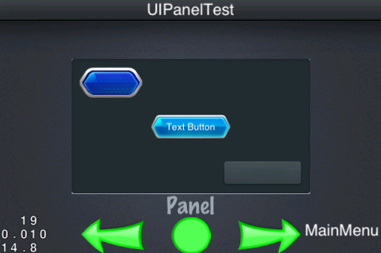
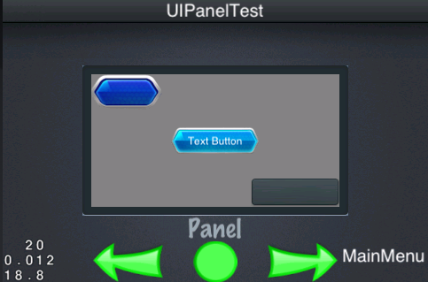
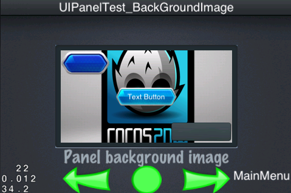
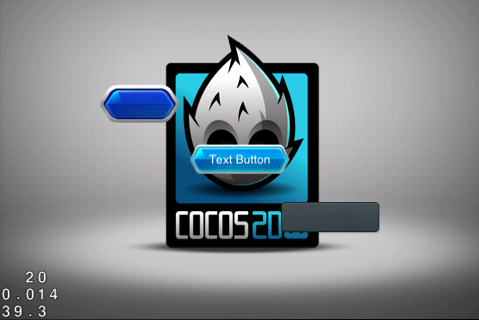
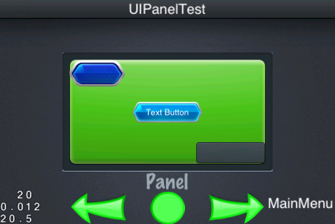
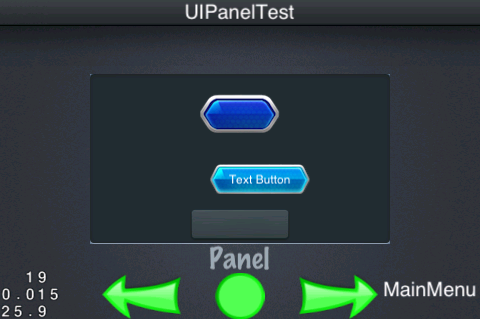
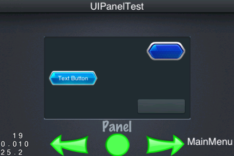
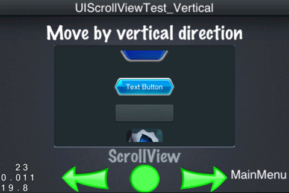
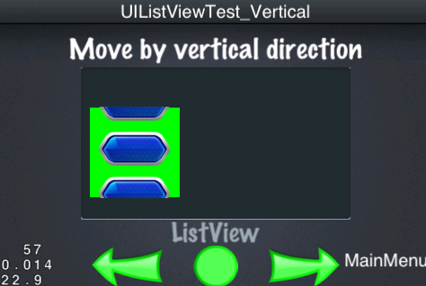
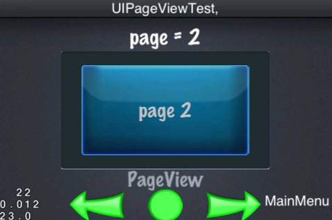

## 「Container Layer」の使用方法

GUIのウィジェットは**Normal Widget**と**Container Widget**と呼ばれる,大まかな２つの種類に分けられます。

Normal widgetsはUIButton, UILabel, UISlider や UITextField　等々の一般的なウィジェットです。

一方で,container widgetsはUILayout, UIScrollView や UIPageView 等々のような特徴を持っています。
そして,container widgetsはその他のウィジットを含んでいます。
にもかかわらず,すべてのウィジェットは他を含むことができます。
しかし,いくつかのものはラベルやボタンの様な一つの事を行うものとなっています。
それらにウィジェットを追加していく方法が一般的です。

では,container widgetの使い方を学んでいきましょう。

### UILayout (Panel)

パネルは最も重要な入れ子です。
それはCocoStudio editorでUIを作る基礎となり,
パネルやそのプロパティを知っておくことが重要となってきます。
パネルに対応するウィジェットは「UILayout」という名前がつけられています。


``` c++
    Size widgetSize = m_pWidget->getSize();
    
    UILayout *background = dynamic_cast<UILayout*>(m_pUiLayer->getWidgetByName("background_Panel"));
    
    // Create the layout
    UILayout* layout = UILayout::create();
    layout->setSize(Size(280, 150));
    Size backgroundSize = background->getSize();
    layout->setPosition(Point((widgetSize.width - backgroundSize.width) / 2 +
                            (backgroundSize.width - layout->getSize().width) / 2,
                            (widgetSize.height - backgroundSize.height) / 2 +
                            (backgroundSize.height - layout->getSize().height) / 2));
    m_pUiLayer->addWidget(layout);
    
    UIButton* button = UIButton::create();
    button->setTouchEnabled(true);
    button->loadTextures("cocosgui/animationbuttonnormal.png", "cocosgui/animationbuttonpressed.png", "");
    button->setPosition(Point(button->getSize().width / 2, layout->getSize().height - button->getSize().height / 2));
    layout->addChild(button);
    
    UIButton* textButton = UIButton::create();
    textButton->setTouchEnabled(true);
    textButton->loadTextures("cocosgui/backtotopnormal.png", "cocosgui/backtotoppressed.png", "");
    textButton->setTitleText("Text Button");
    textButton->setPosition(Point(layout->getSize().width / 2, layout->getSize().height / 2));
    layout->addChild(textButton);
    
    UIButton* button_scale9 = UIButton::create();
    button_scale9->setTouchEnabled(true);
    button_scale9->loadTextures("cocosgui/button.png", "cocosgui/buttonHighlighted.png", "");
    button_scale9->setScale9Enabled(true);
    button_scale9->setSize(Size(100, button_scale9->getContentSize().height));
    button_scale9->setPosition(Point(layout->getSize().width - button_scale9->getSize().width / 2, button_scale9->getSize().height / 2));
    layout->addChild(button_scale9);

```

上記のプログラムで`layout`ウィジェットを作成すると３つのウィジェットが追加されます。
前述した通り`m_pUiLayer`は現在のシーンでのUILayerとなります。
すべてのUI widgetsはUILayerに属しており,UILayerはそれらすべてを管理しています。
下図の様に実際に配置した結果をみる事ができます。




レイアウトに“size”と言う名の値を設定し大きさを変更することができます。
しかし,思った通りの結果は得られないと思います。
なぜならレイアウトのカラーの初期が透明化されているからです。
ですがレイヤーのカラーを設定する事は可能です


``` c++ 
    layout->setBackGroundColorType(LAYOUT_COLOR_SOLID);
    layout->setBackGroundColor(Color3B(128, 128, 128));
    
```



背景もまた好きな様に設定ができます。

``` c++
    layout->setSize(Size(280, 150));
    
    layout->setClippingEnabled(true);
    layout->setBackGroundImage("cocosgui/Hello.png");

```




上記のように背景の画像とサイズを設定できます。
しかし,サイズを揃える場合,`setClippingEnabled`メソッドを呼ぶ事を覚えておいてください。
もしメソッドを呼ばなかった場合次の様な事がおこります。



同じ事を行う他の方法は

``` c++
    layout->setBackGroundImageScale9Enabled(true);
    layout->setBackGroundImage("cocosgui/green_edit.png");

```



背景には四角い画像を用い`setClippingEnabled`を呼ぶ事をわすれずに。


UILayout には色を表示する 3 つのモードがあります。

| LayoutBackGroundColorType | 説明        |
|---------------------------|-------------------|
| LAYOUT_COLOR_NONE         | 透明 |
| LAYOUT_COLOR_SOLID        | 設定可能(単一色) |
| LAYOUT_COLOR_GRADIENT     | グラーデーション  |

### UIPanel Widget's Layout Strategies

UILayoutはlayoutのためにあり,上記では背景の画像を変えるためだけに使われています。
下部は,絶対位置の設定とレイアウトシステムです。


| LayoutType                | 説明        |
|---------------------------|-------------------|
| LAYOUT_ABSOLUTE           |絶対位置での配置 |
| LAYOUT_LINEAR_VERTICAL    |垂直線配置 |
| LAYOUT_LINEAR_HORIZONTAL  |水平線配置 |
| LAYOUT_RELATIVE           |相対位置での配置 |


``` c++
    layout->setLayoutType(LAYOUT_LINEAR_VERTICAL);

    // Another way 
    layout->setLayoutType(LAYOUT_LINEAR_HORIZONTAL);

    // Another way 
    layout->setLayoutType(LAYOUT_RELATIVE);
    
```

コラム；絶対位置での配置を使用した場合,たとえ他の配置を適用していたとしても内部のウィジェットの位置の設定は無視されます。上記の状況で設定位置を反映させたい場合`UILinearLayoutParameter` と `UIRelativeLayoutParameter`という二つのパラメーターを持った`UILayoutParameter` を使う事によりそれが可能となります。
この二つのパラメーターを使ったUIデザインを下記でやってみましょう。


``` c++
    layout->setLayoutType(LAYOUT_LINEAR_VERTICAL);

    // ....The same code to create widget as above 

    UILinearLayoutParameter* lp1 = UILinearLayoutParameter::create();
    lp1->setGravity(LINEAR_GRAVITY_CENTER_HORIZONTAL);
    lp1->setMargin(UIMargin(0, 10, 0, 10));
    
    UILinearLayoutParameter* lp2 = UILinearLayoutParameter::create();
    lp2->setGravity(LINEAR_GRAVITY_CENTER_HORIZONTAL);
    lp2->setMargin(UIMargin(20, 20, 0, 5));
    
    UILinearLayoutParameter* lp3 = UILinearLayoutParameter::create();
    lp3->setGravity(LINEAR_GRAVITY_CENTER_HORIZONTAL);
    lp3->setMargin(UIMargin(0, 10, 0, 10));

    button->setLayoutParameter(lp1);
    textButton->setLayoutParameter(lp2);
    button_scale9->setLayoutParameter(lp3);

```
参考画像



レイアウトの`UILinearLayoutParameter`, `Gravity`,`Margin`の3つのパラメーターを設定した時3つのUIパネルのウィジットの内部の結果をみることができる。


ここでは線形垂直方式を使用しています。
しかし,すべての`Gravity` は'LINEAR_GRAVITY_CENTER_HORIZONTAL'の設定となっておりそれは水平方向を中心として表示され,
余白や端の周りの間隔が表示されます。
 `lp2`の値は`UIMargin(20, 20, 0, 5)`かっこ内左から順に左,上,右,ボタンからの間隔となります。
  
  左の間隔を20にした時`textButton`らの右に少しの間隔が空いてしまいます。
   方向以外はレイアウトの垂直方式の他の設定の水平体系と同じです。
   そしてその二つの体系**Linear Layout**と呼びます。
   それらはすべて同じパラメーターです。
   では次のレイアウトを調べてみてください。

``` c++
    layout->setLayoutType(LAYOUT_RELATIVE);

    //...Widget creating code should be here

    UIRelativeLayoutParameter* rp1 = UIRelativeLayoutParameter::create();
    rp1->setAlign(RELATIVE_ALIGN_PARENT_TOP_RIGHT);
    
    UIRelativeLayoutParameter* rp2 = UIRelativeLayoutParameter::create();
    rp2->setAlign(RELATIVE_ALIGN_PARENT_LEFT_CENTER_VERTICAL);
    
    UIRelativeLayoutParameter* rp3 = UIRelativeLayoutParameter::create();
    rp3->setAlign(RELATIVE_ALIGN_PARENT_RIGHT_BOTTOM);
    
    button->setLayoutParameter(rp1);
    textButton->setLayoutParameter(rp2);
    button_scale9->setLayoutParameter(rp3);

```


ここで3つのレイアウトプロパティと異なる`Align`を設定しました。


### UIScrollView

レイアウトコンテナに加えて,スクロールビューは,常にそれが表示ウィジェットを拡大することができ,コンテンツ要素が増加したときそれは非常に便利です。あなたは好きなようにそれを設定することができます。

``` c++
    UIScrollView* scrollView = UIScrollView::create();
    scrollView->setTouchEnabled(true);
    scrollView->setSize(Size(280, 150));        
    Size backgroundSize = background->getContentSize();
    scrollView->setPosition(Point((widgetSize.width - backgroundSize.width) / 2 +
                           (backgroundSize.width - scrollView->getSize().width) / 2,
                           (widgetSize.height - backgroundSize.height) / 2 +
                           (backgroundSize.height - scrollView->getSize().height) / 2));


    m_pUiLayer->addWidget(scrollView);

    UIImageView* imageView = UIImageView::create();
    imageView->loadTexture("cocosgui/ccicon.png");
    
    float innerWidth = scrollView->getSize().width;
    float innerHeight = scrollView->getSize().height + imageView->getSize().height;
    
    scrollView->setInnerContainerSize(Size(innerWidth, innerHeight));    

    imageView->setPosition(Point(innerWidth / 2, imageView->getSize().height / 2));
    scrollView->addChild(imageView);

    // Add some other widgets for scrollview
    
```




上記の画像の通り,スクロールウィジットを作成しそこに幾つかの内部要素を追加しました。
表示内容が画面に収まることはあまりありません。
このような状況で,我々はコンテンツを表示するためにダウンビューを上下にドラッグしてすることができます。


**コラム**:
imageViewの位置はscrollviewの外側から設定することができます。
それに加えてscrollviewのsetInnerContainerSizeをよびだせば表示領域を変更することができ,ドラックの境界うを確認することができます。
もし水平方向のドラッグを設定する場合,InnerContainerSize'の幅よりも大きいウィジットとそれと高さが同じウィジットが必要です。


この方法で水平方向にドラッグをすることができます。

### UIListView

ListView は ScrollViewを継承しています。
これによりScrollView'の文字がListViewでも見ることができるようになります。
ListView,ScrollView の違いを見てみましょう:

``` c++
    UIListView* lv = UIListView::create();
    UIButton* model = UIButton::create();
    model->loadTextures("cocosgui/animationbuttonnormal.png", "cocosgui/animationbuttonpressed.png", "");
    lv->setItemModel(model);
    
    for (int i=0; i<20; i++)
    {
        lv->pushBackDefaultItem();
    }
    lv->setItemsMargin(10);
    lv->setGravity(LISTVIEW_GRAVITY_CENTER_HORIZONTAL);
    lv->setSize(Size(100, 100));
    lv->setBackGroundColorType(LAYOUT_COLOR_SOLID);
    lv->setBackGroundColor(Color3B::GREEN);
    lv->setPosition(Point(100, 100));
    m_pUiLayer->addWidget(lv);

```



上記がScrollViewの実装です。
`ItemsMargin` と `Gravity`を設定するとドラッグすることができる20のボタンを水平方向中央に表示させることができる 
`ItemsMargin` and `Gravity`は水平方向中央に表示するために設定しました。
`lv->setItemModel(model)`はListViewの初期Itemを設定してくれます。
その後上記の文をfor文で20回,回します。

これは同じモデルを20回追加しますが,元のモデルのクローンである20のオブジェクトを追加するわけでないことに注意してください。
ListViewに追加することができるのは他にもたくさんあります。
`pushBackDefaultItem()`だけではありません

| 関数一覧　                                      | 説明                        |
|-----------------------------------------------|----------------------------| 
| pushBackDefaultItem()                         | Default Itemの追加          | 
| insertDefaultItem(int index)                  | Default Itemのソート,挿入    |
| pushBackCustomItem(UIWidget* item)            | new Itemの追加              | 
| insertCustomItem(UIWidget* item, int index)   | new Itemの挿入              |


上記で示したの追加,挿入する関数です。
下記は削除,取得の関数です。

| 関数一覧                       | 説明　　　　                     |
|-------------------------------|-------------------------------| 
| removeItem(int index)         | 引数のItemを削除                |
| removeLastItem()              | 最後のItemを削除 　　　　         |
| getItem(unsigned int index)   | 引数のItemを取得     　　　      |
| getItems()                    | 全てのItem及び配列の取得　　　　　 |
| getIndex(UIWidget *item)      | Itemのindex番号の取得           |


### UIPageView

ここまでScrollViewと幾つかのウィジットについて勉強してきました。
PageViewでは一度に全ての表示をすることができ,

リストを表示することができ,またPageViewは,ページ全体を一度に表示することができます。
その上,余白を自動で整えページをめくるようなことができます。

``` c++
    UIPageView* pageView = UIPageView::create();
    pageView->setTouchEnabled(true);
    pageView->setSize(Size(240, 130));
    Size backgroundSize = background->getContentSize();
    pageView->setPosition(Point((widgetSize.width - backgroundSize.width) / 2 +
                              (backgroundSize.width - pageView->getSize().width) / 2,
                              (widgetSize.height - backgroundSize.height) / 2 +
                              (backgroundSize.height - pageView->getSize().height) / 2));
    
    for (int i = 0; i < 3; ++i)
    {
        UILayout* layout = UILayout::create();
        layout->setSize(Size(240, 130));
        
        UIImageView* imageView = UIImageView::create();
        imageView->setTouchEnabled(true);
        imageView->setScale9Enabled(true);
        imageView->loadTexture("cocosgui/scrollviewbg.png");
        imageView->setSize(Size(240, 130));
        imageView->setPosition(Point(layout->getSize().width / 2, layout->getSize().height / 2));
        layout->addChild(imageView);
        
        UILabel* label = UILabel::create();
        label->setText(CCString::createWithFormat("page %d", (i + 1))->getCString());
        label->setFontName(font_UIPageViewTest);
        label->setFontSize(30);
        label->setColor(Color3B(192, 192, 192));
        label->setPosition(Point(layout->getSize().width / 2, layout->getSize().height / 2));
        layout->addChild(label);
        
        pageView->addPage(layout);
    }
    pageView->addEventListenerPageView(this, pagevieweventselector(UIPageViewTest::pageViewEvent));
    
    m_pUiLayer->addWidget(pageView);

```




PageViewのオブジェクトはSize(240, 130)で作成し,それが表示領域となります。
UILayout を追加するには,全体のコンテンツを表示できるサイズ「Size(240, 130)」でつくる必要があります。
UILayout に必要なものを追加することができ,`pageView->addPage(layout)`でページを追加することができます。
`UILayout` オブジェクトまたはその派生クラスのオブジェクトを追加する必要があるのを覚えておいてください。

ScrollView が UILayout からは継承されないためPageViewのスクロールを実装の実装ができません。
そのため'UIScrollInterface' が実装されます。ScrollView も同じです。


すべてのウィジェットは GUIシーンを作り　コンテナは骨格です。

PageViewはGUIと相性がいいです。
