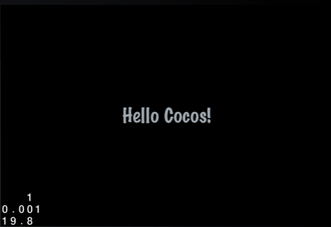
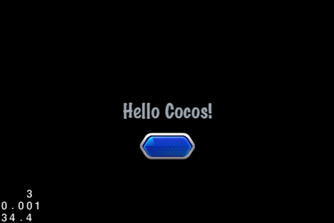
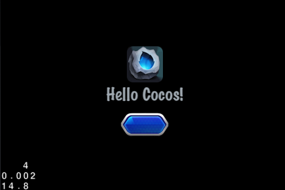

# GUI系の概要

## 導入

GUIシステムが導入されるまでは,複雑なUIをデザインすることは困難でした。
あなたがMMORPGのような特定のジャンルのゲームに特化した特定のUIをデザインできたとしても,UIの豊富さゆえに,期待したものには届かないでしょう。
自分でGUIシステムそのものをデザインすることもできますが,しかしそれを達成しようとすると巨大なプログラムになります。

そこで,独自のソリューションGUIシステムを持ったcocos2d-xです。
始めてみましょう!!

## GUIウィジェット

以下のウィジェット一覧を眺めてみましょう。詳細は後に示します。

Name                                   | Description                                  | Name                                 | Description
--------------------|---------------------------------|-------------------|----------------------------
**UIWidget**            | 全てのGUI要素のベース      | UILoadingBar  | 読み込みのプログレスバー
**UILayout**            | レイヤーウィジェット。コンテナのベース | UIScrollView  | スクロールビュー
**UIRootWidget**        | ルートウィジェット                      | UIListView    | リストビュー
UIButton                | ボタン                            | UISlider      | スライダー
UICheckBox              | チェックボックス                         | UITextField   | テキストフィールド
UIImageView             | 画像表示                     | UILabelBMFont | ビットマップフォントラベル
UILabel                 | 文字ラベル                   | UIPageView    | ページビュー
**UIHelper**            | ヘルパー                        | UILabelAtlas  | アトラスフォントラベル 
**UILayer**             | レイヤー

## 一般的なウィジェットの使い方

### Hello Cocosから始めましょう

GUIシステムの全ての要素は**UIWidget**要素であり,UIWidgetはcocos2d::Objectを継承しています。
UIWidget要素はツリー構造を構築できますが,Nodeによって作られた構造とは無関係です。
これら２つの構造はLayerクラスを継承した**UILayer**によって連結することができます。
LayerはNodeでもあり,そこには**UIRootWidget**を含んでいます。そして全てのUIWidgetやUILayerはGUI構造のトップレベルにあるUIWidgetに存在しています。

以下のコードではシーンの中央に「HelloCocos!」と表示されます。

```
    auto size = Director::getInstance()->getWinSize();
    
    auto uLabel = UILabel::create();
    uLabel->setText("Hello Cocos!");
    uLabel->setFontName("Marker Felt");
    uLabel->setFontSize(30);
    uLabel->setColor(Color3B(159, 168, 176));
    uLabel->setPosition(Point(size.width / 2, size.height / 2));

    auto uLayer = UILayer::create();
    uLayer->addWidget(uLabel);
    addChild(uLayer);

```



備考：UILayerは現在動いているシーンとUIウィジェットを管理できます。しかし,型が一致しない為,動いているNodeにUILabelを追加することはできません。

UILabelの他のプロパティは以下のようになっています。

General proprerties and Methods             | Description 
--------------------------------------------|--------------------
setText(const std::string& text)            | 表示するテキストを設定
getStringValue()                            | 表示されているテキストを取得
getStringLength()                           | 文字列の長さを取得(中国語の文字は英語のものより大きい, iOSでは3)
setFontName(const std::string& name)        | フォントを設定
setFontSize(int size)                       | フォントサイズを設定
setScale(float fScale)                      | 拡大率を設定
setAnchorPoint(const cocos2d::Point &pt)    | アンカー位置を設定
setTouchEnabled(bool enable)                | タッチの有効化
setTouchScaleChangeEnabled(bool enable)     | タッチ時にズームを有効にするか(タッチが有効になっている必要あり)

UILabel はよく静的なテキストを表示する為に使われますが,`addTouchEventListener`を追加することでその機能を得ることもできます。

### UIButtonの使い方

UILabelとUIButtonを追加するコードです。
UIButtonをタッチするとUILabelの内容が変わります。

``` c++
    auto uButton = UIButton::create();
    uButton->setTouchEnabled(true);
    uButton->loadTextures("cocosgui/animationbuttonnormal.png", "cocosgui/animationbuttonpressed.png", "");
    uButton->setPosition(Point(size.width / 2, size.height / 2) + Point(0, -50));
    uButton->addTouchEventListener(this, toucheventselector(HelloWorld::touchEvent));
    uLayer->addWidget(uButton);

```

タッチイベントのコールバック関数を追加する為には`addTouchEventListener`を使用します。
_lblはprivate変数であり,UILabeのリファレンスです。
以下の`touchEvent`関数を実行することで,ボタンの様々な状態（クリック,移動,タッチ,キャンセルのような）をどのように受け取っているかを見る事ができます。

``` c++
    void HelloWorld::touchEvent(Object *pSender, TouchEventType type)
    {
        switch (type)
        {
            case gui::TOUCH_EVENT_BEGAN:
                _lbl->setText("UIButton Click.");
                break;
            case gui::TOUCH_EVENT_MOVED:
                // TODO
                break;
            case gui::TOUCH_EVENT_ENDED:
                // TODO
                break;
            case gui::TOUCH_EVENT_CANCELED:
                // TODO
                break;
            default:
                // TODO
                break;
        }
    }
    
```



General proprerties and methods             | Description
--------------------------------------------|-------------------------
setTouchEnabled(bool enable)                | タッチの有効化。デフォルトは無効
loadTextures(const char* normal,const char* selected,const char* disabled,TextureResType texType = UI_TEX_TYPE_LOCAL); | ボタン画像の読み込み。引数は通常時と押下時,無効時の画像。
setPosition(const Point &pos)       | ウィジェットの位置を設定
addTouchEventListener(Object *target, SEL_TouchEvent selector)  | ボタンのコールバック関数を設定

備考：UILabelやUIImageViewのようないくつかのウィジェットはタッチを有効にすることができません。しかしながらUIButtonやUIScrollViewは`setTouchEnabled`を有効にする必要があります。この機能はUIWidgetに含まれています。


### 一般的なプロパティとUIImageViewの使い方

UIをよりリッチにする為に,画像を表示するウィジェット「UIImageView」が準備されています。

```
    UIImageView *imageView = UIImageView::create();
    imageView->loadTexture("cocosgui/ccicon.png");
    imageView->setPosition(Point(size.width / 2, size.height / 2) + Point(0, 50));
    uLayer->addWidget(imageView);
```




General proprerties and methods             | Description
--------------------------------------------|-------------------------
loadTexture(const char* fileName,TextureResType texType = UI_TEX_TYPE_LOCAL);       | ウィジェットに画像を表示
setTextureRect(const Rect& rect)            | 画像の領域を設定
setScale9Enabled(bool able)                 | Scal9画像の有効化

## Cocos Studioからリソースをインポートする

最初にUIコンテナーを配置する為の**UILayer**を準備し,次に他のウィジェットをその中に追加するという手順です。その間にインタラクションが必要ならば,いくつかの一般的なプロパティ（クリックなど）を設定します。
ウィジェットがあまり多くない場合は容易に管理できますが,UIウィジェットが多くなってくるとそれが困難になってきます。
そこで,Cocos StudioからUIリソースを読み込むという新しい方法を導入しました。

Cocos Studioを使う利点について説明します。
Cocos Studio UI editorでは,たった今デザインしたエディター内の全てのウィジェットをプレビューすることができます。
エディターでプロパティの設定ができるため,コードを書く時間が大幅に削減できます。
例えば,画像を表示する為のUIImageViewを設定できたり,テキストを表示する為のUILabelを設定できたり,ボタン画像ををUIButtonに設定でき,タッチも有効にできます。s
Cocos StudioとGUIライブラリーを共に使うことは効率的です。

## GUIリソースの読み込み

jsonファイルからUIウィジェットが読み込まれたcocostudio::GUIReaderによって提供される方法を使います。
以下のコードは`cocostudio::GUIReader`を使って,jsonファイルからUIウィジェットを読み込む例です。

``` c++
    UILayer* m_pLayer = UILayer::create();
    addChild(m_pLayer);
    
    UILayout* m_pLayout = dynamic_cast<UILayout*>(cocostudio::GUIReader::shareReader()->widgetFromJsonFile("cocosgui/UITest/UITest.json"));

    m_pLayer->addWidget(m_pLayout);

    UILabel* m_pSceneTitle = dynamic_cast<UILabel*>(m_pLayer->getWidgetByName("UItest"));

```

備考：ローダーで読み込まれたUIリソースはUILayerです。前述のように,UIリソースをシーンに追加したい時にはUILayerが必要です。
UILayerオブジェクトを最初に生成した後に,そのUILayerにjsonファイルからUIリソースを追加します。そうしなければUIリソースは表示されません。
UILayerはシーンとUIウィジェットを繋ぐ役割です。

備考：UITest.jsonはCocos StudioのUIエディターによって生成されたファイルであり,通常は内容を変更しません。詳細はCocos StudioのドキュメントにあるCocos Studioの使い方を参照してください。

**UITest.json**は全てのUIの定義,UIのレイアウト,全てのプロパティ設定を含むファイルです。
GUIReaderでリソースを読み込む時に,対応するウィジェットが生成され,プロパティも設定されます。Cocos StudioのUIエディターを使うことでコーディング作業を大幅に削減できます。

### プロシージャーを使ったUIリソース

前述のように,UIリソースからあなたが得る最初のリソースはUILayerリソースであり,Cocos StudioではPanelウィジェットです。これは常にレイアウトを行うUIウィジェットのルートのウィジェットです。
Panelにはボタン,ラベル,テキストボックス,画像,スクロールビューなどを追加できます。さらに,PanelにサブエリアとしてのPanelも追加することができます。
このjsonファイルはDectionaryデータであり,”key”でプロパティ名,”value”で値を持っています。GUIReaderの実装について懸念はありません。

UILayoutをUILayerに追加する時,UILayerに存在するUIリソースの中から`m_pLayer->getWidgetByName(“UItest”)`を使って目的のUIリソースを取得することができます。
**注意したいのは,getWidgetByName()はUILayerではなくUILayoutに属していることです。**UILayoutは単なるウィジェットに過ぎず,UILayerはシーンとUIウィジェットを繋ぐ役割でした。
ちなみに,全てのUIウィジェットはUILayerによって取得することができます。
UILayer内にある全てのウィジェットはUILayerから`getWidgetByName()`とgetWidgetByTag()で取得することになっています。
