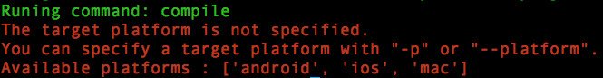

# cocos compile

## 简介

编译并打包 cocos 工程。

## 用法

```
usage: cocos compile [-h] [-s SRC_DIR] [-q] [-p PLATFORM]
                     [--proj-dir PROJ_DIR] [-m MODE] [-j JOBS] [-o OUTPUT_DIR]
                     [--ap ANDROID_PLATFORM] [--ndk-mode NDK_MODE]
                     [--app-abi APP_ABI] [--ndk-toolchain TOOLCHAIN]
                     [--ndk-cppflags CPPFLAGS] [--android-studio]
                     [--vs VS_VERSION] [--source-map] [--advanced]
                     [-t TARGET_NAME] [--sign-identity SIGN_ID] [--no-res]
                     [--compile-script {0,1}] [--lua-encrypt]
                     [--lua-encrypt-key LUA_ENCRYPT_KEY]
                     [--lua-encrypt-sign LUA_ENCRYPT_SIGN]
```

## 参数说明

* **通用参数：**

	参数 | 可用值 | 示例 | 描述 | 是否必需
	:------------: | :-------------: | :------------: | :------------: | :------------:
	-h, --help | - | - | 显示帮助信息。 | 否
	-s, --src | 工程路径 | `./projects/MyLuaGame` | 指定工程路径，默认值为当前路径。 | 否
	-p, --platform | 编译的平台 | `android` | 指定要编译的平台。 | 是
	-m, --mode | 编译模式 | `release` | 指定编译模式，`debug` 或者 `release`。默认值为`debug` | 否
	-j, --jobs | 使用 cpu 的数量 | `4` | 指定编译过程使用几个 cpu。只有在编译 `android` 和 `linux`平台时起效。 | 否
	-o, --output-dir | 输出路径 | `./output` | 指定输出文件路径。 | 否

* **Android 平台参数：**

	参数 | 可用值 | 示例 | 描述 | 是否必需
	:------------: | :-------------: | :------------: | :------------: | :------------:
	--ap | 整数 (必须 >= 10) | `16` | 指定要使用的 Android API-Level。如果未指定，则从 SDK 中自动选择。 | 否
	--ndk-mode | 调用 ndk-build 的模式 | `release` | 设置 ndk-build 的模式。可选值： {debug, release, none}。如果指定为 none，则跳过 ndk-build 步骤。默认值与 `-m` 参数值一致。 | 否
	--android-studio | - | - | 指定编译 Android Studio 工程。 | 否

* **Windows 平台参数：**

	参数 | 可用值 | 示例 | 描述 | 是否必需
	:------------: | :-------------: | :------------: | :------------: | :------------:
	--vs | 整数 | `2013` | 指定编译所使用的 Visual Studio 版本。如：2013。默认自动查找可用版本。 | 否

* **Web 平台参数：**

	参数 | 可用值 | 示例 | 描述 | 是否必需
	:------------: | :-------------: | :------------: | :------------: | :------------:
	--source-map | - | - | 启用 source-map | 否
	--advanced | - | - | 使用 closure 编译器的高级模式编译 js 文件，会获得更高的压缩率，但是有出现 bug 的风险。 | 否

* **iOS/Mac 平台参数：**

	参数 | 可用值 | 示例 | 描述 | 是否必需
	:------------: | :-------------: | :------------: | :------------: | :------------:
	-t, --target | target 名称 | `MyLuaGame iOS` | 指定需要编译的 xcode 工程中的 target。 | 否 

* **iOS 平台参数：**

	参数 | 可用值 | 示例 | 描述 | 是否必需
	:------------: | :-------------: | :------------: | :------------: | :------------:
	--sign-identity | 代码签名 ID | `"iPhone Distribution:xxxxxxxx"` | 编译 iOS device 版本时使用的代码签名 ID | 否

* **lua/js 工程参数：**

	参数 | 可用值 | 示例 | 描述 | 是否必需
	:------------: | :-------------: | :------------: | :------------: | :------------:
	--compile-script | {0,1} | `1` | 开启/关闭将 lua/js 脚本编译为字节码的功能。如果此参数未指定，那么当 `-m` 参数为 `release` 时，此参数值为 `1`；否则此参数值为 `0` | 否

* **lua 工程参数：**

	参数 | 可用值 | 示例 | 描述 | 是否必需
	:------------: | :-------------: | :------------: | :------------: | :------------:
	--lua-encrypt | - | - | 启用 lua 脚本的 XXTea 加密功能。 | 否
	--lua-encrypt-key | 任意字符串 | `MyLuaKey` | 指定 XXTea 加密算法的 key。只有使用了 `--lua-encrypt` 参数时起效。默认值为 `2dxLua`。 | 否
	--lua-encrypt-sign | 任意字符串 | `MyLuaSign` | 指定 XXTea 加密算法的 sign。只有使用了 `--lua-encrypt` 参数时起效。默认值为 `XXTEA`。 | 否

## 注意事项

* 执行命令时，如果不指定 `-p, --platform` 参数，会输出可用的平台，如下图：
	
* 在编译 `linux` 和 `web` 两个平台时，不支持 `--compile-script` 参数。
* 如果启用了 `--lua-encrypt` 参数，需要修改 C++ 代码文件 `frameworks/runtime-src/Classes/AppDelegate.cpp`：

	```
	bool AppDelegate::applicationDidFinishLaunching()
	{
		...
		
		auto engine = LuaEngine::getInstance();
    	ScriptEngineManager::getInstance()->setScriptEngine(engine);
    	
    	// add these two lines 
    	// "MyLuaKey" is the string specified by "--lua-encrypt-key"
    	// "MyLuaSign" is the string specified by "--lua-encrypt-sign"
    	LuaStack* stack = engine->getLuaStack();
    	stack->setXXTEAKeyAndSign("MyLuaKey", strlen("MyLuaKey"), "MyLuaSign", strlen("MyLuaSign"));
    	
		...
	}
	```

## 示例

* `cocos compile -h` 显示帮助信息。
* `cocos compile -s ./projects/MyLuaGame -p android --ndk-mode release --compile-script 1 --lua-encrypt`  
	编译 `MyLuaGame` 工程的 Android 平台。ndk-build 模式为 release。并且编译 & 加密 lua 脚本。
* `cocos compile -s ./projects/MyLuaGame -p ios -m release --sign-identity "iPhone Distribution:xxxxxxxx"`  
 	编译 `MyLuaGame` 工程的 iOS 平台，使用 release 模式，并且使用代码签名 ID：`"iPhone Distribution:xxxxxxxx"`. 