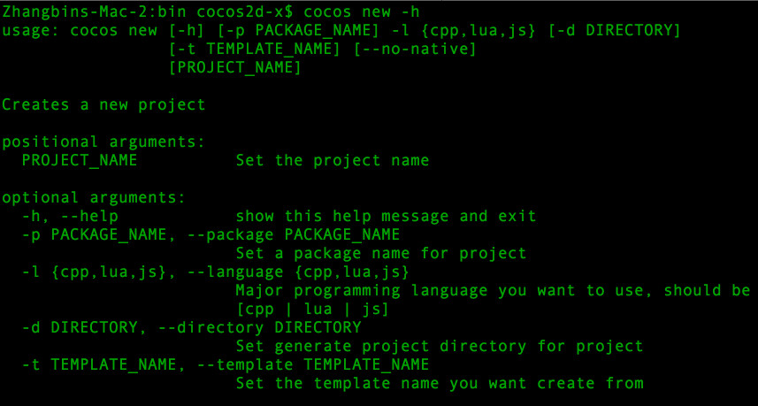

# cocos new

## 简介

创建一个新的 cocos 工程。

## 用法

`cocos new -l {cpp,lua,js} [arguments] [PROJECT_NAME]`

## 参数说明

参数 | 可用值 | 示例 | 描述 | 是否必需
:------------: | :-------------: | :------------: | :------------: | :------------:
-h, --help | - | - | 显示帮助信息 | 否
-p, --package | `*.*.*` 格式的字符串 | `com.company.pkgname` | 设置工程的包名 | 否
-l, --language | {cpp, lua, js} | lua | 指定工程的编程语言。 | 是
-d, --directory | 绝对路径或者相对路径 | `./projects/` | 指定工程的存放路径，默认为当前路径。 | 否
-t, --template | 模板名称 | `runtime` | 指定使用的模板名称，默认值为 `default` | 否
--ios-bundleid | `*.*.*` 格式的字符串 | `com.company.pkgname` | 设置 iOS 的 bundle ID。 | 否
--mac-bundleid | `*.*.*` 格式的字符串 | `com.company.pkgname` | 设置 Mac 的 bundle ID。 | 否
--portrait | - | - | 设置工程为竖屏。 | 否

## 注意事项

查找模板的逻辑：

1. 生成模板文件夹字符串，规则：`[语言]-template-[模板名称]`。  
示例：命令 `cocos new -l lua -t runtime` 所要查找的模板文件夹为 `lua-template-runtime`
2. 在引擎的 `templates` 目录查找模板文件夹。

## 示例

* `cocos new -h`。显示帮助信息。
	
* `cocos new -l lua -p org.cocos2dx.mygame -d ./projects -t runtime MyLuaGame`  
创建的工程属性： 
	* 语言：`lua`
	* 包名：`org.cocos2dx.mygame`
	* 存放路径：`./projects`
	* 工程名称：`MyLuaGame`
	* 模板名称：`runtime`
