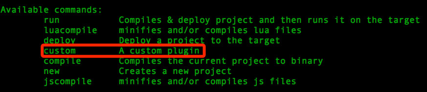

# cocos2d-console

## 简介

cocos2d-console 是一个命令行工具集。可以用于创建，编译，运行 cocos 工程。

此工具使用 Python 语言开发，适用于 Windows，Mac 和 Linux 系统。

## 环境要求

* Python 2.7 *(目前只支持 2.7 版本，不支持 3.x)*.
* 开发 iOS & Mac 程序需要:
	* XCode
* 开发 Android 程序需要:
	* [Android NDK](https://developer.android.com/tools/sdk/ndk/)
	* [Android SDK](https://developer.android.com/tools/sdk/)
	* [Apache Ant](http://ant.apache.org/)
* 开发 windows 程序需要:
	* Visual Studio
* 开发 linux 程序需要:
	* 运行 `cocos2d-x` 或者 `cocos2d-js` 中的 `build/install-deps-linux.sh` 脚本来安装依赖的环境。
	
## 设置环境变量

运行 `cocos2d-x` 或者 `cocos2d-js` 根目录下的 `setup.py`。  
如果需要开发 Android 程序，`setup.py` 执行过程中需要输入 `Android SDK`, `Android NDK` & `Apache Ant` 三个路径。

## 用法

命令行的用法：`cocos [command] [arguments]`

可用的命令:

* [new](./cocos-new/zh.md)
* [compile](./cocos-compile/zh.md)
* [deploy](./cocos-deploy/zh.md)
* [run](./cocos-run/zh.md)
* [jscompile](./cocos-jscompile/zh.md)
* [luacompile](./cocos-luacompile/zh.md)
* [gen-libs](./cocos-gen-libs/zh.md)
* [gen-simulator](./cocos-gen-simulator/zh.md)
* [gen-templates](./cocos-gen-templates/zh.md)
* [package](./cocos-package/zh.md)

## 注意事项

各个命令直接有依赖关系。依赖关系的规则如下：

* 一个命令所依赖的命令会先被执行。
* 如果命令 A 依赖命令 B。那么在执行 A 命令时，所有参数都会传递给 B 命令。

示例： `run` 依赖 `deploy`，并且 `deploy` 依赖 `compile`。

* 命令的执行顺序 `compile->deploy->run`。
* 执行 `cocos run -p android --ndk-mode release` 这个命令时，(`-p` 是 `run` 命令的参数，而 `--ndk-mode` 是用于 `compile` 命令的参数。)

## 如何增加一个新的命令

1. 编辑 `bin/cocos2d.ini`，添加新增命令的类名，示例:  

	```
	plugin_custom.CCPluginCustom
	``` 

2. 在 `plugins` 目录添加一个文件 `plugin_custom.py`。文件内容如下：

	```
	import cocos

    # 这个类需要为 cocos.CCPlugin 的子类
    class CCPluginCustom(cocos.CCPlugin):   
        @staticmethod
        def plugin_category():
            return ""

        @staticmethod
        def plugin_name():
            return "custom"

        @staticmethod
        def brief_description():
            return "A custom plugin"                

        def run(self, argv, dependencies):
            print "plugin called!"
            print argv
	```

3. 执行 `cocos -h` 查看新增的命令：
	
	
	执行 `cocos custom -p android` 的输出如下图：  
	

## 贡献代码

`cocos2d-console` 的代码在 github 上： [console代码](https://github.com/cocos2d/cocos2d-console)

可以 fork 这个仓库，并通过发送 pull request 来贡献代码。
