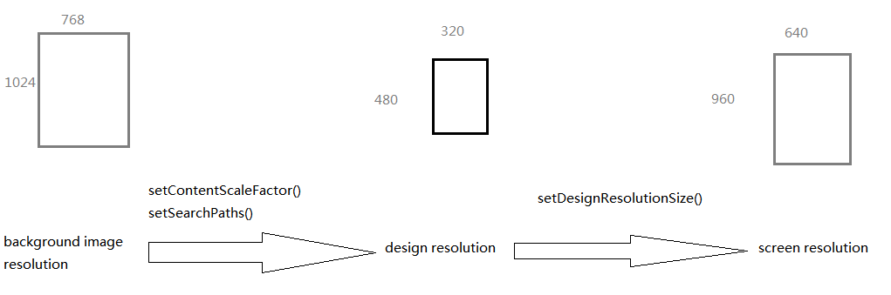
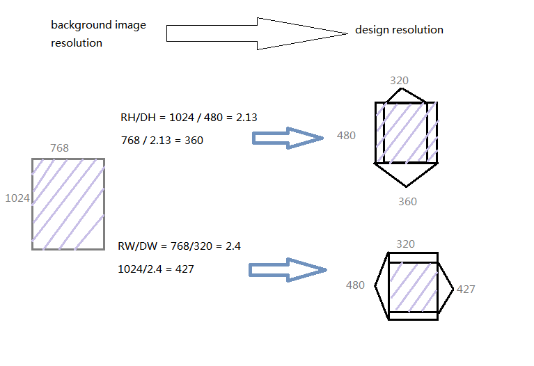
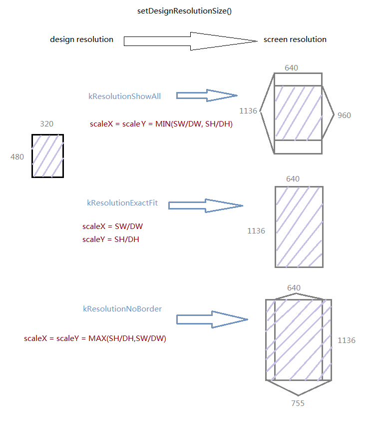
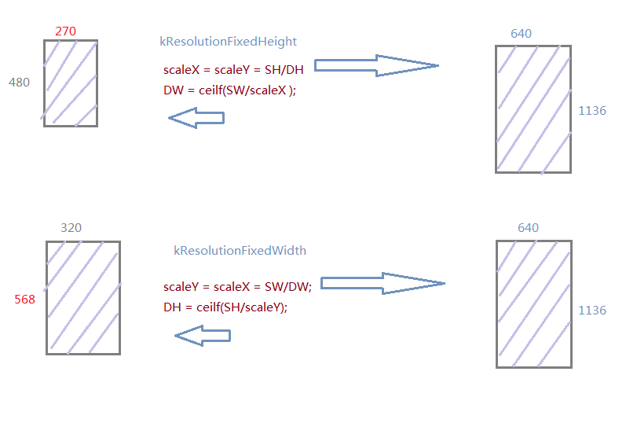
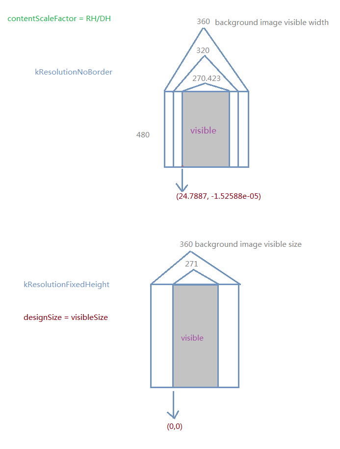

#Cocos2d-x 다중해상도 지원에 대한 자세한 설명

## 개요
Cocos2d-x 2.04 릴리즈 이후로 Cocos2d-x는 다중해상도 지원에 대한 자체 솔루션을 제공합니다. 더이상 Retina의 API는 사용되지 않으며 design resolution이라는 새로운 개념이 사용됩니다.

다중해상도 지원 API:
```
    //set design resolution size and mode
    Director::getInstance()->getOpenGLView()->setDesignResolutionSize() 
    //set content scale factor
    Director::getInstance()->setContentScaleFactor()
    //deprecated
    FileUtils::getInstance()->setResourceDirectory()
    //set resource search path 
    FileUtils::getInstance()->setSearchPaths()
    //get screen resolution 
    Director::getInstance()->getOpenGLView()->getFrameSize() 
    //get design resolution
    Director::getInstance()->getWinSize() 
    //get design resolution’s visable area size
    Director::getInstance()->getVisibleSize() 
    //get origin of the visable area of design resolution
    Director::getInstance()->getVisibleOrigin()
```
```
	--set design resolution size and mode
    cc.Director:getInstance():getOpenGLView():setDesignResolutionSize
    --set content scale factor
    cc.Director:getInstance():setContentScaleFactor
    --deprecated,not support in Lua
    --cc.FileUtils:getInstance():setResourceDirectory
    --set resource search path,not support in 2.x version Lua
    cc.FileUtils::getInstance():setSearchPaths
    --get screen resolution
    cc.Director:getInstance():getOpenGLView():getFrameSize
    --get design resolution
    cc.Director:getInstance():getWinSize
    --get design resolution’s visable area size
    cc.Director:getInstance():getVisibleSize 
    --get origin of the visable area of design resolution
    cc.Director:getInstance():getVisibleOrigin() 
```

Cocos2d-2.1beta3-x-2.1.1이후로

`CCFileUtils::sharedFileUtils()->setResourceDirectory()`

는 아래로 대체되었습니다.

`CCFileUtils::sharedFileUtils()->setSearchPaths(searchPath)`

이 API들은 v2.x에서 Lua를 위해 지원됩니다.

Cocos2d-x 2.1.3 이후로 새로운 해상도 정책인 kResolutionFixedHeight, kResolutionFixedWidth가 엔진에 추가되어 총 5개의 해상도 정책이 지원됩니다.

## Retina에서 Design resolution으로의 발전
Cocos2d-x 2.0.4 이전에 Retina는 Cocos2d-iPhone에서 다중해상도 지원 솔루션이었습니다. 일반 iPhone 리소스와 Retina iPhone 리소스를 구분하여 Retina iPhone을 지원하려면 Cocos2d-iPhone은 접미어로 '-hd'를 사용하여야 했습니다. 우리는 게임을 디자인하며 픽셀 좌표계 대신 점 좌표계를 사용하였습니다. 이런 점은 iOS native App의 개념과 동일하여 당신은 일반 iPhone과 Retina iPhone에서 동일한 코드를 사용하실 수 있습니다. 만약 이미지가 흐릿하다면 당신은 '@2x' 확장자를 사용하여 iOS가 자동으로 고해상도 리소스를 사용하게 할 수 있습니다.

몇가지 측면에서 점 좌표계는 다중해상도 문제를 해결합니다. 그러나 iPhone5와 새로운 iPad는 5종류의 리소스 집합을 요구하며 이것은 매우 짜증스러운 일입니다. 점 좌표계는 이 문제를 해결할 수 없고 Android 플랫폼에서 이 문제는 더 심각해집니다.

Design resolution은 점 좌표계의 발전형으로 Screen resolution을 생성합니다. 스프라이트는 Design resolution 상에 존재하지만 솔루션을 사용하는 것은 쉽지 않습니다. Cocos2d-x는 다중해상도 지원을 위한 API와 꼭 필요한 다섯가지 정책을 지원합니다. 같이 살펴봅시다!

## Resource resolution, Design resolution, Screen resolution
>RW is short for Resources width, RH is short for Resources height.
>DW is short for Design width, DH is short for Design height.
>SW is short for Screen width, SH is short for Screen height.

SDK의 sample 폴더에 HelloCpp 프로젝트는 어떻게 다중해상도 관련 API들을 사용하는지 보여줍니다.
지금부터 HelloCpp에서의 Appmacros.h와 같은 설정의 수직 스크린 게임을 폭과 높이의 교환을 통해 만들어보겠습니다.

Cocos2d-x는 화면을 나타내기 위해 Resource resolution에서 Design resolution으로 한번,
Design resolution에서 Screen resolution으로 한번 총 두번의 논리적 절차를 거칩니다.

그림:



setContentScaleFactor()와 setSearchPaths() API는 첫번째 절차를 제어하고, setDesignResolutionSize()는 두번째 절차를 제어하는데 최종 화면 출력은 이 두 절차에 의해 결정됩니다.

## Resource resolution에서 Design resolution으로의 변환
setSearchPaths()는 Screen resolution에 따라 적절한 설정을 할 수 있다. HellowCpp에서 간단한 방법을 볼 수 있지만 최선이라고 말할 수는 없다.

setContentScaleFactor()는 최종 화면에서의 배율을 설정한다. 그러나 이 설정값은 Resource resolution과 Screen resolution 사이의 비율을 의미하는 것은 아닙니다. Cocos2d-x 엔진은 개발자가 Screen resolution에 직접적으로 접근하는 것을 막았고 그래서 이 값은 Resource resolution과 Design resolution 사이의 비율을 의미합니다.

setContentScaleFactor()에 값을 설정하는 방법은 대개 두가지로 구분됩니다. RH/DH나 RW/DW의 설 각각 다른 특성을 가집니다.

그림:



scale factor로 높이 비율을 사용할 경우 이미지의 수직방향이 모두 출력되는 것을 보장합니다.

scale factor로 폭의 비율을 사용할 경우 이미지의 수평방향이 모두 출력되는 것을 보장합니다.


## Design resolution에서 Screen resolution으로의 변환

setDesignResolutionSize(DW, DH, resolutionPolicy)는 세가지 입력값을 가집니다. - Design resolution 폭, Design resolution 높이, 해상도 정책

처음 두 입력값은 쉽게 이해되지만 마지막 하나는 약간 복잡합니다.

kResolutionShowAll, kResolutionExactFit, kResolutionNoBorder에 대해 잠깐 살펴본 후에 Cocos2d-x 2.1.3부터 새롭게 지원된 정책에 대해 소개하겠습니다.

위 세가지 정책의 Design resolution은 엔진을 통해 변경되지 않습니다.

그림:



### kResolutionShowAll

> Screen resolution과 Design resolution간의, 폭의 비율과 높이 비율 중 작은 값을 scale factor로 사용합니다. Design 영역이 Screen에 모두 출력되는 것을 보장하지만, 일정부분 검은 화면이 보입니다.

### kResolutionExactFit

> X 축에는 폭의 비율을, Y축에는 높이의 비율을 사용합니다. 모든 화면이 가득 차는 것을 보장하지만, 그림이 왜곡될 수 있습니다.

### kResolutionNoBorder

> Screen resolution과 Design resolution간의, 폭의 비율과 높이 비율 중 큰 값을 scale factor로 사용합니다. 하나의 축 방향이 화면에 가득 차는 것을 보장하지만, 다른 축 방향은 화면 밖으로 나갈 수 있습니다.

화면을 왜곡하지 않고 한 축 방향이 모두 보이는 kResolutionNoBorder은 공식적으로 추천되는 정책이었습니다. 하지만 Cocos2d-x 2.1.3에서 kResolutionNoBorder를 대체할 새로운 두가지 정책을 도입했습니다.

kResolutionFixedHeightd와 kResolutionFixedWidth는 엔진에 딱 맞는 Design resolution으로 전체화면을 보장하며 왜곡되지 않습니다.

그림:



### kResolutionFixedHeight

> Design resolution의 높이를 유지하며, Screen에 따라 Design resolution의 폭을 변경합니다.

### kResolutionFixedWidth

> Design resolution의 폭을 유지하며, Screen에 따라 Design resolution의 높이를 변경합니다.


##두 절차의 결합

첫번째 절차에는 두가지 경우의 수가, 두번째 절차에는 다섯가지 경우의 수가 있습니다. 그래서 조합은 총 열가지입니다.

화면 효과를 희생하는 쪽과 화면 영역을 희생하는 쪽 중 어느 것을 선택하시겠습니까?

약간의 화면 영역을 희생하며 두 절차가 어떻게 작동하는지 보여줄 저의 조합이 있습니다.

제 게임에서 저는 Y 축이 모두 출력되어야 하고 X 축은 잘리는 것이 허용되었습니다.

이 결과를 얻기 위해 저는 두 절차에서 모두 X축을 잘르는 결과가 필요했습니다.

- 첫번째 절차로 setContentScaleFactor(RH/DH) 를 사용했습니다.
- 두번째 절차는 kResolutionNoBorder와 kResolutionFixedHeight이 있습니다.

kResolutionNoBorder와 kResolutionFixedHeight의 차이점을 보여주기 위해 VisibleOrigin과 VisibleSize를 도입합니다.

그림:



kResolutionNoBorder에서 스프라이트를  VisibleOrigin과 VisibleSize를 사용해서 출력했을때 Design resolution은 화면에 출력되는 영역과 동일하지 않습니다. 

그러나 kResolutionFixedHeight에서는 VisibleOrigin은 언제나 (0,0)에 위치하며, getVisibleSize() 는 getWinSize()입니다. kResolutionFixedHeights는 같은 결과를 얻기 위해 더 간단한 코드를 사용할 수 있습니다.

kResolutionFixedHeight와 kResolutionFixedWidth는 kResolutionNoBorder의 발전형이며, 새 프로젝트에서 이 두가지 정책을 사용하는 것이 강력하게 권고됩니다.

## 결론
### kResolutionFixedHeight

> 이 정책은 Y축이 모두 보이고 X축이 잘리는  것이 허용되는 게임에 적합합니다. setContentScaleFactor(RH/DH)와 함께 사용되어야 할 것입니다.

### kResolutionFixedWidth

> 이 정책은 X축이 모두 보이고 Y축이 잘리는  것이 허용되는 게임에 적합합니다. setContentScaleFactor(RW/DW)와 함께 사용되어야 할 것입니다.

tip : AppMacros.h의 폭과 높이값을 설정해 봄으로써, 수평 스크린 게임과 수직 스크린 게임의 차이를 알 수 있습니다.