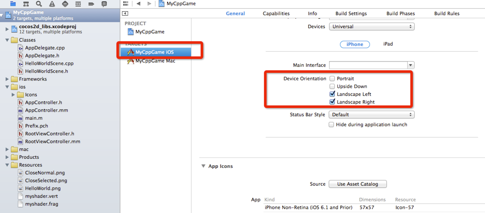
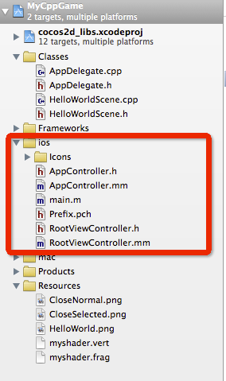
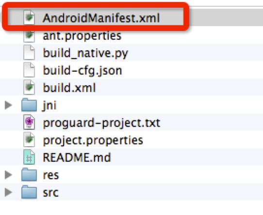
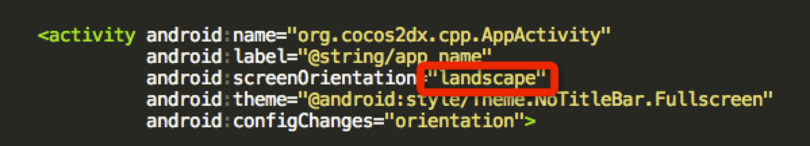

# 장치 방향

## iOS 장치방향 설정

iOS에는 4종류의 방향 설정방식이 있습니다.

- Portrait
- Upside Down
- Landscape Left
- Landscape Right


이 설정법은 프로젝트 타겟의 General 탭에서 확인할 수 있습니다. 아래의 그림을 참고하십시오 (붉은 표시를 주의깊게 봐 주시기 바랍니다):



Cocos2d-x 프로젝트를 새로 만들면 기본 설정값은 **Landscape Left**와 **Landscape Right**입니다.

한번 Portrait로 우리의 장치방향을 바꿔보겠습니다.

먼저 ios 그룹에서 RootViewController.mm 파일을 열어 주십시오:



그리고 다음 코드를 입력해 주시기 바랍니다.:

```
- (BOOL)shouldAutorotateToInterfaceOrientation:(UIInterfaceOrientation)interfaceOrientation {
    return UIInterfaceOrientationIsLandscape( interfaceOrientation );
}

// For ios6, use supportedInterfaceOrientations & shouldAutorotate instead
- (NSUInteger) supportedInterfaceOrientations{
#ifdef __IPHONE_6_0
    return UIInterfaceOrientationMaskAllButUpsideDown;
#endif
}
```

장치 방향을 Portrait로 설정하려면 아래와 같이 변경해 주십시오.

```
- (BOOL)shouldAutorotateToInterfaceOrientation:(UIInterfaceOrientation)interfaceOrientation {
    return UIInterfaceOrientationIsPortrait( interfaceOrientation );
}

// For ios6, use supportedInterfaceOrientations & shouldAutorotate instead
- (NSUInteger) supportedInterfaceOrientations{
#ifdef __IPHONE_6_0
    return UIInterfaceOrientationMaskPortrait;
#endif
}
```


command 버튼을 누른 채로 ** UIInterfaceOrientationMaskPortrait** 매크로를 클릭하면 다른 옵션을 확인할 수 있습니다.

이제 Xcode에서 빌드 후 실행하면 장치방향은 Portrait 모드로 변경되어 있을 것입니다.

##Android 장치방향 설정
**proj.android** 폴더에 있는 **AndroidManifest.xml** 파일을 열어주십시오:



아래 코드를 입력해 주십시오:



landscape를 portrait로 바꾸는 것으로 충분합니다.
