# Effects

## 개요

Effects는 특별한 종류의 Action입니다. 불투명도, 위치, 회전값, 배율 등을 바꾸는 대신에 grid라는 새로운 속성을 변경합니다.

grid 속성은 matrix와 유사합니다. matrix는 서로 직교하는 선들의 집합이며 여러 사각형으로 구성되어 있습니다.

이 특별한 Action들은 어떤 Cocos2d-x Node 오브젝트(Layer, Scene, Sprite 등) 에도 grid를 적용하여 나타낼 수 있으며 꼭짓점들을 이용하여 grid를 변경할 수 있습니다.

grid에는 tiled gird와 non-tiled grid의 두 종류가 있습니다. tiled grid는 독립된 타일로 구성되고 non-tiled grid는 꼭짓점의 집합으로 구성되는 차이가 있습니다.

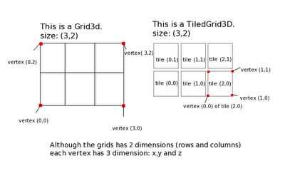

아래 예제는 Grid3D (non-tiled)를 사용한 Ripple3D Action입니다.

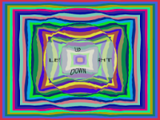 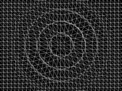

다음 예제는 TiledGrid3D(tiled)를 사용한 FadeOutTR Action입니다.

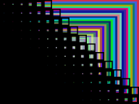 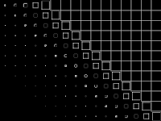

## 사용방법?

다른 Action과 마찬가지로, “runAction”에 의해 실행됩니다. 예제:

	// Create a sprite
	CCSprite* grossini = CCSprite::create("grossini.png");
	grossini->runAction(CCLiquid::create(4, 20, ccg(10,10), 5));

다른 grid Aciont처럼 LIquid도 grid 매개변수를 받습니다. grid의 크기를 변경하여 품질을 향상시킬 수 있지만 FPS의 감소를 유발합니다.

Effect들은 “IntervalAction”으로 다른 Action 처럼 사용할 수 있습니다. 예제:

	// create a Lens3D action
	CCActionInterval* lens = CCLens3D::create(ccp(240,160),240,ccg(15,10),8);
	
	// create a Waved3D action
	CCActionInterval* waves = CCWaves3D::create(18,80,ccg(15,10),10);
	
	// create a sequence and repeat it forever
	grossini->runAction(CCRepeatForever::create((CCSequence*)CCSequence::create(waves, lens, NULL ) ) );

아래는 v2.1.0의 Grid3D(non-tiled) Action입니다.

|Shaky3D|Waves3D|FlipX3D|FlipY3D|
|-------|-------|-------|-------|
|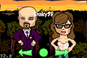|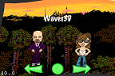|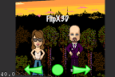|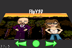|

|Lens3D|Liquid|Waves|Twirl|
|------|------|-----|-----|
|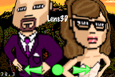|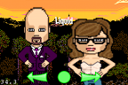|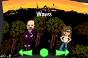|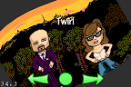|

|Ripple3D|
|--------|
|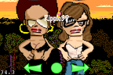|

아래는 TiledGrid3D(tiled) Action입니다.

|ShakyTiles3D|ShatteredTiles3D|ShuffleTiles|FadeOutTRTiles|
|------------|----------------|------------|--------------|
||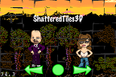|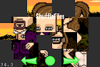|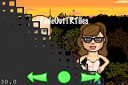|

|FadeOutBLTiles|FadeOutUpTiles|FadeOutDownTiles|TurnOffTiles|
|--------------|--------------|----------------|------------|
|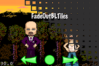|||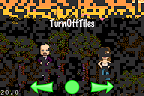|

|WavesTiles3D|JumpTiles3D|SplitRows|SplitCols|
|------------|-----------|---------|---------|
|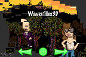|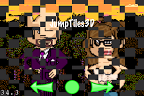|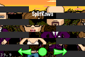|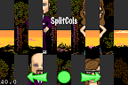| 
			
### 참조

Cocos2d-iphone [Introduction to cocos2d’s effects](http://www.cocos2d-iphone.org/archives/40)
。
