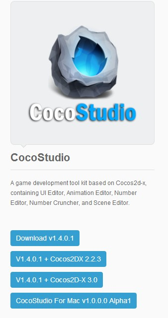
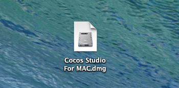
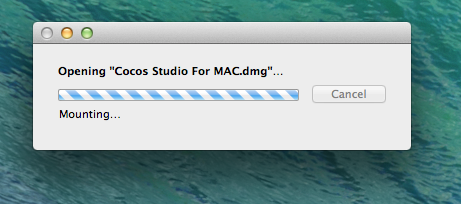
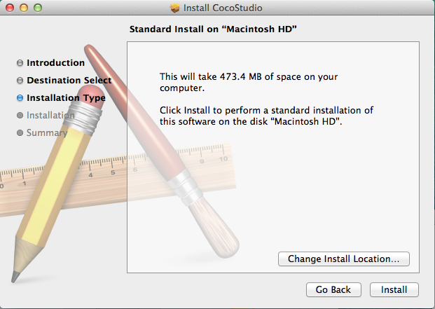

#インストールについて

##入手  
[http://www.cocos2d-x.org](http://www.cocos2d-x.org/download)より,MacもしくはWindows向けの最新バージョンが入手出来ます。

##"OS X"へのインストール

- Mac向けのパッケージをインストールし,ローカルにダウンロードしてください。

   

- ダウンロードが完了したら[CocosStudio.dmg]()というファイルをダブルクリックします。

   

- 完了まで待機。

   

- Cocos Studio.pkgのアイコンをダブルクリックします。   

   

- インストールの概要説明画面が出てくるので,問題なければ"Continue"をクリックします。   

   

- 各種設定項目をニュ力,選択して進めていきます。

   

1. "Install"をくりっくし,Cocos Studioのインストールを開始します。管理者パスワードの入力などが求められる場合があります。
2. "Change Install Location .."をクリックする事でインストール先のディレクトリの変更が可能です。
3. "Go Back"で前の項目に戻る事も可能です。
   
- 以上の手順を踏んだ上でインストールが完了したら"Launchpad"内にCococsStudioのアイコンが出現します。

   

##よくある質問
- Q：CocosStudioはwindows向けに提供されていますか？   
	A：Windows向けでリリースされる物をシュミレーションし,同時にMac向けにリリースしています。

- Q：インストールに失敗しました。    
   A：ディスク領域に余裕がある事を確認してください。もしくは,管理者パスワードの入力に失敗してる可能性もあります。もしあなたが,正しいインストール方法に則っていない場合,一度アンインストールしてから再度インストールし直す事を推奨します。どうしても解決出来ない場合,ヘルプを参考にしてください。[Get Help page](../../contact_support/zh.md)
