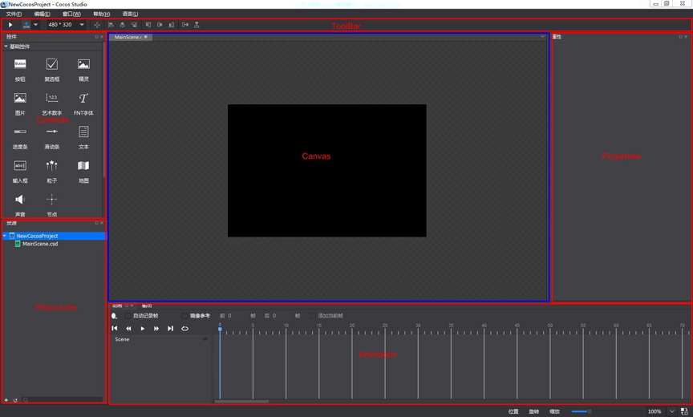

# 1.1 学习界面

以下是Cocos Studio的界面，主界面由顶部的工具栏,中间的画布和停靠在界面周围的一些面板组成，您可以通过视图菜单打开或关闭这些界面。

您可能感兴趣：

[工具栏 (Toolbar)](../toolbar/zh.md)

[控件面板 (Controls Panel)](../controls/zh.md)

[资源面板 (Resource Panel)](../resources/zh.md)

[画布面板 (Canvas)](../canvas/zh.md)

[动画面板 (Animation Panel)](../animation/zh.md)

[属性面板 (Property Panel)](../properties/zh.md)

