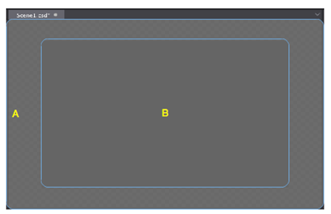

# 1.1.4 Canvas

Canvas is the most commonly used panel in Cocos Studio, you can visually adjust the position, rotation, scaling, anchor point of a widget. you can also adjust widget properties using property panel.

Area B representatives the resolution size you set.
