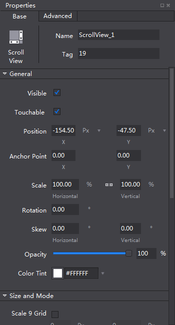
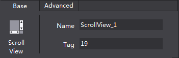
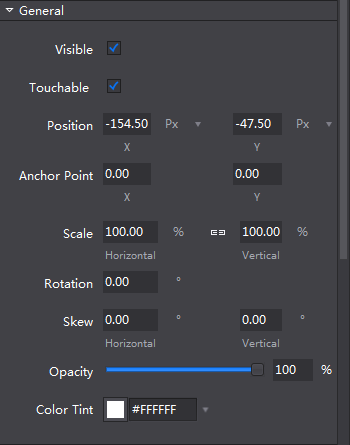
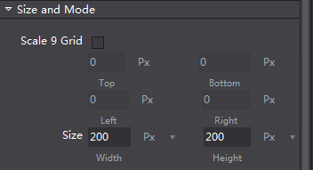
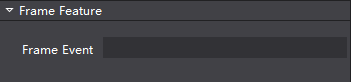

# 1.1.6 属性面板

属性面板展示了控件的所有属性，您可以进行调整和修改。

顶部是固定的标题区，属性面板有两个页签，包含基本属性和高级属性。基本属性部分分为常规,尺寸,特性几个部分，高级属性部分包括帧事件的设置。当您在画布面板选中了一个或多个控件时属性面板会出现相应的属性，可以通过输入数值,添加文件等方式调整。

标题区域：标题区域展示了当前选中的控件类型，您可以通过定义的名称或逻辑标签在程序中定位当前的控件。

#### 常规属性

常规属性包含了一些控件的基础设置，大部分控件的常规属性是统一的，但也有一些控件有特殊情况，请参考如何使用控件。

#### 尺寸属性

尺寸属性包含了关于尺寸的一些设置，您可以设置控件是否根据资源自动调整大小，还是指定控件大小也可以指定一个九宫格以确保控件拉伸但是不变形，这部分可以参考根据资源自动调整尺寸和如何使用九宫格。

#### 高级属性

高级属性主要包含了一些不常用的内容，主要用于设置帧事件。

