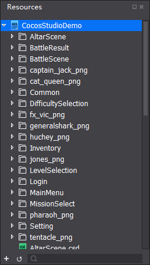
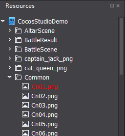

# 1.1.3 에셋 패널(Asset panel)

에셋 패널은 프로젝트의 모든 파일을 보여줍니다. 새로운 파일을 생성하고 이름을 바꾸고 파일을 지우거나 다른 에셋 파일 관련 작업을 여기서 수행할 수 있습니다.

코코스 스튜디오에서 import 메뉴나 에셋을 직접 에셋 패널로 드래그하는 것을 통해 에셋을 추가할 수 있습니다. 또한 에셋 패널의 파일은 속성을 설정하거나 새로운 요소를 만들기 위해 캔버스와 같은 다른 패널로 드래그 할 수 있습니다.

주의사항 : 에셋 패널의 파일 구조는 디스크와 같습니다. 디스크에서 파일을 지우면 위젯이 참고하는 파일이 사라졌졌 때문에 손실되고 이름이 빨간색으로 표시됩니다.
